Inability to work following COVID-19 vaccination among healthcare workers - an important aspect for future booster vaccinations
================

Julia Reusch<sup>1,2\*</sup>; Isabell Wagenhäuser<sup>1,2\*</sup>;Alexander Gabel, PhD<sup>1</sup>; Anna Höhn<sup>1</sup>; Thiên-Trí Lâm, MD<sup>3</sup>; Lukas B. Krone, MD, PhD<sup>4,5</sup>; Anna Frey, MD<sup>2</sup>; Alexandra Schubert-Unkmeir, MD<sup>3</sup>; Lars Dölken, MD<sup>6</sup>; Stefan Frantz, MD<sup>2</sup>; Oliver Kurzai, MD<sup>3,7</sup>; Ulrich Vogel, MD<sup>1,3</sup>; Manuel Krone, MD, MScPH<sup>1,3\*\*</sup>; Nils Petri, MD<sup>2\*\*</sup> <br /><br />  

**Affiliations:**<br />

<sup>1</sup> Infection Control Unit, University Hospital Wuerzburg, Wuerzburg, Germany<br /> 
<sup>2</sup> Department of Internal Medicine I, University Hospital Wuerzburg, Wuerzburg, Germany<br /> 
<sup>3</sup> Institute for Hygiene and Microbiology, University of Wuerzburg, Wuerzburg, Germany<br /> 
<sup>4</sup> Department of Physiology, Anatomy and Genetics, University of Oxford, Oxford, UK<br /> 
<sup>5</sup> University Hospital of Psychiatry and Psychotherapy, University of Bern, Bern, Switzerland<br /> 
<sup>6</sup> Institute for Virology and Immunobiology, University of Wuerzburg, Wuerzburg, Germany<br />
<sup>7</sup> Leibniz Institute for Natural Product Research and Infection Biology – Hans-Knoell-Institute, Jena, Germany <br />
<sup>\*</sup> both authors contributed equally <br />
<sup>\*\*</sup> both authors contributed equally 

- <a href="#functions-external-packages-and-folder-structure"
  id="toc-functions-external-packages-and-folder-structure">Functions,
  external packages and folder structure</a>
  - <a href="#import-data-set" id="toc-import-data-set">Import data set</a>
- <a href="#summaries" id="toc-summaries">Summaries</a>
  - <a href="#vaccination-schedule"
    id="toc-vaccination-schedule">Vaccination schedule</a>
  - <a href="#total" id="toc-total">Total</a>
  - <a href="#gender-spec" id="toc-gender-spec">Gender spec.</a>
  - <a href="#dosage-spec" id="toc-dosage-spec">Dosage spec.</a>
  - <a href="#profession-spec" id="toc-profession-spec">Profession spec.</a>
- <a href="#sick-leave-after-vaccination"
  id="toc-sick-leave-after-vaccination">Sick leave after vaccination</a>
  - <a href="#total-1" id="toc-total-1">Total</a>
  - <a href="#gender-spec-1" id="toc-gender-spec-1">Gender spec.</a>
  - <a href="#profession-spec-1" id="toc-profession-spec-1">Profession
    spec.</a>
  - <a href="#rel-to-vaccination" id="toc-rel-to-vaccination">Rel. to
    vaccination</a>
- <a href="#hcws-on-sick-leave" id="toc-hcws-on-sick-leave">HCWs on sick
  leave</a>
  - <a href="#total-2" id="toc-total-2">Total</a>
  - <a href="#rel-to-vaccination-1" id="toc-rel-to-vaccination-1">Rel. to
    Vaccination</a>
- <a href="#medication-after-vaccination"
  id="toc-medication-after-vaccination">Medication after vaccination</a>
  - <a href="#total-3" id="toc-total-3">Total</a>
  - <a href="#gender" id="toc-gender">Gender</a>
  - <a href="#profession" id="toc-profession">Profession</a>
  - <a href="#rel-to-vaccination-2" id="toc-rel-to-vaccination-2">Rel. to
    vaccination</a>
- <a href="#sub-analysis-age-above-30"
  id="toc-sub-analysis-age-above-30">Sub Analysis Age above 30</a>
  - <a href="#summaries-1" id="toc-summaries-1">Summaries</a>
  - <a href="#sick-leave-after-vaccination-1"
    id="toc-sick-leave-after-vaccination-1">Sick leave after vaccination</a>
- <a href="#total-5" id="toc-total-5">Total</a>
  - <a href="#hcws-on-sick-leave-1" id="toc-hcws-on-sick-leave-1">HCWs on
    sick leave</a>
  - <a href="#medication-after-vaccination-1"
    id="toc-medication-after-vaccination-1">Medication after vaccination</a>

# Functions, external packages and folder structure

Besides the packages loaded with `library`, the packages *rstatix*,
*ggsci*, and *ggpattern* needs to be installed.

``` r
setwd("/path/to/git/dir/")
source("R/helper_functions.R")

library(dplyr)
library(ggplot2)
library(lubridate)
library(glmnet)
library(emmeans)
library(officedown)
library(knitr) 
library(kableExtra)
library(Hmisc)

plot.dir <- file.path("/path/to/result/dir/", "plots")
```

## Import data set

``` r
df_inab <- readRDS("data/inab_data.rds")

vaccine_names <- c("Comirnaty (BNT162b2mRNA)", "Spikevax (mRNA-1273)", "VaxZevria (ChAdOx1-S)", 
    "Janssen (Ad26.COV2-S)", "Other", "Nuvaxovid (Novavax CZ)")

professions <- c("Nursing", "Physicians", "other HCWs with patient contact", "other HCWs without any patient contact")

df_inab <- df_inab %>% mutate(dose1 = factor(dose1, levels = vaccine_names),
                              dose2 = factor(dose2, levels = vaccine_names),
                              dose3 = factor(dose3, levels = vaccine_names),
                              AgeCategory = factor(AgeCategory, levels = c("18-29", "30+")),
                              gender = factor(gender, levels = c("female", "male")),
                              smoking = factor(smoking, levels = c("smoker", "non-smoker")),
                              profession =  factor(profession, levels = professions))
```

# Summaries

## Vaccination schedule

``` r
df_inab %>% ungroup() %>% 
  summarise(Vaccine = vaccine_names,
            `first dose` = table(dose1),
            `second dose` = table(dose2),
            `third dose` = table(dose3)) %>% 
  as.data.frame() %>% 
knitr::kable() %>%
kableExtra::kable_paper() %>%
kableExtra::kable_styling(position = "left")%>%
kableExtra::column_spec(1, bold = T)
```

<table class=" lightable-paper table" style="font-family: &quot;Arial Narrow&quot;, arial, helvetica, sans-serif; margin-left: auto; margin-right: auto; ">
<thead>
<tr>
<th style="text-align:left;">
Vaccine
</th>
<th style="text-align:right;">
first dose
</th>
<th style="text-align:right;">
second dose
</th>
<th style="text-align:right;">
third dose
</th>
</tr>
</thead>
<tbody>
<tr>
<td style="text-align:left;font-weight: bold;">
Comirnaty (BNT162b2mRNA)
</td>
<td style="text-align:right;">
1664
</td>
<td style="text-align:right;">
1680
</td>
<td style="text-align:right;">
1100
</td>
</tr>
<tr>
<td style="text-align:left;font-weight: bold;">
Spikevax (mRNA-1273)
</td>
<td style="text-align:right;">
12
</td>
<td style="text-align:right;">
18
</td>
<td style="text-align:right;">
255
</td>
</tr>
<tr>
<td style="text-align:left;font-weight: bold;">
VaxZevria (ChAdOx1-S)
</td>
<td style="text-align:right;">
21
</td>
<td style="text-align:right;">
0
</td>
<td style="text-align:right;">
0
</td>
</tr>
<tr>
<td style="text-align:left;font-weight: bold;">
Janssen (Ad26.COV2-S)
</td>
<td style="text-align:right;">
7
</td>
<td style="text-align:right;">
0
</td>
<td style="text-align:right;">
0
</td>
</tr>
<tr>
<td style="text-align:left;font-weight: bold;">
Other
</td>
<td style="text-align:right;">
0
</td>
<td style="text-align:right;">
0
</td>
<td style="text-align:right;">
0
</td>
</tr>
<tr>
<td style="text-align:left;font-weight: bold;">
Nuvaxovid (Novavax CZ)
</td>
<td style="text-align:right;">
0
</td>
<td style="text-align:right;">
0
</td>
<td style="text-align:right;">
0
</td>
</tr>
</tbody>
</table>

## Total

``` r
df_inab %>% summarise(`Number of Subjects` = n(),
                       Age = med_iqr(age),
                       Weight = med_iqr(weight),
                       Height = med_iqr(height),
                       BMI = med_iqr(bmi),
                       "Sick leaves past 12 month" = med_iqr(sl_year),
                       "#Sick leaves past 12 month" = sum(sl_year, na.rm = T),
                       "Sick days 1" = med_iqr(audosis1),
                       "Sick days 2" = med_iqr(audosis2),
                       "Sick days 3" = med_iqr(audosis3),
                       "#Sick days 1" = sum(audosis1, na.rm = T),
                       "#Sick days 2" = sum(audosis2, na.rm = T),
                       "#Sick days 3" = sum(audosis3, na.rm = T),
                       Smoking = mut_num_perc(smoking, "smoker"),
                       "Side effects 1" = mut_num_perc(uaw1, 1),
                       "Side effects 2" = mut_num_perc(uaw2, 1),
                       "Side effects 3" = mut_num_perc(uaw3, 1),
                       "Med 1" = mut_num_perc(meds1, 1),
                       "Med 2" = mut_num_perc(meds2, 1),
                       "Med 3" = mut_num_perc(meds3, 1),
                       "Immune deficiency" = mut_num_perc(immun_def, 1),
                       Days_Vacc_12 = med_iqr(days_vaccs12),
                       Days_Vacc_23 = med_iqr(days_vaccs23),
                       IgG1 = med_iqr(IgG1),
                       IgG2 = med_iqr(IgG2),
                       IgG3 = med_iqr(IgG3)) %>% 
   mutate(across(.fns = as.character)) %>% 
  tidyr::pivot_longer(cols = c(`Number of Subjects`, Age, Weight, Height, BMI, matches("Days|mRNA|Coadmin|Smoking|IgG|Sick|Side|Immune|Med")), names_to = "Feature", values_to = "Stats") %>%
  knitr::kable()%>%
  kableExtra::kable_paper() %>%
  kableExtra::kable_styling(position = "left")%>%
  kableExtra::column_spec(1, bold = T)
```

<table class=" lightable-paper table" style="font-family: &quot;Arial Narrow&quot;, arial, helvetica, sans-serif; margin-left: auto; margin-right: auto; ">
<thead>
<tr>
<th style="text-align:left;">
Feature
</th>
<th style="text-align:left;">
Stats
</th>
</tr>
</thead>
<tbody>
<tr>
<td style="text-align:left;font-weight: bold;">
Number of Subjects
</td>
<td style="text-align:left;">
1704
</td>
</tr>
<tr>
<td style="text-align:left;font-weight: bold;">
Age
</td>
<td style="text-align:left;">
39 (29-52)
</td>
</tr>
<tr>
<td style="text-align:left;font-weight: bold;">
Weight
</td>
<td style="text-align:left;">
68 (60-80)
</td>
</tr>
<tr>
<td style="text-align:left;font-weight: bold;">
Height
</td>
<td style="text-align:left;">
169 (164-175)
</td>
</tr>
<tr>
<td style="text-align:left;font-weight: bold;">
BMI
</td>
<td style="text-align:left;">
23.6 (21.4-26.7)
</td>
</tr>
<tr>
<td style="text-align:left;font-weight: bold;">
Sick leaves past 12 month
</td>
<td style="text-align:left;">
1 (0-1)
</td>
</tr>
<tr>
<td style="text-align:left;font-weight: bold;">
\#Sick leaves past 12 month
</td>
<td style="text-align:left;">
1744
</td>
</tr>
<tr>
<td style="text-align:left;font-weight: bold;">
Sick days 1
</td>
<td style="text-align:left;">
0 (0-0)
</td>
</tr>
<tr>
<td style="text-align:left;font-weight: bold;">
Sick days 2
</td>
<td style="text-align:left;">
0 (0-0)
</td>
</tr>
<tr>
<td style="text-align:left;font-weight: bold;">
Sick days 3
</td>
<td style="text-align:left;">
0 (0-0)
</td>
</tr>
<tr>
<td style="text-align:left;font-weight: bold;">
\#Sick days 1
</td>
<td style="text-align:left;">
124
</td>
</tr>
<tr>
<td style="text-align:left;font-weight: bold;">
\#Sick days 2
</td>
<td style="text-align:left;">
735
</td>
</tr>
<tr>
<td style="text-align:left;font-weight: bold;">
\#Sick days 3
</td>
<td style="text-align:left;">
691
</td>
</tr>
<tr>
<td style="text-align:left;font-weight: bold;">
Smoking
</td>
<td style="text-align:left;">
211 (12.38%)
</td>
</tr>
<tr>
<td style="text-align:left;font-weight: bold;">
Side effects 1
</td>
<td style="text-align:left;">
549 (32.22%)
</td>
</tr>
<tr>
<td style="text-align:left;font-weight: bold;">
Side effects 2
</td>
<td style="text-align:left;">
326 (19.13%)
</td>
</tr>
<tr>
<td style="text-align:left;font-weight: bold;">
Side effects 3
</td>
<td style="text-align:left;">
197 (11.56%)
</td>
</tr>
<tr>
<td style="text-align:left;font-weight: bold;">
Med 1
</td>
<td style="text-align:left;">
1319 (77.41%)
</td>
</tr>
<tr>
<td style="text-align:left;font-weight: bold;">
Med 2
</td>
<td style="text-align:left;">
914 (53.64%)
</td>
</tr>
<tr>
<td style="text-align:left;font-weight: bold;">
Med 3
</td>
<td style="text-align:left;">
190 (11.15%)
</td>
</tr>
<tr>
<td style="text-align:left;font-weight: bold;">
Immune deficiency
</td>
<td style="text-align:left;">
40 (2.35%)
</td>
</tr>
<tr>
<td style="text-align:left;font-weight: bold;">
Days_Vacc_12
</td>
<td style="text-align:left;">
21 (21-21)
</td>
</tr>
<tr>
<td style="text-align:left;font-weight: bold;">
Days_Vacc_23
</td>
<td style="text-align:left;">
248 (219.2-266.5)
</td>
</tr>
<tr>
<td style="text-align:left;font-weight: bold;">
IgG1
</td>
<td style="text-align:left;">
159.9 (85.9-283.1)
</td>
</tr>
<tr>
<td style="text-align:left;font-weight: bold;">
IgG2
</td>
<td style="text-align:left;">
161.2 (86.4-284.6)
</td>
</tr>
<tr>
<td style="text-align:left;font-weight: bold;">
IgG3
</td>
<td style="text-align:left;">
1954.5 (1225.3-3041.1)
</td>
</tr>
</tbody>
</table>

## Gender spec.

``` r
df_inab %>% group_by(gender) %>% summarise(`Number of Subjects` = n(),
                       Age = med_iqr(age),
                       Weight = med_iqr(weight),
                       Height = med_iqr(height),
                       BMI = med_iqr(bmi),
                       "Sick leaves past 12 month" = med_iqr(sl_year),
                       "#Sick leaves past 12 month" = sum(sl_year, na.rm = T),
                       "Sick days 1" = med_iqr(audosis1),
                       "Sick days 2" = med_iqr(audosis2),
                       "Sick days 3" = med_iqr(audosis3),
                       "#Sick days 1" = sum(audosis1, na.rm = T),
                       "#Sick days 2" = sum(audosis2, na.rm = T),
                       "#Sick days 3" = sum(audosis3, na.rm = T),
                       Smoking = mut_num_perc(smoking, "smoker"),
                       "Side effects 1" = mut_num_perc(uaw1, 1),
                       "Side effects 2" = mut_num_perc(uaw2, 1),
                       "Side effects 3" = mut_num_perc(uaw3, 1),
                       "Incapacity after 1 vacc" = mut_num_perc(incapacity1, 2),
                       "Incapacity after 2 vacc" = mut_num_perc(incapacity2, 2),
                       "Incapacity after 3 vacc" = mut_num_perc(incapacity3, 2),
                       "Med after vacc 1" = mut_num_perc(meds1, 1),
                       "Med after vacc 2" = mut_num_perc(meds2, 1),
                       "Med after vacc 3" = mut_num_perc(meds3, 1),
                       "Immune deficiency" = mut_num_perc(immun_def, 1),
                       Days_Vacc_12 = med_iqr(days_vaccs12),
                       Days_Vacc_23 = med_iqr(days_vaccs23),
                       IgG1 = med_iqr(IgG1),
                       IgG2 = med_iqr(IgG2),
                       IgG3 = med_iqr(IgG3)) %>% 
  mutate(`Number of Subjects` = paste0(`Number of Subjects`, " (", as.numeric(format(`Number of Subjects`/sum(`Number of Subjects`)*100, digits = 2)), "%)"),
         across(.fns = as.character)) %>% 
  tidyr::pivot_longer(cols = c(`Number of Subjects`, Age, Weight, Height, BMI, matches("Days|mRNA|Coadmin|Smoking|IgG|Sick|Side|Immune|Incap|Med")), names_to = "Feature", values_to = "vales") %>% 
  tidyr::pivot_wider(names_from = gender, values_from = c(vales)) %>%
  knitr::kable()%>%
  kableExtra::kable_paper() %>%
  kableExtra::kable_styling(position = "left")%>%
  kableExtra::column_spec(1, bold = T)
```

<table class=" lightable-paper table" style="font-family: &quot;Arial Narrow&quot;, arial, helvetica, sans-serif; margin-left: auto; margin-right: auto; ">
<thead>
<tr>
<th style="text-align:left;">
Feature
</th>
<th style="text-align:left;">
female
</th>
<th style="text-align:left;">
male
</th>
</tr>
</thead>
<tbody>
<tr>
<td style="text-align:left;font-weight: bold;">
Number of Subjects
</td>
<td style="text-align:left;">
1379 (81%)
</td>
<td style="text-align:left;">
325 (19%)
</td>
</tr>
<tr>
<td style="text-align:left;font-weight: bold;">
Age
</td>
<td style="text-align:left;">
39 (29-53)
</td>
<td style="text-align:left;">
37 (31-48)
</td>
</tr>
<tr>
<td style="text-align:left;font-weight: bold;">
Weight
</td>
<td style="text-align:left;">
65 (59-75)
</td>
<td style="text-align:left;">
81 (73-90)
</td>
</tr>
<tr>
<td style="text-align:left;font-weight: bold;">
Height
</td>
<td style="text-align:left;">
168 (163-172)
</td>
<td style="text-align:left;">
180 (176-185)
</td>
</tr>
<tr>
<td style="text-align:left;font-weight: bold;">
BMI
</td>
<td style="text-align:left;">
23.4 (21.1-26.7)
</td>
<td style="text-align:left;">
24.5 (22.6-27.1)
</td>
</tr>
<tr>
<td style="text-align:left;font-weight: bold;">
Sick leaves past 12 month
</td>
<td style="text-align:left;">
1 (1-1)
</td>
<td style="text-align:left;">
1 (0-1)
</td>
</tr>
<tr>
<td style="text-align:left;font-weight: bold;">
\#Sick leaves past 12 month
</td>
<td style="text-align:left;">
1468
</td>
<td style="text-align:left;">
276
</td>
</tr>
<tr>
<td style="text-align:left;font-weight: bold;">
Sick days 1
</td>
<td style="text-align:left;">
0 (0-0)
</td>
<td style="text-align:left;">
0 (0-0)
</td>
</tr>
<tr>
<td style="text-align:left;font-weight: bold;">
Sick days 2
</td>
<td style="text-align:left;">
0 (0-0)
</td>
<td style="text-align:left;">
0 (0-0)
</td>
</tr>
<tr>
<td style="text-align:left;font-weight: bold;">
Sick days 3
</td>
<td style="text-align:left;">
0 (0-0)
</td>
<td style="text-align:left;">
0 (0-0)
</td>
</tr>
<tr>
<td style="text-align:left;font-weight: bold;">
\#Sick days 1
</td>
<td style="text-align:left;">
114
</td>
<td style="text-align:left;">
10
</td>
</tr>
<tr>
<td style="text-align:left;font-weight: bold;">
\#Sick days 2
</td>
<td style="text-align:left;">
658
</td>
<td style="text-align:left;">
77
</td>
</tr>
<tr>
<td style="text-align:left;font-weight: bold;">
\#Sick days 3
</td>
<td style="text-align:left;">
623
</td>
<td style="text-align:left;">
68
</td>
</tr>
<tr>
<td style="text-align:left;font-weight: bold;">
Smoking
</td>
<td style="text-align:left;">
163 (11.82%)
</td>
<td style="text-align:left;">
48 (14.77%)
</td>
</tr>
<tr>
<td style="text-align:left;font-weight: bold;">
Side effects 1
</td>
<td style="text-align:left;">
405 (29.37%)
</td>
<td style="text-align:left;">
144 (44.31%)
</td>
</tr>
<tr>
<td style="text-align:left;font-weight: bold;">
Side effects 2
</td>
<td style="text-align:left;">
245 (17.77%)
</td>
<td style="text-align:left;">
81 (24.92%)
</td>
</tr>
<tr>
<td style="text-align:left;font-weight: bold;">
Side effects 3
</td>
<td style="text-align:left;">
148 (10.73%)
</td>
<td style="text-align:left;">
49 (15.08%)
</td>
</tr>
<tr>
<td style="text-align:left;font-weight: bold;">
Incapacity after 1 vacc
</td>
<td style="text-align:left;">
59 (4.28%)
</td>
<td style="text-align:left;">
5 (1.54%)
</td>
</tr>
<tr>
<td style="text-align:left;font-weight: bold;">
Incapacity after 2 vacc
</td>
<td style="text-align:left;">
331 (24%)
</td>
<td style="text-align:left;">
39 (12%)
</td>
</tr>
<tr>
<td style="text-align:left;font-weight: bold;">
Incapacity after 3 vacc
</td>
<td style="text-align:left;">
338 (24.51%)
</td>
<td style="text-align:left;">
40 (12.31%)
</td>
</tr>
<tr>
<td style="text-align:left;font-weight: bold;">
Med after vacc 1
</td>
<td style="text-align:left;">
1048 (76%)
</td>
<td style="text-align:left;">
271 (83.38%)
</td>
</tr>
<tr>
<td style="text-align:left;font-weight: bold;">
Med after vacc 2
</td>
<td style="text-align:left;">
692 (50.18%)
</td>
<td style="text-align:left;">
222 (68.31%)
</td>
</tr>
<tr>
<td style="text-align:left;font-weight: bold;">
Med after vacc 3
</td>
<td style="text-align:left;">
157 (11.39%)
</td>
<td style="text-align:left;">
33 (10.15%)
</td>
</tr>
<tr>
<td style="text-align:left;font-weight: bold;">
Immune deficiency
</td>
<td style="text-align:left;">
38 (2.76%)
</td>
<td style="text-align:left;">
2 (0.62%)
</td>
</tr>
<tr>
<td style="text-align:left;font-weight: bold;">
Days_Vacc_12
</td>
<td style="text-align:left;">
21 (21-21)
</td>
<td style="text-align:left;">
21 (21-22)
</td>
</tr>
<tr>
<td style="text-align:left;font-weight: bold;">
Days_Vacc_23
</td>
<td style="text-align:left;">
247 (228-267)
</td>
<td style="text-align:left;">
254 (203-264)
</td>
</tr>
<tr>
<td style="text-align:left;font-weight: bold;">
IgG1
</td>
<td style="text-align:left;">
164.9 (89.3-284.9)
</td>
<td style="text-align:left;">
127.5 (74.3-273.8)
</td>
</tr>
<tr>
<td style="text-align:left;font-weight: bold;">
IgG2
</td>
<td style="text-align:left;">
165.4 (89.4-285.9)
</td>
<td style="text-align:left;">
129 (75.6-277.3)
</td>
</tr>
<tr>
<td style="text-align:left;font-weight: bold;">
IgG3
</td>
<td style="text-align:left;">
1955.1 (1251.5-3047.9)
</td>
<td style="text-align:left;">
1925.6 (1138-2994.8)
</td>
</tr>
</tbody>
</table>

## Dosage spec.

### 1st dose

``` r
df_inab %>% filter(!is.na(dose1)) %>% 
            group_by(dose1) %>% 
            summarise(`Number of Subjects` = n(),
                       male = paste0(sum(gender %in% "male"), " (", round(sum(gender %in% "male")/n() * 100, 2),"%)"),
                       female = paste0(sum(gender %in% "female"), " (", round(sum(gender %in% "female")/n() * 100, 2),"%)"),
                       Age = med_iqr(age),
                       Weight = med_iqr(weight),
                       Height = med_iqr(height),
                       BMI = med_iqr(bmi),
                       "Sick leaves past 12 month" = med_iqr(sl_year),
                       "#Sick leaves past 12 month" = sum(sl_year, na.rm = T),
                       "Sick days" = med_iqr(audosis1),
                       "#Sick days" = sum(audosis1, na.rm = T),
                       Smoking = mut_num_perc(smoking, "smoker"),
                       "Side effects" = mut_num_perc(uaw1, 1),
                       "Incapacity after 1st vacc" = mut_num_perc(incapacity1, 2),
                       "Med after vacc" = mut_num_perc(meds1, 1),
                       "Immune deficiency" = mut_num_perc(immun_def, 1),
                       IgG1 = med_iqr(IgG1)) %>% 
  mutate(`Number of Subjects` = paste0(`Number of Subjects`, " (", as.numeric(format(`Number of Subjects`/sum(`Number of Subjects`)*100, digits = 2)), "%)"),
         across(.fns = as.character)) %>% 
  tidyr::pivot_longer(cols = c(`Number of Subjects`, Age, Weight, Height, BMI,
                               matches("Days|male|mRNA|Coadmin|Smoking|IgG|Sick|Side|Immune|Med|Incap")), 
                      names_to = "Feature", values_to = "vales") %>%
  tidyr::pivot_wider(names_from = dose1, values_from = c(vales)) %>%
  knitr::kable()%>%
  kableExtra::kable_paper() %>%
  kableExtra::kable_styling(position = "left")%>%
  kableExtra::column_spec(1, bold = T)
```

<table class=" lightable-paper table" style="font-family: &quot;Arial Narrow&quot;, arial, helvetica, sans-serif; margin-left: auto; margin-right: auto; ">
<thead>
<tr>
<th style="text-align:left;">
Feature
</th>
<th style="text-align:left;">
Comirnaty (BNT162b2mRNA)
</th>
<th style="text-align:left;">
Spikevax (mRNA-1273)
</th>
<th style="text-align:left;">
VaxZevria (ChAdOx1-S)
</th>
<th style="text-align:left;">
Janssen (Ad26.COV2-S)
</th>
</tr>
</thead>
<tbody>
<tr>
<td style="text-align:left;font-weight: bold;">
Number of Subjects
</td>
<td style="text-align:left;">
1664 (97.65%)
</td>
<td style="text-align:left;">
12 (0.7%)
</td>
<td style="text-align:left;">
21 (1.23%)
</td>
<td style="text-align:left;">
7 (0.41%)
</td>
</tr>
<tr>
<td style="text-align:left;font-weight: bold;">
Age
</td>
<td style="text-align:left;">
39 (30-52)
</td>
<td style="text-align:left;">
27.5 (24.2-30.8)
</td>
<td style="text-align:left;">
27 (26-31)
</td>
<td style="text-align:left;">
37 (29.5-47)
</td>
</tr>
<tr>
<td style="text-align:left;font-weight: bold;">
Weight
</td>
<td style="text-align:left;">
68 (60-80)
</td>
<td style="text-align:left;">
68.5 (59-76.8)
</td>
<td style="text-align:left;">
70 (59-80)
</td>
<td style="text-align:left;">
60 (57.5-80.5)
</td>
</tr>
<tr>
<td style="text-align:left;font-weight: bold;">
Height
</td>
<td style="text-align:left;">
169 (164-175)
</td>
<td style="text-align:left;">
170 (168.8-174.2)
</td>
<td style="text-align:left;">
168 (164-176)
</td>
<td style="text-align:left;">
167 (160-175.5)
</td>
</tr>
<tr>
<td style="text-align:left;font-weight: bold;">
BMI
</td>
<td style="text-align:left;">
23.6 (21.5-26.7)
</td>
<td style="text-align:left;">
23 (20.6-25.7)
</td>
<td style="text-align:left;">
24.8 (20.2-27.8)
</td>
<td style="text-align:left;">
22.4 (20.5-27.9)
</td>
</tr>
<tr>
<td style="text-align:left;font-weight: bold;">
male
</td>
<td style="text-align:left;">
318 (19.11%)
</td>
<td style="text-align:left;">
1 (8.33%)
</td>
<td style="text-align:left;">
4 (19.05%)
</td>
<td style="text-align:left;">
2 (28.57%)
</td>
</tr>
<tr>
<td style="text-align:left;font-weight: bold;">
female
</td>
<td style="text-align:left;">
1346 (80.89%)
</td>
<td style="text-align:left;">
11 (91.67%)
</td>
<td style="text-align:left;">
17 (80.95%)
</td>
<td style="text-align:left;">
5 (71.43%)
</td>
</tr>
<tr>
<td style="text-align:left;font-weight: bold;">
Sick leaves past 12 month
</td>
<td style="text-align:left;">
1 (0-1)
</td>
<td style="text-align:left;">
1 (0-1)
</td>
<td style="text-align:left;">
1 (1-1)
</td>
<td style="text-align:left;">
1 (1-2)
</td>
</tr>
<tr>
<td style="text-align:left;font-weight: bold;">
\#Sick leaves past 12 month
</td>
<td style="text-align:left;">
1698
</td>
<td style="text-align:left;">
11
</td>
<td style="text-align:left;">
24
</td>
<td style="text-align:left;">
11
</td>
</tr>
<tr>
<td style="text-align:left;font-weight: bold;">
Sick days
</td>
<td style="text-align:left;">
0 (0-0)
</td>
<td style="text-align:left;">
0 (0-0)
</td>
<td style="text-align:left;">
1 (0-2)
</td>
<td style="text-align:left;">
0 (0-1)
</td>
</tr>
<tr>
<td style="text-align:left;font-weight: bold;">
\#Sick days
</td>
<td style="text-align:left;">
95
</td>
<td style="text-align:left;">
0
</td>
<td style="text-align:left;">
22
</td>
<td style="text-align:left;">
7
</td>
</tr>
<tr>
<td style="text-align:left;font-weight: bold;">
Smoking
</td>
<td style="text-align:left;">
207 (12.44%)
</td>
<td style="text-align:left;">
0 (0%)
</td>
<td style="text-align:left;">
2 (9.52%)
</td>
<td style="text-align:left;">
2 (28.57%)
</td>
</tr>
<tr>
<td style="text-align:left;font-weight: bold;">
Side effects
</td>
<td style="text-align:left;">
540 (32.45%)
</td>
<td style="text-align:left;">
6 (50%)
</td>
<td style="text-align:left;">
1 (4.76%)
</td>
<td style="text-align:left;">
2 (28.57%)
</td>
</tr>
<tr>
<td style="text-align:left;font-weight: bold;">
Incapacity after 1st vacc
</td>
<td style="text-align:left;">
51 (3.06%)
</td>
<td style="text-align:left;">
0 (0%)
</td>
<td style="text-align:left;">
11 (52.38%)
</td>
<td style="text-align:left;">
2 (28.57%)
</td>
</tr>
<tr>
<td style="text-align:left;font-weight: bold;">
Med after vacc
</td>
<td style="text-align:left;">
1299 (78.06%)
</td>
<td style="text-align:left;">
11 (91.67%)
</td>
<td style="text-align:left;">
5 (23.81%)
</td>
<td style="text-align:left;">
4 (57.14%)
</td>
</tr>
<tr>
<td style="text-align:left;font-weight: bold;">
Immune deficiency
</td>
<td style="text-align:left;">
40 (2.4%)
</td>
<td style="text-align:left;">
0 (0%)
</td>
<td style="text-align:left;">
0 (0%)
</td>
<td style="text-align:left;">
0 (0%)
</td>
</tr>
<tr>
<td style="text-align:left;font-weight: bold;">
IgG1
</td>
<td style="text-align:left;">
159.2 (84.9-279.6)
</td>
<td style="text-align:left;">
306.3 (219-632.2)
</td>
<td style="text-align:left;">
237 (193.3-358.7)
</td>
<td style="text-align:left;">
71.5 (47.3-98.3)
</td>
</tr>
</tbody>
</table>

### 2nd dose

``` r
df_inab %>% filter(!is.na(dose2)) %>% 
            group_by(dose2) %>% 
            summarise(`Number of Subjects` = n(),
                       male = paste0(sum(gender %in% "male"), " (", round(sum(gender %in% "male")/n() * 100, 2),"%)"),
                       female = paste0(sum(gender %in% "female"), " (", round(sum(gender %in% "female")/n() * 100, 2),"%)"),
                       Age = med_iqr(age),
                       Weight = med_iqr(weight),
                       Height = med_iqr(height),
                       BMI = med_iqr(bmi),
                       "Sick leaves past 12 month" = med_iqr(sl_year),
                       "#Sick leaves past 12 month" = sum(sl_year, na.rm = T),
                       "Sick days" = med_iqr(audosis2),
                       "#Sick days" = sum(audosis2, na.rm = T),
                       Smoking = mut_num_perc(smoking, "smoker"),
                       "Side effects" = mut_num_perc(uaw2, 1),
                       "Incapacity after 2nd vacc" = mut_num_perc(incapacity2, 2),
                       "Med after vacc" = mut_num_perc(meds2, 1),
                       "Immune deficiency" = mut_num_perc(immun_def, 1),
                       Days_Vacc_12 = med_iqr(days_vaccs12),
                       IgG2 = med_iqr(IgG2)) %>% 
  mutate(`Number of Subjects` = paste0(`Number of Subjects`, " (", as.numeric(format(`Number of Subjects`/sum(`Number of Subjects`)*100, digits = 2)), "%)"),
         across(.fns = as.character)) %>% 
  tidyr::pivot_longer(cols = c(`Number of Subjects`, Age, Weight, Height, BMI,
                               matches("Days|male|mRNA|Coadmin|Smoking|IgG|Sick|Side|Immune|Incap|Med")), 
                      names_to = "Feature", values_to = "vales") %>%
  tidyr::pivot_wider(names_from = dose2, values_from = c(vales)) %>%
  knitr::kable()%>%
  kableExtra::kable_paper() %>%
  kableExtra::kable_styling(position = "left")%>%
  kableExtra::column_spec(1, bold = T)
```

<table class=" lightable-paper table" style="font-family: &quot;Arial Narrow&quot;, arial, helvetica, sans-serif; margin-left: auto; margin-right: auto; ">
<thead>
<tr>
<th style="text-align:left;">
Feature
</th>
<th style="text-align:left;">
Comirnaty (BNT162b2mRNA)
</th>
<th style="text-align:left;">
Spikevax (mRNA-1273)
</th>
</tr>
</thead>
<tbody>
<tr>
<td style="text-align:left;font-weight: bold;">
Number of Subjects
</td>
<td style="text-align:left;">
1680 (98.9%)
</td>
<td style="text-align:left;">
18 (1.1%)
</td>
</tr>
<tr>
<td style="text-align:left;font-weight: bold;">
Age
</td>
<td style="text-align:left;">
39 (30-52)
</td>
<td style="text-align:left;">
28.5 (25.2-30.8)
</td>
</tr>
<tr>
<td style="text-align:left;font-weight: bold;">
Weight
</td>
<td style="text-align:left;">
68 (60-80)
</td>
<td style="text-align:left;">
70 (60.5-78)
</td>
</tr>
<tr>
<td style="text-align:left;font-weight: bold;">
Height
</td>
<td style="text-align:left;">
169 (164-175)
</td>
<td style="text-align:left;">
170 (165.5-174.5)
</td>
</tr>
<tr>
<td style="text-align:left;font-weight: bold;">
BMI
</td>
<td style="text-align:left;">
23.6 (21.5-26.7)
</td>
<td style="text-align:left;">
23.6 (20.9-27.1)
</td>
</tr>
<tr>
<td style="text-align:left;font-weight: bold;">
male
</td>
<td style="text-align:left;">
322 (19.17%)
</td>
<td style="text-align:left;">
2 (11.11%)
</td>
</tr>
<tr>
<td style="text-align:left;font-weight: bold;">
female
</td>
<td style="text-align:left;">
1358 (80.83%)
</td>
<td style="text-align:left;">
16 (88.89%)
</td>
</tr>
<tr>
<td style="text-align:left;font-weight: bold;">
Sick leaves past 12 month
</td>
<td style="text-align:left;">
1 (0-1)
</td>
<td style="text-align:left;">
1 (1-1.8)
</td>
</tr>
<tr>
<td style="text-align:left;font-weight: bold;">
\#Sick leaves past 12 month
</td>
<td style="text-align:left;">
1716
</td>
<td style="text-align:left;">
21
</td>
</tr>
<tr>
<td style="text-align:left;font-weight: bold;">
Sick days
</td>
<td style="text-align:left;">
0 (0-0)
</td>
<td style="text-align:left;">
0 (0-0.8)
</td>
</tr>
<tr>
<td style="text-align:left;font-weight: bold;">
\#Sick days
</td>
<td style="text-align:left;">
725
</td>
<td style="text-align:left;">
10
</td>
</tr>
<tr>
<td style="text-align:left;font-weight: bold;">
Smoking
</td>
<td style="text-align:left;">
208 (12.38%)
</td>
<td style="text-align:left;">
1 (5.56%)
</td>
</tr>
<tr>
<td style="text-align:left;font-weight: bold;">
Side effects
</td>
<td style="text-align:left;">
324 (19.29%)
</td>
<td style="text-align:left;">
2 (11.11%)
</td>
</tr>
<tr>
<td style="text-align:left;font-weight: bold;">
Incapacity after 2nd vacc
</td>
<td style="text-align:left;">
365 (21.73%)
</td>
<td style="text-align:left;">
5 (27.78%)
</td>
</tr>
<tr>
<td style="text-align:left;font-weight: bold;">
Med after vacc
</td>
<td style="text-align:left;">
906 (53.93%)
</td>
<td style="text-align:left;">
8 (44.44%)
</td>
</tr>
<tr>
<td style="text-align:left;font-weight: bold;">
Immune deficiency
</td>
<td style="text-align:left;">
40 (2.38%)
</td>
<td style="text-align:left;">
0 (0%)
</td>
</tr>
<tr>
<td style="text-align:left;font-weight: bold;">
Days_Vacc_12
</td>
<td style="text-align:left;">
21 (21-21)
</td>
<td style="text-align:left;">
42 (33-83)
</td>
</tr>
<tr>
<td style="text-align:left;font-weight: bold;">
IgG2
</td>
<td style="text-align:left;">
159.6 (85.6-281.4)
</td>
<td style="text-align:left;">
340.9 (247.6-597.7)
</td>
</tr>
</tbody>
</table>

### 3rd dose

``` r
df_inab %>% filter(!is.na(dose3)) %>% 
            group_by(dose3) %>% 
            summarise(`Number of Subjects` = n(),
                       male = paste0(sum(gender %in% "male"), " (", round(sum(gender %in% "male")/n() * 100, 2),"%)"),
                       female = paste0(sum(gender %in% "female"), " (", round(sum(gender %in% "female")/n() * 100, 2),"%)"),
                       Age = med_iqr(age),
                       Weight = med_iqr(weight),
                       Height = med_iqr(height),
                       BMI = med_iqr(bmi),
                       "Sick leaves past 12 month" = med_iqr(sl_year),
                       "#Sick leaves past 12 month" = sum(sl_year, na.rm = T),
                       "Sick days" = med_iqr(audosis3),
                       "#Sick days" = sum(audosis3, na.rm = T),
                       Smoking = mut_num_perc(smoking, "smoker"),
                       "Side effects" = mut_num_perc(uaw3, 1),
                       "Incapacity after 3rd vacc" = mut_num_perc(incapacity3, 2),
                       "Med after vacc" = mut_num_perc(meds3, 1),
                       "Immune deficiency" = mut_num_perc(immun_def, 1),
                       "Coadmininstration" = mut_num_perc(coadmin, 1),
                       Days_Vacc_23 = med_iqr(days_vaccs23),
                       IgG3 = med_iqr(IgG3)) %>% 
  mutate(`Number of Subjects` = paste0(`Number of Subjects`, " (", as.numeric(format(`Number of Subjects`/sum(`Number of Subjects`)*100, digits = 2)), "%)"),
         across(.fns = as.character)) %>% 
  tidyr::pivot_longer(cols = c(`Number of Subjects`, Age, Weight, Height, BMI,
                               matches("Days|male|mRNA|Coadmin|Smoking|IgG|Sick|Side|Immune|Incap|Med")), 
                      names_to = "Feature", values_to = "vales") %>%
  tidyr::pivot_wider(names_from = dose3, values_from = c(vales)) %>%
  knitr::kable()%>%
  kableExtra::kable_paper() %>%
  kableExtra::kable_styling(position = "left")%>%
  kableExtra::column_spec(1, bold = T)
```

<table class=" lightable-paper table" style="font-family: &quot;Arial Narrow&quot;, arial, helvetica, sans-serif; margin-left: auto; margin-right: auto; ">
<thead>
<tr>
<th style="text-align:left;">
Feature
</th>
<th style="text-align:left;">
Comirnaty (BNT162b2mRNA)
</th>
<th style="text-align:left;">
Spikevax (mRNA-1273)
</th>
</tr>
</thead>
<tbody>
<tr>
<td style="text-align:left;font-weight: bold;">
Number of Subjects
</td>
<td style="text-align:left;">
1100 (81%)
</td>
<td style="text-align:left;">
255 (19%)
</td>
</tr>
<tr>
<td style="text-align:left;font-weight: bold;">
Age
</td>
<td style="text-align:left;">
39 (29-53)
</td>
<td style="text-align:left;">
45 (39-55)
</td>
</tr>
<tr>
<td style="text-align:left;font-weight: bold;">
Weight
</td>
<td style="text-align:left;">
69 (60-80)
</td>
<td style="text-align:left;">
68 (60-79.5)
</td>
</tr>
<tr>
<td style="text-align:left;font-weight: bold;">
Height
</td>
<td style="text-align:left;">
169 (164-175)
</td>
<td style="text-align:left;">
168 (164-173)
</td>
</tr>
<tr>
<td style="text-align:left;font-weight: bold;">
BMI
</td>
<td style="text-align:left;">
23.8 (21.5-27.1)
</td>
<td style="text-align:left;">
23.8 (21.5-27)
</td>
</tr>
<tr>
<td style="text-align:left;font-weight: bold;">
male
</td>
<td style="text-align:left;">
200 (18.18%)
</td>
<td style="text-align:left;">
34 (13.33%)
</td>
</tr>
<tr>
<td style="text-align:left;font-weight: bold;">
female
</td>
<td style="text-align:left;">
900 (81.82%)
</td>
<td style="text-align:left;">
221 (86.67%)
</td>
</tr>
<tr>
<td style="text-align:left;font-weight: bold;">
Sick leaves past 12 month
</td>
<td style="text-align:left;">
1 (0-1)
</td>
<td style="text-align:left;">
1 (1-1)
</td>
</tr>
<tr>
<td style="text-align:left;font-weight: bold;">
\#Sick leaves past 12 month
</td>
<td style="text-align:left;">
1111
</td>
<td style="text-align:left;">
280
</td>
</tr>
<tr>
<td style="text-align:left;font-weight: bold;">
Sick days
</td>
<td style="text-align:left;">
0 (0-0)
</td>
<td style="text-align:left;">
0 (0-1)
</td>
</tr>
<tr>
<td style="text-align:left;font-weight: bold;">
\#Sick days
</td>
<td style="text-align:left;">
487
</td>
<td style="text-align:left;">
204
</td>
</tr>
<tr>
<td style="text-align:left;font-weight: bold;">
Smoking
</td>
<td style="text-align:left;">
136 (12.36%)
</td>
<td style="text-align:left;">
25 (9.8%)
</td>
</tr>
<tr>
<td style="text-align:left;font-weight: bold;">
Side effects
</td>
<td style="text-align:left;">
174 (15.82%)
</td>
<td style="text-align:left;">
23 (9.02%)
</td>
</tr>
<tr>
<td style="text-align:left;font-weight: bold;">
Incapacity after 3rd vacc
</td>
<td style="text-align:left;">
272 (24.73%)
</td>
<td style="text-align:left;">
106 (41.57%)
</td>
</tr>
<tr>
<td style="text-align:left;font-weight: bold;">
Med after vacc
</td>
<td style="text-align:left;">
119 (10.82%)
</td>
<td style="text-align:left;">
71 (27.84%)
</td>
</tr>
<tr>
<td style="text-align:left;font-weight: bold;">
Immune deficiency
</td>
<td style="text-align:left;">
29 (2.64%)
</td>
<td style="text-align:left;">
4 (1.57%)
</td>
</tr>
<tr>
<td style="text-align:left;font-weight: bold;">
Coadmininstration
</td>
<td style="text-align:left;">
240 (21.82%)
</td>
<td style="text-align:left;">
25 (9.8%)
</td>
</tr>
<tr>
<td style="text-align:left;font-weight: bold;">
Days_Vacc_23
</td>
<td style="text-align:left;">
249 (218-267)
</td>
<td style="text-align:left;">
244 (224-265)
</td>
</tr>
<tr>
<td style="text-align:left;font-weight: bold;">
IgG3
</td>
<td style="text-align:left;">
1832.9 (1149.1-2872.3)
</td>
<td style="text-align:left;">
2655.8 (1698.7-3987.9)
</td>
</tr>
</tbody>
</table>

## Profession spec.

``` r
df_sick_longer <- df_inab %>%
  tidyr::pivot_longer(cols = matches("dose"), names_to = "dose", values_to = "vaccine") %>%
  tidyr::pivot_longer(cols = matches("audosis"), names_to = "sickleave", values_to = "days") %>%
  filter(!(dose == "dose1" & sickleave %in% c("audosis2", "audosis3")),
         !(dose == "dose2" & sickleave %in% c("audosis1", "audosis3")),
         !(dose == "dose3" & sickleave %in% c("audosis1", "audosis2")),
         !is.na(vaccine))

df_inab %>% filter(!is.na(profession)) %>%
            group_by(profession) %>% 
            summarise( `Number of Subjects` = n(),
                       male = paste0(sum(gender %in% "male"), " (", round(sum(gender %in% "male")/n() * 100, 1),"%)"),
                       female = paste0(sum(gender %in% "female"), " (", round(sum(gender %in% "female")/n() * 100, 1),"%)"),
                       Age = med_iqr(age),
                       BMI = med_iqr(bmi),
                       Smoking = mut_num_perc(smoking, "smoker"),
                       "#Sick leaves past 12 month" = sum(sl_year, na.rm = T),
                       "Average: Sick leaves past 12 month" = mean_std(sl_year),
                       "#Sick days 1" = sum(audosis1, na.rm = T),
                       "#Sick days 2" = sum(audosis2, na.rm = T),
                       "#Sick days 3" = sum(audosis3, na.rm = T),
                       "Average: Sick days 1" = mean_std(audosis1),
                       "Average: Sick days 2" = mean_std(audosis2),
                       "Average: Sick days 3" = mean_std(audosis3),
                       "%Medical treatment vacc 1" = mut_num_perc(meds1, 1),
                       "%Medical treatment vacc 2" = mut_num_perc(meds2, 1),
                       "%Medical treatment vacc 3" = mut_num_perc(meds3, 1))  %>% 
  mutate(across(.fns = as.character)) %>%
  tidyr::pivot_longer(cols = c(matches("Number|male|female|Age|BMI|Smoking|Sick|Medical")), 
                      names_to = "Feature", values_to = "vales") %>%
  tidyr::pivot_wider(names_from = profession, values_from = vales) %>%
  knitr::kable()%>%
  kableExtra::kable_paper() %>%
  kableExtra::kable_styling(position = "left")%>%
  kableExtra::column_spec(1, bold = T)
```

<table class=" lightable-paper table" style="font-family: &quot;Arial Narrow&quot;, arial, helvetica, sans-serif; margin-left: auto; margin-right: auto; ">
<thead>
<tr>
<th style="text-align:left;">
Feature
</th>
<th style="text-align:left;">
Nursing
</th>
<th style="text-align:left;">
Physicians
</th>
<th style="text-align:left;">
other HCWs with patient contact
</th>
<th style="text-align:left;">
other HCWs without any patient contact
</th>
</tr>
</thead>
<tbody>
<tr>
<td style="text-align:left;font-weight: bold;">
Number of Subjects
</td>
<td style="text-align:left;">
594
</td>
<td style="text-align:left;">
317
</td>
<td style="text-align:left;">
375
</td>
<td style="text-align:left;">
417
</td>
</tr>
<tr>
<td style="text-align:left;font-weight: bold;">
male
</td>
<td style="text-align:left;">
77 (13%)
</td>
<td style="text-align:left;">
127 (40.1%)
</td>
<td style="text-align:left;">
43 (11.5%)
</td>
<td style="text-align:left;">
77 (18.5%)
</td>
</tr>
<tr>
<td style="text-align:left;font-weight: bold;">
female
</td>
<td style="text-align:left;">
517 (87%)
</td>
<td style="text-align:left;">
190 (59.9%)
</td>
<td style="text-align:left;">
332 (88.5%)
</td>
<td style="text-align:left;">
340 (81.5%)
</td>
</tr>
<tr>
<td style="text-align:left;font-weight: bold;">
Age
</td>
<td style="text-align:left;">
39 (27-51)
</td>
<td style="text-align:left;">
33 (30-42)
</td>
<td style="text-align:left;">
42 (30-55)
</td>
<td style="text-align:left;">
42 (32-54)
</td>
</tr>
<tr>
<td style="text-align:left;font-weight: bold;">
BMI
</td>
<td style="text-align:left;">
24.3 (21.9-28.1)
</td>
<td style="text-align:left;">
22.7 (20.8-24.5)
</td>
<td style="text-align:left;">
23.8 (21.2-27.2)
</td>
<td style="text-align:left;">
23.6 (21.5-26.6)
</td>
</tr>
<tr>
<td style="text-align:left;font-weight: bold;">
Smoking
</td>
<td style="text-align:left;">
120 (20.2%)
</td>
<td style="text-align:left;">
15 (4.73%)
</td>
<td style="text-align:left;">
44 (11.73%)
</td>
<td style="text-align:left;">
32 (7.67%)
</td>
</tr>
<tr>
<td style="text-align:left;font-weight: bold;">
\#Sick leaves past 12 month
</td>
<td style="text-align:left;">
694
</td>
<td style="text-align:left;">
212
</td>
<td style="text-align:left;">
422
</td>
<td style="text-align:left;">
415
</td>
</tr>
<tr>
<td style="text-align:left;font-weight: bold;">
Average: Sick leaves past 12 month
</td>
<td style="text-align:left;">
1.17 (±0.93)
</td>
<td style="text-align:left;">
0.67 (±0.67)
</td>
<td style="text-align:left;">
1.13 (±0.86)
</td>
<td style="text-align:left;">
1 (±0.77)
</td>
</tr>
<tr>
<td style="text-align:left;font-weight: bold;">
\#Sick days 1
</td>
<td style="text-align:left;">
45
</td>
<td style="text-align:left;">
17
</td>
<td style="text-align:left;">
44
</td>
<td style="text-align:left;">
18
</td>
</tr>
<tr>
<td style="text-align:left;font-weight: bold;">
\#Sick days 2
</td>
<td style="text-align:left;">
269
</td>
<td style="text-align:left;">
82
</td>
<td style="text-align:left;">
217
</td>
<td style="text-align:left;">
167
</td>
</tr>
<tr>
<td style="text-align:left;font-weight: bold;">
\#Sick days 3
</td>
<td style="text-align:left;">
259
</td>
<td style="text-align:left;">
65
</td>
<td style="text-align:left;">
200
</td>
<td style="text-align:left;">
167
</td>
</tr>
<tr>
<td style="text-align:left;font-weight: bold;">
Average: Sick days 1
</td>
<td style="text-align:left;">
0.08 (±0.49)
</td>
<td style="text-align:left;">
0.05 (±0.44)
</td>
<td style="text-align:left;">
0.12 (±0.71)
</td>
<td style="text-align:left;">
0.04 (±0.27)
</td>
</tr>
<tr>
<td style="text-align:left;font-weight: bold;">
Average: Sick days 2
</td>
<td style="text-align:left;">
0.45 (±1.1)
</td>
<td style="text-align:left;">
0.26 (±0.81)
</td>
<td style="text-align:left;">
0.58 (±1.92)
</td>
<td style="text-align:left;">
0.4 (±1.23)
</td>
</tr>
<tr>
<td style="text-align:left;font-weight: bold;">
Average: Sick days 3
</td>
<td style="text-align:left;">
0.44 (±1.11)
</td>
<td style="text-align:left;">
0.21 (±0.58)
</td>
<td style="text-align:left;">
0.53 (±1.28)
</td>
<td style="text-align:left;">
0.4 (±0.81)
</td>
</tr>
<tr>
<td style="text-align:left;font-weight: bold;">
%Medical treatment vacc 1
</td>
<td style="text-align:left;">
435 (73.23%)
</td>
<td style="text-align:left;">
262 (82.65%)
</td>
<td style="text-align:left;">
283 (75.47%)
</td>
<td style="text-align:left;">
338 (81.06%)
</td>
</tr>
<tr>
<td style="text-align:left;font-weight: bold;">
%Medical treatment vacc 2
</td>
<td style="text-align:left;">
283 (47.64%)
</td>
<td style="text-align:left;">
189 (59.62%)
</td>
<td style="text-align:left;">
195 (52%)
</td>
<td style="text-align:left;">
246 (58.99%)
</td>
</tr>
<tr>
<td style="text-align:left;font-weight: bold;">
%Medical treatment vacc 3
</td>
<td style="text-align:left;">
59 (9.93%)
</td>
<td style="text-align:left;">
31 (9.78%)
</td>
<td style="text-align:left;">
38 (10.13%)
</td>
<td style="text-align:left;">
62 (14.87%)
</td>
</tr>
</tbody>
</table>

### 1st dose

``` r
df_inab %>% filter(!is.na(profession), !is.na(dose1)) %>% 
            group_by(dose1, profession) %>% 
            summarise(`Number of Subjects` = n()) %>% 
  ungroup() %>%
  mutate(`Number of Subjects` = paste0(`Number of Subjects`, " (", as.numeric(format(`Number of Subjects`/sum(`Number of Subjects`)*100, digits = 2)), "%)"),
         across(.fns = as.character)) %>% 
  tidyr::pivot_wider(names_from = profession, values_from =`Number of Subjects`) %>%
  knitr::kable()%>%
  kableExtra::kable_paper() %>%
  kableExtra::kable_styling(position = "left")%>%
  kableExtra::column_spec(1, bold = T)
```

<table class=" lightable-paper table" style="font-family: &quot;Arial Narrow&quot;, arial, helvetica, sans-serif; margin-left: auto; margin-right: auto; ">
<thead>
<tr>
<th style="text-align:left;">
dose1
</th>
<th style="text-align:left;">
Nursing
</th>
<th style="text-align:left;">
Physicians
</th>
<th style="text-align:left;">
other HCWs with patient contact
</th>
<th style="text-align:left;">
other HCWs without any patient contact
</th>
</tr>
</thead>
<tbody>
<tr>
<td style="text-align:left;font-weight: bold;">
Comirnaty (BNT162b2mRNA)
</td>
<td style="text-align:left;">
583 (34.234%)
</td>
<td style="text-align:left;">
310 (18.203%)
</td>
<td style="text-align:left;">
366 (21.491%)
</td>
<td style="text-align:left;">
404 (23.723%)
</td>
</tr>
<tr>
<td style="text-align:left;font-weight: bold;">
Spikevax (mRNA-1273)
</td>
<td style="text-align:left;">
2 (0.117%)
</td>
<td style="text-align:left;">
2 (0.117%)
</td>
<td style="text-align:left;">
3 (0.176%)
</td>
<td style="text-align:left;">
5 (0.294%)
</td>
</tr>
<tr>
<td style="text-align:left;font-weight: bold;">
VaxZevria (ChAdOx1-S)
</td>
<td style="text-align:left;">
7 (0.411%)
</td>
<td style="text-align:left;">
5 (0.294%)
</td>
<td style="text-align:left;">
5 (0.294%)
</td>
<td style="text-align:left;">
4 (0.235%)
</td>
</tr>
<tr>
<td style="text-align:left;font-weight: bold;">
Janssen (Ad26.COV2-S)
</td>
<td style="text-align:left;">
2 (0.117%)
</td>
<td style="text-align:left;">
NA
</td>
<td style="text-align:left;">
1 (0.059%)
</td>
<td style="text-align:left;">
4 (0.235%)
</td>
</tr>
</tbody>
</table>

### 2nd dose

``` r
df_inab %>% filter(!is.na(profession), !is.na(dose2)) %>% 
            group_by(dose2, profession) %>% 
            summarise(`Number of Subjects` = n()) %>% 
  ungroup() %>%
  mutate(`Number of Subjects` = paste0(`Number of Subjects`, " (", as.numeric(format(`Number of Subjects`/sum(`Number of Subjects`)*100, digits = 2)), "%)"),
         across(.fns = as.character)) %>% 
  tidyr::pivot_wider(names_from = profession, values_from =`Number of Subjects`) %>%
  knitr::kable()%>%
  kableExtra::kable_paper() %>%
  kableExtra::kable_styling(position = "left")%>%
  kableExtra::column_spec(1, bold = T)
```

<table class=" lightable-paper table" style="font-family: &quot;Arial Narrow&quot;, arial, helvetica, sans-serif; margin-left: auto; margin-right: auto; ">
<thead>
<tr>
<th style="text-align:left;">
dose2
</th>
<th style="text-align:left;">
Nursing
</th>
<th style="text-align:left;">
Physicians
</th>
<th style="text-align:left;">
other HCWs with patient contact
</th>
<th style="text-align:left;">
other HCWs without any patient contact
</th>
</tr>
</thead>
<tbody>
<tr>
<td style="text-align:left;font-weight: bold;">
Comirnaty (BNT162b2mRNA)
</td>
<td style="text-align:left;">
586 (34.53%)
</td>
<td style="text-align:left;">
314 (18.5%)
</td>
<td style="text-align:left;">
371 (21.86%)
</td>
<td style="text-align:left;">
408 (24.04%)
</td>
</tr>
<tr>
<td style="text-align:left;font-weight: bold;">
Spikevax (mRNA-1273)
</td>
<td style="text-align:left;">
6 (0.35%)
</td>
<td style="text-align:left;">
3 (0.18%)
</td>
<td style="text-align:left;">
3 (0.18%)
</td>
<td style="text-align:left;">
6 (0.35%)
</td>
</tr>
</tbody>
</table>

### 3rd dose

``` r
df_inab %>% filter(!is.na(profession), !is.na(dose3)) %>% 
            group_by(dose3, profession) %>% 
            summarise(`Number of Subjects` = n()) %>% 
  ungroup() %>%
  mutate(`Number of Subjects` = paste0(`Number of Subjects`, " (", as.numeric(format(`Number of Subjects`/sum(`Number of Subjects`)*100, digits = 2)), "%)"),
         across(.fns = as.character)) %>% 
  tidyr::pivot_wider(names_from = profession, values_from =`Number of Subjects`) %>%
  knitr::kable()%>%
  kableExtra::kable_paper() %>%
  kableExtra::kable_styling(position = "left")%>%
  kableExtra::column_spec(1, bold = T)
```

<table class=" lightable-paper table" style="font-family: &quot;Arial Narrow&quot;, arial, helvetica, sans-serif; margin-left: auto; margin-right: auto; ">
<thead>
<tr>
<th style="text-align:left;">
dose3
</th>
<th style="text-align:left;">
Nursing
</th>
<th style="text-align:left;">
Physicians
</th>
<th style="text-align:left;">
other HCWs with patient contact
</th>
<th style="text-align:left;">
other HCWs without any patient contact
</th>
</tr>
</thead>
<tbody>
<tr>
<td style="text-align:left;font-weight: bold;">
Comirnaty (BNT162b2mRNA)
</td>
<td style="text-align:left;">
381 (28.1%)
</td>
<td style="text-align:left;">
232 (17.1%)
</td>
<td style="text-align:left;">
235 (17.4%)
</td>
<td style="text-align:left;">
251 (18.5%)
</td>
</tr>
<tr>
<td style="text-align:left;font-weight: bold;">
Spikevax (mRNA-1273)
</td>
<td style="text-align:left;">
81 (6%)
</td>
<td style="text-align:left;">
16 (1.2%)
</td>
<td style="text-align:left;">
58 (4.3%)
</td>
<td style="text-align:left;">
100 (7.4%)
</td>
</tr>
</tbody>
</table>

# Sick leave after vaccination

## Total

``` r
sick_days_overall <- df_inab %>%
  summarise(audosis1_abs = sum(audosis1, na.rm = T),
            audosis2_abs = sum(audosis2, na.rm = T),
            audosis3_abs = sum(audosis3, na.rm = T),
            audosis1_rel = audosis1_abs/sum(!is.na(dose1)),
            audosis2_rel = audosis2_abs/sum(!is.na(dose2)),
            audosis3_rel = audosis3_abs/sum(!is.na(dose3)))

sick_days <- df_inab %>% mutate(N1 = sum(!is.na(dose1)),
                                N2 = sum(!is.na(dose2)),
                                N3 = sum(!is.na(dose3))) %>%
  group_by(AgeCategory, gender, profession) %>%
  mutate(audosis1 = replace(audosis1, NA, 0),
         audosis2 = replace(audosis2, NA, 0),
         audosis3 = replace(audosis3, NA, 0)) %>%
  summarise(audosis1_abs = sum(audosis1, na.rm = T),
            audosis2_abs = sum(audosis2, na.rm = T),
            audosis3_abs = sum(audosis3, na.rm = T),
            audosis1_rel = audosis1_abs/N1,
            audosis2_rel = audosis2_abs/N2,
            audosis3_rel = audosis3_abs/N3) %>% unique() %>% na.omit()

df_sick_longer <- df_inab %>%
  tidyr::pivot_longer(cols = matches("dose"), names_to = "dose", values_to = "vaccine") %>%
  tidyr::pivot_longer(cols = matches("audosis"), names_to = "sickleave", values_to = "days") %>%
  mutate(sickleave = factor(sickleave, levels = paste0("audosis", 1:3))) %>%
  filter(!(dose == "dose1" & sickleave %in% c("audosis2", "audosis3")),
         !(dose == "dose2" & sickleave %in% c("audosis1", "audosis3")),
         !(dose == "dose3" & sickleave %in% c("audosis1", "audosis2")),
         !is.na(vaccine))

mean_sick_total <- df_sick_longer %>%
            group_by(sickleave) %>% 
            summarise(Mean_days = mean(days, na.rm = T),
                      SD_days = sd(days, na.rm = T)) %>%
            mutate(sickleave = gsub(x = sickleave, pattern = "audosis", replacement = "dose "))


stat_mwu <- df_sick_longer %>% select(days, sickleave) %>% rstatix::wilcox_test(days ~ sickleave, p.adjust.method = "BY") %>% 
                               rstatix::add_xy_position() %>%
                               mutate(group1 = gsub(x = group1, pattern = "audosis", replacement = "dose "),
                                      group2 = gsub(x = group2, pattern = "audosis", replacement = "dose ")) %>% 
                               filter(p.adj.signif < 0.05) 

stat_mwu$y.position <- c(2, 2.3, 2.1)

plt_list_figure_2 <- list()

avg_sick_leave_plt <- mean_sick_total %>%
  ggplot2::ggplot(ggplot2::aes(x = sickleave, fill = sickleave, y = Mean_days)) + 
  ggplot2::geom_col(position = ggplot2::position_dodge(0.9), col = "black") +
  ggplot2::geom_errorbar(aes(ymin = Mean_days, ymax = Mean_days + SD_days), width = 0.2, position = ggplot2::position_dodge(0.9)) +
  ggplot2::theme_bw() +
  ggplot2::scale_y_continuous(expand = c(0,0)) + 
  ggplot2::scale_x_discrete(labels = c("first dose", "second dose", "third dose")) +
  ggplot2::scale_fill_manual(values = c("#E5F5E0", "#A1D99B", "#31A354")) + 
  ggplot2::theme(axis.text = ggplot2::element_text(size = 12, colour = "black"),
                 axis.title = ggplot2::element_text(face = "bold", size = 12),
                 legend.title = ggplot2::element_blank(),
                 legend.text = ggplot2::element_text(size = 12),
                 legend.position = "bottom") +
  ggplot2::ylab("average days on sick leave") +
  ggplot2::xlab("dose of COVID-19 vaccination") + 
  ggplot2::coord_cartesian(ylim = c(0,3)) +
  ggsignif::geom_signif(xmin = stat_mwu$xmin,
                        xmax = stat_mwu$xmax,
                        y_position = stat_mwu$y.position,
                        annotation = stat_mwu$p.adj.signif,
                        tip_length = 0.025, vjust = 0.5, lwd = 0.75, textsize = 7)
avg_sick_leave_plt
```

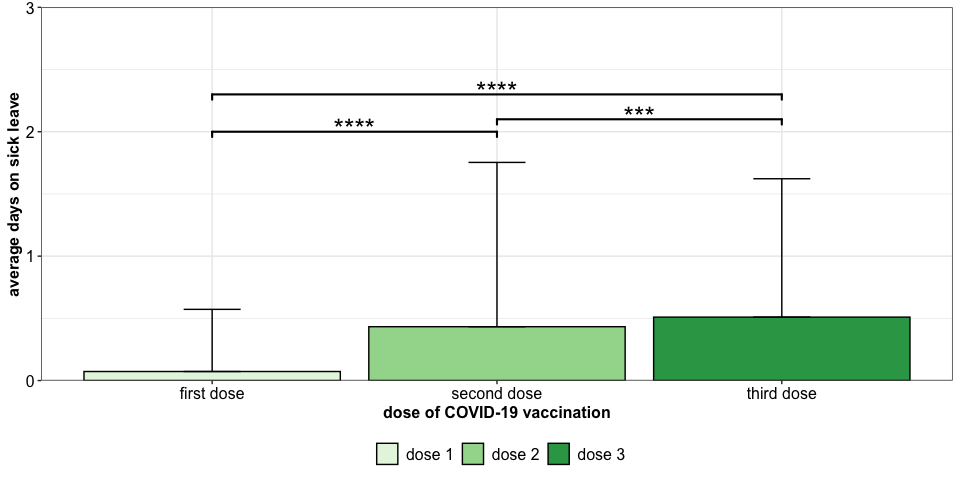<!-- -->

``` r
stat_mwu %>% inner_join(mean_sick_total , by = c("group1" = "sickleave")) %>% 
  inner_join(mean_sick_total, by = c("group2" = "sickleave"), suffix = c(".gr1", ".gr2")) %>% 
  select(-".y.") %>%
  knitr::kable() %>%
  kableExtra::kable_paper() %>%
  kableExtra::kable_styling(position = "left")%>%
  kableExtra::column_spec(1:2, bold = T)
```

<table class=" lightable-paper table" style="font-family: &quot;Arial Narrow&quot;, arial, helvetica, sans-serif; margin-left: auto; margin-right: auto; ">
<thead>
<tr>
<th style="text-align:left;">
group1
</th>
<th style="text-align:left;">
group2
</th>
<th style="text-align:right;">
n1
</th>
<th style="text-align:right;">
n2
</th>
<th style="text-align:right;">
statistic
</th>
<th style="text-align:right;">
p
</th>
<th style="text-align:right;">
p.adj
</th>
<th style="text-align:left;">
p.adj.signif
</th>
<th style="text-align:right;">
y.position
</th>
<th style="text-align:left;">
groups
</th>
<th style="text-align:right;">
xmin
</th>
<th style="text-align:right;">
xmax
</th>
<th style="text-align:right;">
Mean_days.gr1
</th>
<th style="text-align:right;">
SD_days.gr1
</th>
<th style="text-align:right;">
Mean_days.gr2
</th>
<th style="text-align:right;">
SD_days.gr2
</th>
</tr>
</thead>
<tbody>
<tr>
<td style="text-align:left;font-weight: bold;">
dose 1
</td>
<td style="text-align:left;font-weight: bold;">
dose 2
</td>
<td style="text-align:right;">
1704
</td>
<td style="text-align:right;">
1698
</td>
<td style="text-align:right;">
1188953.0
</td>
<td style="text-align:right;">
0.000000
</td>
<td style="text-align:right;">
0.000000
</td>
<td style="text-align:left;">
\*\*\*\*
</td>
<td style="text-align:right;">
2.0
</td>
<td style="text-align:left;">
audosis1, audosis2
</td>
<td style="text-align:right;">
1
</td>
<td style="text-align:right;">
2
</td>
<td style="text-align:right;">
0.0727700
</td>
<td style="text-align:right;">
0.4995456
</td>
<td style="text-align:right;">
0.4328622
</td>
<td style="text-align:right;">
1.320445
</td>
</tr>
<tr>
<td style="text-align:left;font-weight: bold;">
dose 1
</td>
<td style="text-align:left;font-weight: bold;">
dose 3
</td>
<td style="text-align:right;">
1704
</td>
<td style="text-align:right;">
1355
</td>
<td style="text-align:right;">
878155.5
</td>
<td style="text-align:right;">
0.000000
</td>
<td style="text-align:right;">
0.000000
</td>
<td style="text-align:left;">
\*\*\*\*
</td>
<td style="text-align:right;">
2.3
</td>
<td style="text-align:left;">
audosis1, audosis3
</td>
<td style="text-align:right;">
1
</td>
<td style="text-align:right;">
3
</td>
<td style="text-align:right;">
0.0727700
</td>
<td style="text-align:right;">
0.4995456
</td>
<td style="text-align:right;">
0.5099631
</td>
<td style="text-align:right;">
1.112111
</td>
</tr>
<tr>
<td style="text-align:left;font-weight: bold;">
dose 2
</td>
<td style="text-align:left;font-weight: bold;">
dose 3
</td>
<td style="text-align:right;">
1698
</td>
<td style="text-align:right;">
1355
</td>
<td style="text-align:right;">
1082303.5
</td>
<td style="text-align:right;">
0.000171
</td>
<td style="text-align:right;">
0.000314
</td>
<td style="text-align:left;">
\*\*\*
</td>
<td style="text-align:right;">
2.1
</td>
<td style="text-align:left;">
audosis2, audosis3
</td>
<td style="text-align:right;">
2
</td>
<td style="text-align:right;">
3
</td>
<td style="text-align:right;">
0.4328622
</td>
<td style="text-align:right;">
1.3204449
</td>
<td style="text-align:right;">
0.5099631
</td>
<td style="text-align:right;">
1.112111
</td>
</tr>
</tbody>
</table>

## Gender spec.

#### Overview

``` r
gender_sick_leave_oview <- df_sick_longer %>% select(subjectID, sickleave, gender, days) %>% filter(days == 0) %>% 
                   group_by(sickleave, gender) %>% count(name = "healthy") %>% 
                   inner_join(df_sick_longer %>% select(subjectID, sickleave, gender, days) %>% 
                              filter(days > 0) %>% group_by(sickleave, gender) %>% count(name = "sick")) %>% 
                    mutate(percentage = sick/(healthy+sick) * 100,
                           N = healthy+sick) %>% arrange(gender, sickleave)

gender_sick_leave_oview %>%
  knitr::kable() %>%
  kableExtra::kable_paper() %>%
  kableExtra::kable_styling(position = "left")%>%
  kableExtra::column_spec(1, bold = T)
```

<table class=" lightable-paper table" style="font-family: &quot;Arial Narrow&quot;, arial, helvetica, sans-serif; margin-left: auto; margin-right: auto; ">
<thead>
<tr>
<th style="text-align:left;">
sickleave
</th>
<th style="text-align:left;">
gender
</th>
<th style="text-align:right;">
healthy
</th>
<th style="text-align:right;">
sick
</th>
<th style="text-align:right;">
percentage
</th>
<th style="text-align:right;">
N
</th>
</tr>
</thead>
<tbody>
<tr>
<td style="text-align:left;font-weight: bold;">
audosis1
</td>
<td style="text-align:left;">
female
</td>
<td style="text-align:right;">
1323
</td>
<td style="text-align:right;">
56
</td>
<td style="text-align:right;">
4.060914
</td>
<td style="text-align:right;">
1379
</td>
</tr>
<tr>
<td style="text-align:left;font-weight: bold;">
audosis2
</td>
<td style="text-align:left;">
female
</td>
<td style="text-align:right;">
1049
</td>
<td style="text-align:right;">
325
</td>
<td style="text-align:right;">
23.653566
</td>
<td style="text-align:right;">
1374
</td>
</tr>
<tr>
<td style="text-align:left;font-weight: bold;">
audosis3
</td>
<td style="text-align:left;">
female
</td>
<td style="text-align:right;">
788
</td>
<td style="text-align:right;">
333
</td>
<td style="text-align:right;">
29.705620
</td>
<td style="text-align:right;">
1121
</td>
</tr>
<tr>
<td style="text-align:left;font-weight: bold;">
audosis1
</td>
<td style="text-align:left;">
male
</td>
<td style="text-align:right;">
320
</td>
<td style="text-align:right;">
5
</td>
<td style="text-align:right;">
1.538461
</td>
<td style="text-align:right;">
325
</td>
</tr>
<tr>
<td style="text-align:left;font-weight: bold;">
audosis2
</td>
<td style="text-align:left;">
male
</td>
<td style="text-align:right;">
286
</td>
<td style="text-align:right;">
38
</td>
<td style="text-align:right;">
11.728395
</td>
<td style="text-align:right;">
324
</td>
</tr>
<tr>
<td style="text-align:left;font-weight: bold;">
audosis3
</td>
<td style="text-align:left;">
male
</td>
<td style="text-align:right;">
194
</td>
<td style="text-align:right;">
40
</td>
<td style="text-align:right;">
17.094017
</td>
<td style="text-align:right;">
234
</td>
</tr>
</tbody>
</table>

``` r
sick_healthy_probs_gender <- df_sick_longer %>% group_by(subjectID, gender) %>% summarise(days = sum(days)) %>% filter(days == 0) %>% 
                   group_by(gender) %>% summarise(healthy = length(unique(subjectID))) %>% 
                   inner_join(df_sick_longer %>% group_by(subjectID, gender) %>% summarise(days = sum(days)) %>% filter(days != 0) %>% 
                   group_by(gender) %>% summarise(sick = length(unique(subjectID)))) %>% relocate(gender, sick, healthy)

conf_mat <- sick_healthy_probs_gender %>% select(-gender) %>% as.matrix()
rownames(conf_mat) <- sick_healthy_probs_gender %>% pull(gender)

p.val <- format(fisher.test(conf_mat)$p.value, scientific = T, digits = 3)
odds_ratio <- fisher.test(conf_mat)$estimate

mean_sick_gender <- df_sick_longer %>%
            group_by(gender, sickleave) %>% 
            summarise(N_subjects = length(unique(subjectID)),
                      Sum_days = sum(days, na.rm = T),
                      Mean_days = mean(days, na.rm = T),
                      SD_days = sd(days, na.rm = T)) %>%
            mutate(sickleave = gsub(x = sickleave, pattern = "audosis", replacement = "dose "))

stat_mwu <- df_sick_longer %>% select(gender, days, sickleave) %>% group_by(sickleave) %>% 
            rstatix::pairwise_wilcox_test(days ~ gender, p.adjust.method = "BY")  %>%
            rstatix::add_xy_position() %>%
            mutate(sickleave = gsub(x = sickleave, pattern = "audosis", replacement = "dose ")) %>% 
            filter(p.adj.signif < 0.05) 

stat_mwu$y.position <- c(0.75, 1.95 , 1.9)
stat_mwu$xmin <- c(0.77, 1.77, 2.77)
stat_mwu$xmax <- c(1.23, 2.23, 3.23)

plt_avg_sick_gender <- mean_sick_gender %>%
  ggplot2::ggplot(ggplot2::aes(x = sickleave, fill = gender, y = Mean_days)) + 
  ggplot2::geom_col(position = ggplot2::position_dodge(0.9), col = "black") +
  ggplot2::geom_errorbar(aes(ymin = Mean_days, ymax = Mean_days + SD_days), width = 0.2, position = ggplot2::position_dodge(0.9)) +
  ggplot2::theme_bw() +
  ggplot2::scale_x_discrete(labels = c("first dose", "second dose", "third dose")) +
  ggplot2::scale_y_continuous(expand = c(0,0)) + 
  ggplot2::scale_fill_manual(values = c("#D95F02", "#1B9E77")) +
  ggplot2::theme(axis.text = ggplot2::element_text(size = 12, colour = "black"),
                 axis.title = ggplot2::element_text(face = "bold", size = 12),
                 legend.title = ggplot2::element_blank(),
                 legend.text = ggplot2::element_text(size = 12),
                 legend.position = "bottom") +
  ggplot2::ylab("average days on sick leave") +
  ggplot2::xlab("dose of COVID-19 vaccination")  + 
  ggplot2::coord_cartesian(ylim = c(0,2.1)) +
  ggsignif::geom_signif(xmin = stat_mwu$xmin,
                        xmax = stat_mwu$xmax,
                        y_position = stat_mwu$y.position,
                        annotation = stat_mwu$p.adj.signif,
                        tip_length = 0.025, vjust = 0.5, lwd = 0.75, textsize = 7)
plt_avg_sick_gender
```

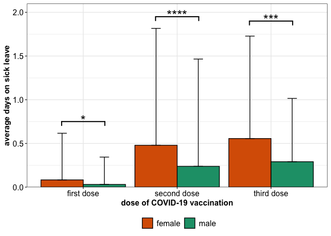<!-- -->

#### Significance

``` r
df_sick_longer %>% select(gender, days, sickleave) %>% group_by(sickleave) %>% 
            rstatix::pairwise_wilcox_test(days ~ gender, p.adjust.method = "BY")  %>%
            mutate(sickleave = gsub(x = sickleave, pattern = "audosis", replacement = "dose ")) %>% 
  inner_join(mean_sick_gender , by = c("group1" = "gender", "sickleave" = "sickleave")) %>% 
  inner_join(mean_sick_gender, by = c("group2" = "gender", "sickleave" = "sickleave"), suffix = c(".gr1", ".gr2")) %>% 
  relocate(sickleave, group1, group2, matches("gr")) %>% select(-`.y.`,-n1, -n2) %>%
  rename(Dosis = sickleave) %>%
  knitr::kable() %>%
  kableExtra::kable_paper() %>%
  kableExtra::kable_styling(position = "left")%>%
  kableExtra::column_spec(1, bold = T)
```

<table class=" lightable-paper table" style='font-family: "Arial Narrow", arial, helvetica, sans-serif; margin-left: auto; margin-right: auto; '>
<thead>
<tr>
<th style="text-align:left;">
Dosis
</th>
<th style="text-align:left;">
group1
</th>
<th style="text-align:left;">
group2
</th>
<th style="text-align:right;">
N_subjects.gr1
</th>
<th style="text-align:right;">
Sum_days.gr1
</th>
<th style="text-align:right;">
Mean_days.gr1
</th>
<th style="text-align:right;">
SD_days.gr1
</th>
<th style="text-align:right;">
N_subjects.gr2
</th>
<th style="text-align:right;">
Sum_days.gr2
</th>
<th style="text-align:right;">
Mean_days.gr2
</th>
<th style="text-align:right;">
SD_days.gr2
</th>
<th style="text-align:right;">
statistic
</th>
<th style="text-align:right;">
p
</th>
<th style="text-align:right;">
p.adj
</th>
<th style="text-align:left;">
p.adj.signif
</th>
</tr>
</thead>
<tbody>
<tr>
<td style="text-align:left;font-weight: bold;">
dose 1
</td>
<td style="text-align:left;">
female
</td>
<td style="text-align:left;">
male
</td>
<td style="text-align:right;">
1379
</td>
<td style="text-align:right;">
114
</td>
<td style="text-align:right;">
0.0826686
</td>
<td style="text-align:right;">
0.5337491
</td>
<td style="text-align:right;">
325
</td>
<td style="text-align:right;">
10
</td>
<td style="text-align:right;">
0.0307692
</td>
<td style="text-align:right;">
0.3127551
</td>
<td style="text-align:right;">
229751.0
</td>
<td style="text-align:right;">
2.80e-02
</td>
<td style="text-align:right;">
2.80e-02
</td>
<td style="text-align:left;">

- </td>
  </tr>
  <tr>
  <td style="text-align:left;font-weight: bold;">
  dose 2
  </td>
  <td style="text-align:left;">
  female
  </td>
  <td style="text-align:left;">
  male
  </td>
  <td style="text-align:right;">
  1374
  </td>
  <td style="text-align:right;">
  658
  </td>
  <td style="text-align:right;">
  0.4788937
  </td>
  <td style="text-align:right;">
  1.3376959
  </td>
  <td style="text-align:right;">
  324
  </td>
  <td style="text-align:right;">
  77
  </td>
  <td style="text-align:right;">
  0.2376543
  </td>
  <td style="text-align:right;">
  1.2275231
  </td>
  <td style="text-align:right;">
  249839.0
  </td>
  <td style="text-align:right;">
  1.60e-06
  </td>
  <td style="text-align:right;">
  1.60e-06
  </td>
  <td style="text-align:left;">
  \*\*\*\*
  </td>
  </tr>
  <tr>
  <td style="text-align:left;font-weight: bold;">
  dose 3
  </td>
  <td style="text-align:left;">
  female
  </td>
  <td style="text-align:left;">
  male
  </td>
  <td style="text-align:right;">
  1121
  </td>
  <td style="text-align:right;">
  623
  </td>
  <td style="text-align:right;">
  0.5557538
  </td>
  <td style="text-align:right;">
  1.1721338
  </td>
  <td style="text-align:right;">
  234
  </td>
  <td style="text-align:right;">
  68
  </td>
  <td style="text-align:right;">
  0.2905983
  </td>
  <td style="text-align:right;">
  0.7243150
  </td>
  <td style="text-align:right;">
  147651.5
  </td>
  <td style="text-align:right;">
  1.13e-04
  </td>
  <td style="text-align:right;">
  1.13e-04
  </td>
  <td style="text-align:left;">
  \*\*\*
  </td>
  </tr>
  </tbody>
  </table>

## Profession spec.

#### Overview

``` r
profession_sick_leave_oview <- df_sick_longer %>% filter(!is.na(profession)) %>%
                   select(subjectID, sickleave, profession, days) %>% filter(days == 0) %>% 
                   group_by(sickleave, profession) %>% count(name = "healthy") %>% 
                   inner_join(df_sick_longer %>% select(subjectID, sickleave, profession, days) %>% 
                              filter(days > 0) %>% group_by(sickleave, profession) %>% count(name = "sick")) %>% 
                    mutate(percentage = sick/(healthy+sick) * 100,
                           N = healthy+sick) %>% arrange(profession, sickleave)

profession_sick_leave_oview %>%
  knitr::kable() %>%
  kableExtra::kable_paper() %>%
  kableExtra::kable_styling(position = "left")%>%
  kableExtra::column_spec(1, bold = T)
```

<table class=" lightable-paper table" style="font-family: &quot;Arial Narrow&quot;, arial, helvetica, sans-serif; margin-left: auto; margin-right: auto; ">
<thead>
<tr>
<th style="text-align:left;">
sickleave
</th>
<th style="text-align:left;">
profession
</th>
<th style="text-align:right;">
healthy
</th>
<th style="text-align:right;">
sick
</th>
<th style="text-align:right;">
percentage
</th>
<th style="text-align:right;">
N
</th>
</tr>
</thead>
<tbody>
<tr>
<td style="text-align:left;font-weight: bold;">
audosis1
</td>
<td style="text-align:left;">
Nursing
</td>
<td style="text-align:right;">
574
</td>
<td style="text-align:right;">
20
</td>
<td style="text-align:right;">
3.367003
</td>
<td style="text-align:right;">
594
</td>
</tr>
<tr>
<td style="text-align:left;font-weight: bold;">
audosis2
</td>
<td style="text-align:left;">
Nursing
</td>
<td style="text-align:right;">
460
</td>
<td style="text-align:right;">
132
</td>
<td style="text-align:right;">
22.297297
</td>
<td style="text-align:right;">
592
</td>
</tr>
<tr>
<td style="text-align:left;font-weight: bold;">
audosis3
</td>
<td style="text-align:left;">
Nursing
</td>
<td style="text-align:right;">
344
</td>
<td style="text-align:right;">
118
</td>
<td style="text-align:right;">
25.541125
</td>
<td style="text-align:right;">
462
</td>
</tr>
<tr>
<td style="text-align:left;font-weight: bold;">
audosis1
</td>
<td style="text-align:left;">
Physicians
</td>
<td style="text-align:right;">
308
</td>
<td style="text-align:right;">
9
</td>
<td style="text-align:right;">
2.839117
</td>
<td style="text-align:right;">
317
</td>
</tr>
<tr>
<td style="text-align:left;font-weight: bold;">
audosis2
</td>
<td style="text-align:left;">
Physicians
</td>
<td style="text-align:right;">
271
</td>
<td style="text-align:right;">
46
</td>
<td style="text-align:right;">
14.511041
</td>
<td style="text-align:right;">
317
</td>
</tr>
<tr>
<td style="text-align:left;font-weight: bold;">
audosis3
</td>
<td style="text-align:left;">
Physicians
</td>
<td style="text-align:right;">
205
</td>
<td style="text-align:right;">
43
</td>
<td style="text-align:right;">
17.338710
</td>
<td style="text-align:right;">
248
</td>
</tr>
<tr>
<td style="text-align:left;font-weight: bold;">
audosis1
</td>
<td style="text-align:left;">
other HCWs with patient contact
</td>
<td style="text-align:right;">
355
</td>
<td style="text-align:right;">
20
</td>
<td style="text-align:right;">
5.333333
</td>
<td style="text-align:right;">
375
</td>
</tr>
<tr>
<td style="text-align:left;font-weight: bold;">
audosis2
</td>
<td style="text-align:left;">
other HCWs with patient contact
</td>
<td style="text-align:right;">
283
</td>
<td style="text-align:right;">
91
</td>
<td style="text-align:right;">
24.331551
</td>
<td style="text-align:right;">
374
</td>
</tr>
<tr>
<td style="text-align:left;font-weight: bold;">
audosis3
</td>
<td style="text-align:left;">
other HCWs with patient contact
</td>
<td style="text-align:right;">
185
</td>
<td style="text-align:right;">
108
</td>
<td style="text-align:right;">
36.860068
</td>
<td style="text-align:right;">
293
</td>
</tr>
<tr>
<td style="text-align:left;font-weight: bold;">
audosis1
</td>
<td style="text-align:left;">
other HCWs without any patient contact
</td>
<td style="text-align:right;">
405
</td>
<td style="text-align:right;">
12
</td>
<td style="text-align:right;">
2.877698
</td>
<td style="text-align:right;">
417
</td>
</tr>
<tr>
<td style="text-align:left;font-weight: bold;">
audosis2
</td>
<td style="text-align:left;">
other HCWs without any patient contact
</td>
<td style="text-align:right;">
320
</td>
<td style="text-align:right;">
94
</td>
<td style="text-align:right;">
22.705314
</td>
<td style="text-align:right;">
414
</td>
</tr>
<tr>
<td style="text-align:left;font-weight: bold;">
audosis3
</td>
<td style="text-align:left;">
other HCWs without any patient contact
</td>
<td style="text-align:right;">
247
</td>
<td style="text-align:right;">
104
</td>
<td style="text-align:right;">
29.629630
</td>
<td style="text-align:right;">
351
</td>
</tr>
</tbody>
</table>

``` r
sick_healthy_probs_gender <- df_sick_longer %>% group_by(subjectID, gender) %>% summarise(days = sum(days)) %>% filter(days == 0) %>% 
                   group_by(gender) %>% summarise(healthy = length(unique(subjectID))) %>% 
                   inner_join(df_sick_longer %>% group_by(subjectID, gender) %>% summarise(days = sum(days)) %>% filter(days != 0) %>% 
                   group_by(gender) %>% summarise(sick = length(unique(subjectID)))) %>% relocate(gender, sick, healthy)

conf_mat <- sick_healthy_probs_gender %>% select(-gender) %>% as.matrix()
rownames(conf_mat) <- sick_healthy_probs_gender %>% pull(gender)

p.val <- format(fisher.test(conf_mat)$p.value, scientific = T, digits = 3)
odds_ratio <- fisher.test(conf_mat)$estimate

mean_sick_profession <- df_sick_longer %>% filter(!is.na(profession)) %>%
            group_by(profession, sickleave) %>% 
            summarise(Mean_days = mean(days, na.rm = T),
                      SD_days = sd(days, na.rm = T)) %>%
            mutate(sickleave = gsub(x = sickleave, pattern = "audosis", replacement = "dose "))

stat_mwu <- df_sick_longer %>% select(profession, days, sickleave) %>% group_by(sickleave) %>% 
            rstatix::pairwise_wilcox_test(days ~ profession, p.adjust.method = "BY")  %>%
            mutate(sickleave = gsub(x = sickleave, pattern = "audosis", replacement = "dose ")) %>% 
            filter(p.adj.signif < 0.05) %>%
            rstatix::add_xy_position()

stat_mwu$y.position <- c(1.75, 2.75, 3,   2.1, 2.4, 2.75, 3)
stat_mwu$xmin <- c(1.67, 1.89, 1.89,   2.67, 2.67, 2.89, 2.89)
stat_mwu$xmax <- c(1.89, 2.11, 2.33,   2.89, 3.11, 3.11, 3.33)

avg_sick_profession_plt <- mean_sick_profession %>%
  ggplot2::ggplot(ggplot2::aes(x = sickleave, fill = profession, y = Mean_days)) + 
  ggplot2::geom_col(position = ggplot2::position_dodge(0.9), col = "black") +
  ggplot2::geom_errorbar(aes(ymin = Mean_days, ymax = Mean_days + SD_days), width = 0.2, position = ggplot2::position_dodge(0.9)) +
  ggplot2::theme_bw() +
  ggplot2::scale_y_continuous(expand = c(0,0)) + 
  ggplot2::scale_x_discrete(labels = c("first dose", "second dose", "third dose")) +
  ggplot2::scale_fill_manual(values = c("#F39B7FFF", "#4DBBD5FF", "#91D1C2FF", "#8491B4FF")) +
  ggplot2::theme(axis.text = ggplot2::element_text(size = 12, colour = "black"),
                 axis.title = ggplot2::element_text(face = "bold", size = 12),
                 legend.title = ggplot2::element_blank(),
                 legend.text = ggplot2::element_text(size = 12),
                 legend.position = "bottom") +
  ggplot2::ylab("average days on sick leave") +
  ggplot2::xlab("dose of COVID-19 vaccination") + 
  ggplot2::coord_cartesian(ylim = c(0,3.2)) +
  ggsignif::geom_signif(xmin = stat_mwu$xmin,
                        xmax = stat_mwu$xmax,
                        y_position = stat_mwu$y.position,
                        annotation = stat_mwu$p.adj.signif,
                        tip_length = 0.025, vjust = 0.5, lwd = 0.75, textsize = 7) +
  ggplot2::guides(fill = ggplot2::guide_legend(nrow = 2))

avg_sick_profession_plt
```

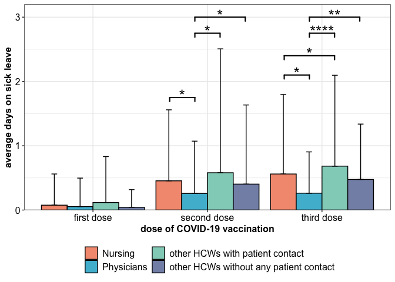<!-- -->

#### Significance

``` r
df_sick_longer %>% select(profession, days, sickleave) %>% group_by(sickleave) %>% 
            rstatix::pairwise_wilcox_test(days ~ profession, p.adjust.method = "BY")  %>%
            mutate(sickleave = gsub(x = sickleave, pattern = "audosis", replacement = "dose ")) %>% 
  inner_join(mean_sick_profession , by = c("group1" = "profession", "sickleave" = "sickleave")) %>% 
  inner_join(mean_sick_profession, by = c("group2" = "profession", "sickleave" = "sickleave"), suffix = c(".gr1", ".gr2")) %>% 
  relocate(sickleave, group1, group2, matches("gr")) %>% select(-`.y.`,-n1, -n2) %>%
  knitr::kable() %>%
  kableExtra::kable_paper() %>%
  kableExtra::kable_styling(position = "left") %>%
  kableExtra::column_spec(1, bold = T)
```

<table class=" lightable-paper table" style='font-family: "Arial Narrow", arial, helvetica, sans-serif; margin-left: auto; margin-right: auto; '>
<thead>
<tr>
<th style="text-align:left;">
sickleave
</th>
<th style="text-align:left;">
group1
</th>
<th style="text-align:left;">
group2
</th>
<th style="text-align:right;">
Mean_days.gr1
</th>
<th style="text-align:right;">
SD_days.gr1
</th>
<th style="text-align:right;">
Mean_days.gr2
</th>
<th style="text-align:right;">
SD_days.gr2
</th>
<th style="text-align:right;">
statistic
</th>
<th style="text-align:right;">
p
</th>
<th style="text-align:right;">
p.adj
</th>
<th style="text-align:left;">
p.adj.signif
</th>
</tr>
</thead>
<tbody>
<tr>
<td style="text-align:left;font-weight: bold;">
dose 1
</td>
<td style="text-align:left;">
Nursing
</td>
<td style="text-align:left;">
Physicians
</td>
<td style="text-align:right;">
0.0757576
</td>
<td style="text-align:right;">
0.4851781
</td>
<td style="text-align:right;">
0.0536278
</td>
<td style="text-align:right;">
0.4432630
</td>
<td style="text-align:right;">
94673.0
</td>
<td style="text-align:right;">
6.49e-01
</td>
<td style="text-align:right;">
1.00e+00
</td>
<td style="text-align:left;">
ns
</td>
</tr>
<tr>
<td style="text-align:left;font-weight: bold;">
dose 1
</td>
<td style="text-align:left;">
Nursing
</td>
<td style="text-align:left;">
other HCWs with patient contact
</td>
<td style="text-align:right;">
0.0757576
</td>
<td style="text-align:right;">
0.4851781
</td>
<td style="text-align:right;">
0.1173333
</td>
<td style="text-align:right;">
0.7143250
</td>
<td style="text-align:right;">
109217.0
</td>
<td style="text-align:right;">
1.40e-01
</td>
<td style="text-align:right;">
6.86e-01
</td>
<td style="text-align:left;">
ns
</td>
</tr>
<tr>
<td style="text-align:left;font-weight: bold;">
dose 1
</td>
<td style="text-align:left;">
Nursing
</td>
<td style="text-align:left;">
other HCWs without any patient contact
</td>
<td style="text-align:right;">
0.0757576
</td>
<td style="text-align:right;">
0.4851781
</td>
<td style="text-align:right;">
0.0431655
</td>
<td style="text-align:right;">
0.2739623
</td>
<td style="text-align:right;">
124490.5
</td>
<td style="text-align:right;">
6.44e-01
</td>
<td style="text-align:right;">
1.00e+00
</td>
<td style="text-align:left;">
ns
</td>
</tr>
<tr>
<td style="text-align:left;font-weight: bold;">
dose 1
</td>
<td style="text-align:left;">
Physicians
</td>
<td style="text-align:left;">
other HCWs with patient contact
</td>
<td style="text-align:right;">
0.0536278
</td>
<td style="text-align:right;">
0.4432630
</td>
<td style="text-align:right;">
0.1173333
</td>
<td style="text-align:right;">
0.7143250
</td>
<td style="text-align:right;">
57940.5
</td>
<td style="text-align:right;">
1.00e-01
</td>
<td style="text-align:right;">
6.86e-01
</td>
<td style="text-align:left;">
ns
</td>
</tr>
<tr>
<td style="text-align:left;font-weight: bold;">
dose 1
</td>
<td style="text-align:left;">
Physicians
</td>
<td style="text-align:left;">
other HCWs without any patient contact
</td>
<td style="text-align:right;">
0.0536278
</td>
<td style="text-align:right;">
0.4432630
</td>
<td style="text-align:right;">
0.0431655
</td>
<td style="text-align:right;">
0.2739623
</td>
<td style="text-align:right;">
66066.0
</td>
<td style="text-align:right;">
9.73e-01
</td>
<td style="text-align:right;">
1.00e+00
</td>
<td style="text-align:left;">
ns
</td>
</tr>
<tr>
<td style="text-align:left;font-weight: bold;">
dose 1
</td>
<td style="text-align:left;">
other HCWs with patient contact
</td>
<td style="text-align:left;">
other HCWs without any patient contact
</td>
<td style="text-align:right;">
0.1173333
</td>
<td style="text-align:right;">
0.7143250
</td>
<td style="text-align:right;">
0.0431655
</td>
<td style="text-align:right;">
0.2739623
</td>
<td style="text-align:right;">
80121.0
</td>
<td style="text-align:right;">
7.80e-02
</td>
<td style="text-align:right;">
6.86e-01
</td>
<td style="text-align:left;">
ns
</td>
</tr>
<tr>
<td style="text-align:left;font-weight: bold;">
dose 2
</td>
<td style="text-align:left;">
Nursing
</td>
<td style="text-align:left;">
Physicians
</td>
<td style="text-align:right;">
0.4543919
</td>
<td style="text-align:right;">
1.1043435
</td>
<td style="text-align:right;">
0.2586751
</td>
<td style="text-align:right;">
0.8128490
</td>
<td style="text-align:right;">
101671.5
</td>
<td style="text-align:right;">
3.00e-03
</td>
<td style="text-align:right;">
2.00e-02
</td>
<td style="text-align:left;">

- </td>
  </tr>
  <tr>
  <td style="text-align:left;font-weight: bold;">
  dose 2
  </td>
  <td style="text-align:left;">
  Nursing
  </td>
  <td style="text-align:left;">
  other HCWs with patient contact
  </td>
  <td style="text-align:right;">
  0.4543919
  </td>
  <td style="text-align:right;">
  1.1043435
  </td>
  <td style="text-align:right;">
  0.5802139
  </td>
  <td style="text-align:right;">
  1.9270152
  </td>
  <td style="text-align:right;">
  108513.0
  </td>
  <td style="text-align:right;">
  4.82e-01
  </td>
  <td style="text-align:right;">
  1.00e+00
  </td>
  <td style="text-align:left;">
  ns
  </td>
  </tr>
  <tr>
  <td style="text-align:left;font-weight: bold;">
  dose 2
  </td>
  <td style="text-align:left;">
  Nursing
  </td>
  <td style="text-align:left;">
  other HCWs without any patient contact
  </td>
  <td style="text-align:right;">
  0.4543919
  </td>
  <td style="text-align:right;">
  1.1043435
  </td>
  <td style="text-align:right;">
  0.4033816
  </td>
  <td style="text-align:right;">
  1.2307946
  </td>
  <td style="text-align:right;">
  123246.5
  </td>
  <td style="text-align:right;">
  8.32e-01
  </td>
  <td style="text-align:right;">
  1.00e+00
  </td>
  <td style="text-align:left;">
  ns
  </td>
  </tr>
  <tr>
  <td style="text-align:left;font-weight: bold;">
  dose 2
  </td>
  <td style="text-align:left;">
  Physicians
  </td>
  <td style="text-align:left;">
  other HCWs with patient contact
  </td>
  <td style="text-align:right;">
  0.2586751
  </td>
  <td style="text-align:right;">
  0.8128490
  </td>
  <td style="text-align:right;">
  0.5802139
  </td>
  <td style="text-align:right;">
  1.9270152
  </td>
  <td style="text-align:right;">
  53147.5
  </td>
  <td style="text-align:right;">
  7.46e-04
  </td>
  <td style="text-align:right;">
  1.10e-02
  </td>
  <td style="text-align:left;">

  - </td>
    </tr>
    <tr>
    <td style="text-align:left;font-weight: bold;">
    dose 2
    </td>
    <td style="text-align:left;">
    Physicians
    </td>
    <td style="text-align:left;">
    other HCWs without any patient contact
    </td>
    <td style="text-align:right;">
    0.2586751
    </td>
    <td style="text-align:right;">
    0.8128490
    </td>
    <td style="text-align:right;">
    0.4033816
    </td>
    <td style="text-align:right;">
    1.2307946
    </td>
    <td style="text-align:right;">
    60271.0
    </td>
    <td style="text-align:right;">
    6.00e-03
    </td>
    <td style="text-align:right;">
    2.90e-02
    </td>
    <td style="text-align:left;">

    - </td>
      </tr>
      <tr>
      <td style="text-align:left;font-weight: bold;">
      dose 2
      </td>
      <td style="text-align:left;">
      other HCWs with patient contact
      </td>
      <td style="text-align:left;">
      other HCWs without any patient contact
      </td>
      <td style="text-align:right;">
      0.5802139
      </td>
      <td style="text-align:right;">
      1.9270152
      </td>
      <td style="text-align:right;">
      0.4033816
      </td>
      <td style="text-align:right;">
      1.2307946
      </td>
      <td style="text-align:right;">
      79393.5
      </td>
      <td style="text-align:right;">
      4.04e-01
      </td>
      <td style="text-align:right;">
      1.00e+00
      </td>
      <td style="text-align:left;">
      ns
      </td>
      </tr>
      <tr>
      <td style="text-align:left;font-weight: bold;">
      dose 3
      </td>
      <td style="text-align:left;">
      Nursing
      </td>
      <td style="text-align:left;">
      Physicians
      </td>
      <td style="text-align:right;">
      0.5606061
      </td>
      <td style="text-align:right;">
      1.2355920
      </td>
      <td style="text-align:right;">
      0.2620968
      </td>
      <td style="text-align:right;">
      0.6425018
      </td>
      <td style="text-align:right;">
      62659.0
      </td>
      <td style="text-align:right;">
      5.00e-03
      </td>
      <td style="text-align:right;">
      2.30e-02
      </td>
      <td style="text-align:left;">

      - </td>
        </tr>
        <tr>
        <td style="text-align:left;font-weight: bold;">
        dose 3
        </td>
        <td style="text-align:left;">
        Nursing
        </td>
        <td style="text-align:left;">
        other HCWs with patient contact
        </td>
        <td style="text-align:right;">
        0.5606061
        </td>
        <td style="text-align:right;">
        1.2355920
        </td>
        <td style="text-align:right;">
        0.6825939
        </td>
        <td style="text-align:right;">
        1.4135853
        </td>
        <td style="text-align:right;">
        61226.0
        </td>
        <td style="text-align:right;">
        6.00e-03
        </td>
        <td style="text-align:right;">
        2.30e-02
        </td>
        <td style="text-align:left;">

        - </td>
          </tr>
          <tr>
          <td style="text-align:left;font-weight: bold;">
          dose 3
          </td>
          <td style="text-align:left;">
          Nursing
          </td>
          <td style="text-align:left;">
          other HCWs without any patient contact
          </td>
          <td style="text-align:right;">
          0.5606061
          </td>
          <td style="text-align:right;">
          1.2355920
          </td>
          <td style="text-align:right;">
          0.4757835
          </td>
          <td style="text-align:right;">
          0.8611357
          </td>
          <td style="text-align:right;">
          79133.0
          </td>
          <td style="text-align:right;">
          4.53e-01
          </td>
          <td style="text-align:right;">
          1.00e+00
          </td>
          <td style="text-align:left;">
          ns
          </td>
          </tr>
          <tr>
          <td style="text-align:left;font-weight: bold;">
          dose 3
          </td>
          <td style="text-align:left;">
          Physicians
          </td>
          <td style="text-align:left;">
          other HCWs with patient contact
          </td>
          <td style="text-align:right;">
          0.2620968
          </td>
          <td style="text-align:right;">
          0.6425018
          </td>
          <td style="text-align:right;">
          0.6825939
          </td>
          <td style="text-align:right;">
          1.4135853
          </td>
          <td style="text-align:right;">
          29059.5
          </td>
          <td style="text-align:right;">
          4.00e-07
          </td>
          <td style="text-align:right;">
          5.20e-06
          </td>
          <td style="text-align:left;">
          \*\*\*\*
          </td>
          </tr>
          <tr>
          <td style="text-align:left;font-weight: bold;">
          dose 3
          </td>
          <td style="text-align:left;">
          Physicians
          </td>
          <td style="text-align:left;">
          other HCWs without any patient contact
          </td>
          <td style="text-align:right;">
          0.2620968
          </td>
          <td style="text-align:right;">
          0.6425018
          </td>
          <td style="text-align:right;">
          0.4757835
          </td>
          <td style="text-align:right;">
          0.8611357
          </td>
          <td style="text-align:right;">
          38077.0
          </td>
          <td style="text-align:right;">
          5.27e-04
          </td>
          <td style="text-align:right;">
          4.00e-03
          </td>
          <td style="text-align:left;">
          \*\*
          </td>
          </tr>
          <tr>
          <td style="text-align:left;font-weight: bold;">
          dose 3
          </td>
          <td style="text-align:left;">
          other HCWs with patient contact
          </td>
          <td style="text-align:left;">
          other HCWs without any patient contact
          </td>
          <td style="text-align:right;">
          0.6825939
          </td>
          <td style="text-align:right;">
          1.4135853
          </td>
          <td style="text-align:right;">
          0.4757835
          </td>
          <td style="text-align:right;">
          0.8611357
          </td>
          <td style="text-align:right;">
          55332.5
          </td>
          <td style="text-align:right;">
          4.50e-02
          </td>
          <td style="text-align:right;">
          1.33e-01
          </td>
          <td style="text-align:left;">
          ns
          </td>
          </tr>
          </tbody>
          </table>

## Rel. to vaccination

``` r
vaccine_order <- data.frame(vaccine = levels(df_sick_longer$vaccine), nr = seq_along(levels(df_sick_longer$vaccine)))

df_sick_longer_sub <- df_sick_longer %>% dplyr::select(subjectID, gender, AgeCategory, profession, dose, vaccine, days)

df_sick_mean_vacc <- df_sick_longer_sub %>% 
                     group_by(vaccine, dose) %>% 
                     summarise(N_subjects = length(unique(subjectID)),
                              Sum_days = sum(days, na.rm = T),
                              Mean_days = mean(days, na.rm = T),
                              SD_days = sd(days, na.rm = T))

stat.test <- df_sick_longer_sub %>% group_by(dose) %>% rstatix::wilcox_test(days ~ vaccine) %>% rstatix::add_significance()

gr_matrix <- as.data.frame(t(combn(levels(df_sick_longer_sub$vaccine), 2)))
colnames(gr_matrix) <- c("group1", "group2")
gr_matrix <- cbind(dose = rep(unique(df_sick_longer_sub$dose), each = 15), gr_matrix)      
                    
gr_count <- df_sick_longer_sub %>% group_by(vaccine, dose) %>% count() 

stat.comp <- gr_matrix %>% full_join(gr_count %>% as.data.frame() %>% mutate(vaccine = as.character(vaccine)), 
                                     by = c("group1" = "vaccine"), suffix = c("1", "2")) %>% 
                 inner_join(gr_count %>% as.data.frame(), by = c("group2" = "vaccine"), suffix = c("1", "2")) %>% 
                 filter(dose1 == dose2) %>% select(-dose, -dose2) %>%
                 inner_join(stat.test) %>% arrange(dose) 

stat.comp <- stat.comp %>% inner_join(vaccine_order, by = c("group1" = "vaccine")) %>% rename(xmin = nr) %>%
             inner_join(vaccine_order, by = c("group2" = "vaccine")) %>% rename(xmax = nr)

stat.comp <- stat.comp %>% filter(p.adj < 0.05) 

box_upper <- df_sick_mean_vacc %>% mutate(days_max = Mean_days + SD_days)

stat.comp <- stat.comp %>% inner_join(box_upper, by = c("group1" = "vaccine", "dose" = "dose")) %>% rename(ygr1 = days_max) %>% 
                           inner_join(box_upper, by = c("group2" = "vaccine", "dose" = "dose"))  %>% rename(ygr2 = days_max)

stat.comp <- stat.comp %>% group_by(group1, group2) %>%
                           mutate(ymax = max(ygr1, ygr2))

stat.comp <- stat.comp %>% mutate(plt_xmin = dplyr::case_when(dose == "dose1" ~ 0.7 + (xmin-1) * 0.2,
                                                              dose == "dose2" ~ 1.8 + (xmin-1) * 0.4,
                                                              dose == "dose3" ~ 2.8 + (xmin-1) * 0.4),
                                  plt_xmax = dplyr::case_when(dose == "dose1" ~ 0.7 + (xmax-1) * 0.2,
                                                              dose == "dose2" ~ 1.8 + (xmax-1) * 0.4,
                                                              dose == "dose3" ~ 2.8 + (xmax-1) * 0.4))
stat.comp <- stat.comp %>% group_by(dose) %>% mutate(ymax = max(ymax))

stat.comp$ymax <- c(3.05, 3.3, 2.8, 2.3)

plt_sick_leave_days_mean <- df_sick_mean_vacc %>% 
  ggplot2::ggplot(ggplot2::aes(x = dose, y = Mean_days, fill = factor(vaccine))) +
  ggplot2::geom_col(position = ggplot2::position_dodge(0.9), col = "black") +
  ggplot2::geom_errorbar(aes(ymin = Mean_days, ymax = Mean_days + SD_days), width = 0.2, position = ggplot2::position_dodge(0.9)) +
  ggplot2::theme_bw() +
  ggplot2::scale_x_discrete(labels = c("first dose", "second dose", "third dose")) +
  ggplot2::scale_y_continuous(expand = c(0,0)) + 
  ggsci::scale_fill_nejm() +
  ggplot2::theme(axis.text = ggplot2::element_text(size = 12, colour = "black"),
                 axis.title = ggplot2::element_text(face = "bold", size = 12),
                 legend.title = ggplot2::element_blank(),
                 legend.text = ggplot2::element_text(size = 12),
                 legend.position = "bottom") +
  ggplot2::ylab("average days on sick leave") +
  ggplot2::xlab("dose of COVID-19 vaccination") +
  ggplot2::coord_cartesian(ylim = c(0, 4)) +
  ggsignif::geom_signif(xmin = stat.comp$plt_xmin,
                        xmax = stat.comp$plt_xmax,
                        y_position = stat.comp$ymax,
                        annotation = stat.comp$p.adj.signif,
                        tip_length = 0.025, vjust = 0.5, lwd = 0.75, textsize = 7) +
  ggplot2::guides(fill = ggplot2::guide_legend(nrow = 2))


plt_sick_leave_days_mean
```

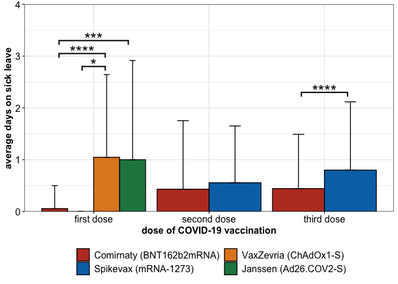<!-- -->

#### Significance

``` r
stat.test %>% dplyr::select(-p.adj, -matches("x|y")) %>% dplyr::rename(p.value = p, p.value.signif = p.adj.signif) %>%
              dplyr::mutate(group1 = gsub(x = group1, pattern = "dose", replace = "dose "),
                            group2 = gsub(x = group2, pattern = "dose", replace = "dose ")) %>%
  knitr::kable() %>%
  kableExtra::kable_paper() %>%
  kableExtra::kable_styling(position = "left")%>%
  kableExtra::column_spec(1:2, bold = T)
```

<table class=" lightable-paper table" style='font-family: "Arial Narrow", arial, helvetica, sans-serif; margin-left: auto; margin-right: auto; '>
<thead>
<tr>
<th style="text-align:left;">
dose
</th>
<th style="text-align:left;">
group1
</th>
<th style="text-align:left;">
group2
</th>
<th style="text-align:right;">
n1
</th>
<th style="text-align:right;">
n2
</th>
<th style="text-align:right;">
statistic
</th>
<th style="text-align:right;">
p.value
</th>
<th style="text-align:left;">
p.value.signif
</th>
</tr>
</thead>
<tbody>
<tr>
<td style="text-align:left;font-weight: bold;">
dose1
</td>
<td style="text-align:left;font-weight: bold;">
Comirnaty (BNT162b2mRNA)
</td>
<td style="text-align:left;">
Spikevax (mRNA-1273)
</td>
<td style="text-align:right;">
1664
</td>
<td style="text-align:right;">
12
</td>
<td style="text-align:right;">
10272.0
</td>
<td style="text-align:right;">
5.51e-01
</td>
<td style="text-align:left;">
ns
</td>
</tr>
<tr>
<td style="text-align:left;font-weight: bold;">
dose1
</td>
<td style="text-align:left;font-weight: bold;">
Comirnaty (BNT162b2mRNA)
</td>
<td style="text-align:left;">
VaxZevria (ChAdOx1-S)
</td>
<td style="text-align:right;">
1664
</td>
<td style="text-align:right;">
21
</td>
<td style="text-align:right;">
8816.5
</td>
<td style="text-align:right;">
0.00e+00
</td>
<td style="text-align:left;">
\*\*\*\*
</td>
</tr>
<tr>
<td style="text-align:left;font-weight: bold;">
dose1
</td>
<td style="text-align:left;font-weight: bold;">
Comirnaty (BNT162b2mRNA)
</td>
<td style="text-align:left;">
Janssen (Ad26.COV2-S)
</td>
<td style="text-align:right;">
1664
</td>
<td style="text-align:right;">
7
</td>
<td style="text-align:right;">
4299.0
</td>
<td style="text-align:right;">
5.02e-05
</td>
<td style="text-align:left;">
\*\*\*
</td>
</tr>
<tr>
<td style="text-align:left;font-weight: bold;">
dose1
</td>
<td style="text-align:left;font-weight: bold;">
Spikevax (mRNA-1273)
</td>
<td style="text-align:left;">
VaxZevria (ChAdOx1-S)
</td>
<td style="text-align:right;">
12
</td>
<td style="text-align:right;">
21
</td>
<td style="text-align:right;">
60.0
</td>
<td style="text-align:right;">
3.00e-03
</td>
<td style="text-align:left;">

- </td>
  </tr>
  <tr>
  <td style="text-align:left;font-weight: bold;">
  dose1
  </td>
  <td style="text-align:left;font-weight: bold;">
  Spikevax (mRNA-1273)
  </td>
  <td style="text-align:left;">
  Janssen (Ad26.COV2-S)
  </td>
  <td style="text-align:right;">
  12
  </td>
  <td style="text-align:right;">
  7
  </td>
  <td style="text-align:right;">
  30.0
  </td>
  <td style="text-align:right;">
  6.80e-02
  </td>
  <td style="text-align:left;">
  ns
  </td>
  </tr>
  <tr>
  <td style="text-align:left;font-weight: bold;">
  dose1
  </td>
  <td style="text-align:left;font-weight: bold;">
  VaxZevria (ChAdOx1-S)
  </td>
  <td style="text-align:left;">
  Janssen (Ad26.COV2-S)
  </td>
  <td style="text-align:right;">
  21
  </td>
  <td style="text-align:right;">
  7
  </td>
  <td style="text-align:right;">
  84.5
  </td>
  <td style="text-align:right;">
  5.41e-01
  </td>
  <td style="text-align:left;">
  ns
  </td>
  </tr>
  <tr>
  <td style="text-align:left;font-weight: bold;">
  dose2
  </td>
  <td style="text-align:left;font-weight: bold;">
  Comirnaty (BNT162b2mRNA)
  </td>
  <td style="text-align:left;">
  Spikevax (mRNA-1273)
  </td>
  <td style="text-align:right;">
  1680
  </td>
  <td style="text-align:right;">
  18
  </td>
  <td style="text-align:right;">
  14076.0
  </td>
  <td style="text-align:right;">
  4.81e-01
  </td>
  <td style="text-align:left;">
  ns
  </td>
  </tr>
  <tr>
  <td style="text-align:left;font-weight: bold;">
  dose3
  </td>
  <td style="text-align:left;font-weight: bold;">
  Comirnaty (BNT162b2mRNA)
  </td>
  <td style="text-align:left;">
  Spikevax (mRNA-1273)
  </td>
  <td style="text-align:right;">
  1100
  </td>
  <td style="text-align:right;">
  255
  </td>
  <td style="text-align:right;">
  116731.0
  </td>
  <td style="text-align:right;">
  1.00e-07
  </td>
  <td style="text-align:left;">
  \*\*\*\*
  </td>
  </tr>
  </tbody>
  </table>

# HCWs on sick leave

## Total

``` r
sick_days_vacc <- df_sick_longer %>% 
                  group_by(dose, sickleave, vaccine) %>%
                  count(.drop = FALSE) %>%
                  full_join(df_sick_longer %>% filter(days > 0) %>%
                              group_by(dose, sickleave, vaccine) %>%
                              dplyr::count(name = "n_sick", .drop = FALSE)) %>%
                   mutate(n_sick = replace(n_sick, is.na(n_sick), 0)) 

sick_hcw_overall_rel <- df_sick_longer %>% 
                  group_by(dose, sickleave) %>%
                  count(.drop = FALSE) %>%
                  full_join(df_sick_longer %>% filter(days > 0) %>%
                              group_by(dose, sickleave) %>%
                              dplyr::count(name = "n_sick", .drop = FALSE)) %>%
                   mutate(n_sick = replace(n_sick, is.na(n_sick), 0)) 

gr_labs <- c("Dose 1", "Dose 2", "Dose 3")
names(gr_labs) <- paste0("dose", 1:3)

sick_hcw_df <- sick_hcw_overall_rel %>% tidyr::pivot_longer(cols = c(n, n_sick), names_to = "n_subset", values_to = "number")  %>% ungroup() %>% select(!sickleave) %>%
                   mutate(dose = gsub(x = dose, pattern = "dose", replacement = ""),
                          n_subset = if_else(n_subset == "n", true = "#hcw", false = "#hcw on sick leave")) %>%
                  tidyr::pivot_wider(names_from = n_subset, values_from = number) 


dose <- as.character(unique(sick_hcw_df$dose))
stats_hcw_overall <- c()
exclude <- c()
for(dose_i in dose){
  exclude <- c(exclude, dose_i)
  for(dose_j in dose[!dose %in% exclude]){
      
    tmp_mat <- sick_hcw_df %>% filter(dose %in% c(dose_i, dose_j)) %>% ungroup() %>% select(matches("hcw")) %>% as.matrix()
    tmp_mat[,1] <- tmp_mat[,1] - tmp_mat[,2]
    tmp_mat <- tmp_mat[,2:1]
    stats_hcw_overall <- rbind(stats_hcw_overall, data.frame(dose.gr1 = dose_i, dose.gr2 = dose_j, 
                                                             sick.gr1 = tmp_mat[1,1],
                                                             sick.gr2 = tmp_mat[2,1],
                                                             not.sick.gr1 = tmp_mat[1,2],
                                                             not.sick.gr2 = tmp_mat[2,2],
                                                             odds_ratio = fisher.test(tmp_mat)$estimate,
                                                             p.value = fisher.test(tmp_mat)$p.value))
  }
}
stats_hcw_overall <- stats_hcw_overall %>% as_tibble()

stats_hcw_overall_plt <- stats_hcw_overall
stats_hcw_overall_plt$xmin <- as.numeric(stats_hcw_overall_plt$dose.gr1)
stats_hcw_overall_plt$xmax <- as.numeric(stats_hcw_overall_plt$dose.gr2)
stats_hcw_overall_plt$y.position <- c(0.28, 0.35, 0.45)

stats_hcw_overall_plt <- stats_hcw_overall_plt %>% rstatix::add_significance(p.col = "p.value")

plt_rels <- sick_hcw_overall_rel %>% group_by(dose) %>% 
                   summarise(n_sick_freq = Hmisc::binconf(x = n_sick, n = n)[1],
                             CI_upper = Hmisc::binconf(x = n_sick, n = n)[3])


plt_hcw_leave <-  plt_rels %>%
  ggplot2::ggplot(ggplot2::aes(x = dose, y = n_sick_freq * 100, fill = dose)) +
  ggplot2::geom_col(col = "black") +
  ggplot2::geom_errorbar(aes(ymin = n_sick_freq*100, ymax = CI_upper*100), width = 0.2) +
  ggplot2::theme_bw() +
  ggplot2::scale_x_discrete(labels = c("first dose", "second dose", "third dose")) +
  ggplot2::scale_fill_manual(values = c("#9ECAE1", "#4292C6", "#08519C")) + 
  ggplot2::theme(axis.text = ggplot2::element_text(size = 12, colour = "black"),
                 axis.title = ggplot2::element_text(face = "bold", size = 12),
                 legend.title = ggplot2::element_blank(),
                 legend.text = ggplot2::element_text(size = 12),
                 legend.position = "none") +
  ggplot2::ylab("% sick HCWs") +
  ggplot2::xlab("dose of COVID-19 vaccination") +
  ggplot2::coord_cartesian(ylim = c(0,100)) +
  ggplot2::scale_y_continuous(expand = c(0,0)) + 
  ggplot2::guides(fill = ggplot2::guide_legend(nrow = 2)) +
  ggsignif::geom_signif(xmin = stats_hcw_overall_plt$xmin,
                        xmax = stats_hcw_overall_plt$xmax,
                        y_position = stats_hcw_overall_plt$y.position * 100,
                        annotation = stats_hcw_overall_plt$p.value.signif,
                        tip_length = 0.05, vjust = 0.5, lwd = 0.75, textsize = 7) 


plt_hcw_leave
```

<!-- -->

#### Significance

``` r
stats_hcw_overall %>%
  kable() %>%
  kableExtra::kable_paper() %>%
  kableExtra::kable_styling(position = "left")%>%
  kableExtra::column_spec(1, bold = T)
```

<table class=" lightable-paper table" style="font-family: &quot;Arial Narrow&quot;, arial, helvetica, sans-serif; margin-left: auto; margin-right: auto; ">
<thead>
<tr>
<th style="text-align:left;">
dose.gr1
</th>
<th style="text-align:left;">
dose.gr2
</th>
<th style="text-align:right;">
sick.gr1
</th>
<th style="text-align:right;">
sick.gr2
</th>
<th style="text-align:right;">
not.sick.gr1
</th>
<th style="text-align:right;">
not.sick.gr2
</th>
<th style="text-align:right;">
odds_ratio
</th>
<th style="text-align:right;">
p.value
</th>
</tr>
</thead>
<tbody>
<tr>
<td style="text-align:left;font-weight: bold;">
1
</td>
<td style="text-align:left;">
2
</td>
<td style="text-align:right;">
61
</td>
<td style="text-align:right;">
363
</td>
<td style="text-align:right;">
1643
</td>
<td style="text-align:right;">
1335
</td>
<td style="text-align:right;">
0.1365863
</td>
<td style="text-align:right;">
0.00e+00
</td>
</tr>
<tr>
<td style="text-align:left;font-weight: bold;">
1
</td>
<td style="text-align:left;">
3
</td>
<td style="text-align:right;">
61
</td>
<td style="text-align:right;">
373
</td>
<td style="text-align:right;">
1643
</td>
<td style="text-align:right;">
982
</td>
<td style="text-align:right;">
0.0978164
</td>
<td style="text-align:right;">
0.00e+00
</td>
</tr>
<tr>
<td style="text-align:left;font-weight: bold;">
2
</td>
<td style="text-align:left;">
3
</td>
<td style="text-align:right;">
363
</td>
<td style="text-align:right;">
373
</td>
<td style="text-align:right;">
1335
</td>
<td style="text-align:right;">
982
</td>
<td style="text-align:right;">
0.7159524
</td>
<td style="text-align:right;">
8.84e-05
</td>
</tr>
</tbody>
</table>

## Rel. to Vaccination

#### Overview

``` r
sick_days_vacc %>% tidyr::pivot_longer(cols = c(n, n_sick), names_to = "n_subset", values_to = "number") %>% filter(vaccine != "Other") %>% ungroup() %>% select(!sickleave) %>%
                   mutate(dose = gsub(x = dose, pattern = "dose", replacement = ""),
                          n_subset = if_else(n_subset == "n", true = "#hcw", false = "#hcw on sick leave")) %>%
                  tidyr::pivot_wider(names_from = n_subset, values_from = number) %>%
  kable() %>%
  kableExtra::kable_paper() %>%
  kableExtra::kable_styling(position = "left")%>%
  kableExtra::column_spec(1, bold = T)
```

<table class=" lightable-paper table" style="font-family: &quot;Arial Narrow&quot;, arial, helvetica, sans-serif; margin-left: auto; margin-right: auto; ">
<thead>
<tr>
<th style="text-align:left;">
dose
</th>
<th style="text-align:left;">
vaccine
</th>
<th style="text-align:right;">
\#hcw
</th>
<th style="text-align:right;">
\#hcw on sick leave
</th>
</tr>
</thead>
<tbody>
<tr>
<td style="text-align:left;font-weight: bold;">
1
</td>
<td style="text-align:left;">
Comirnaty (BNT162b2mRNA)
</td>
<td style="text-align:right;">
1664
</td>
<td style="text-align:right;">
48
</td>
</tr>
<tr>
<td style="text-align:left;font-weight: bold;">
1
</td>
<td style="text-align:left;">
Spikevax (mRNA-1273)
</td>
<td style="text-align:right;">
12
</td>
<td style="text-align:right;">
0
</td>
</tr>
<tr>
<td style="text-align:left;font-weight: bold;">
1
</td>
<td style="text-align:left;">
VaxZevria (ChAdOx1-S)
</td>
<td style="text-align:right;">
21
</td>
<td style="text-align:right;">
11
</td>
</tr>
<tr>
<td style="text-align:left;font-weight: bold;">
1
</td>
<td style="text-align:left;">
Janssen (Ad26.COV2-S)
</td>
<td style="text-align:right;">
7
</td>
<td style="text-align:right;">
2
</td>
</tr>
<tr>
<td style="text-align:left;font-weight: bold;">
2
</td>
<td style="text-align:left;">
Comirnaty (BNT162b2mRNA)
</td>
<td style="text-align:right;">
1680
</td>
<td style="text-align:right;">
358
</td>
</tr>
<tr>
<td style="text-align:left;font-weight: bold;">
2
</td>
<td style="text-align:left;">
Spikevax (mRNA-1273)
</td>
<td style="text-align:right;">
18
</td>
<td style="text-align:right;">
5
</td>
</tr>
<tr>
<td style="text-align:left;font-weight: bold;">
3
</td>
<td style="text-align:left;">
Comirnaty (BNT162b2mRNA)
</td>
<td style="text-align:right;">
1100
</td>
<td style="text-align:right;">
270
</td>
</tr>
<tr>
<td style="text-align:left;font-weight: bold;">
3
</td>
<td style="text-align:left;">
Spikevax (mRNA-1273)
</td>
<td style="text-align:right;">
255
</td>
<td style="text-align:right;">
103
</td>
</tr>
</tbody>
</table>

``` r
sick_leave_df <- sick_days_vacc %>% tidyr::pivot_longer(cols = c(n, n_sick), names_to = "n_subset", values_to = "number") %>% filter(vaccine != "Other") %>% ungroup() %>% select(!sickleave) %>%
                   mutate(dose = gsub(x = dose, pattern = "dose", replacement = ""),
                          n_subset = if_else(n_subset == "n", true = "#hcw", false = "#hcw on sick leave")) %>%
                  tidyr::pivot_wider(names_from = n_subset, values_from = number) %>% group_by(dose, vaccine)


stats_sick_leave <- do.call("rbind", lapply(split(sick_leave_df, f = sick_leave_df$dose), function(mat){
  
  vaccs <- as.character(unique(mat$vaccine))
  df_comp <- c()
  exclude <- c()
  for(vaccs_i in vaccs){
    exclude <- c(exclude, vaccs_i)
    for(vaccs_j in vaccs[!vaccs %in% exclude]){
      
      tmp_mat <- mat %>% filter(vaccine %in% c(vaccs_i, vaccs_j)) %>% ungroup() %>% select(matches("hcw")) %>% as.matrix()
      tmp_mat[,1] <- tmp_mat[,1] - tmp_mat[,2]
      tmp_mat <- tmp_mat[,2:1]
      df_comp <- rbind(df_comp, data.frame(dose = unique(mat$dose), group1 = vaccs_i, group2 = vaccs_j, 
                                            sick.gr1 = tmp_mat[1,1],
                                            sick.gr2 = tmp_mat[2,1],
                                            not.sick.gr1 = tmp_mat[1,2],
                                            not.sick.gr2 = tmp_mat[2,2],
                                            odds_ratio = fisher.test(tmp_mat)$estimate,
                                            p.value = fisher.test(tmp_mat)$p.value))
    }
  }
  df_comp
}))

stats_sick_leave <- cbind(stats_sick_leave, p.adj = p.adjust(stats_sick_leave$p.value, method = "BY")) %>% as_tibble()

stats_sick_leave_plt <- stats_sick_leave %>% filter(p.adj < 0.05)
stats_sick_leave_plt$xmin <- c(0.66, 0.89, 2.77)
stats_sick_leave_plt$xmax <- c(1.11, 1.11, 3.23)
stats_sick_leave_plt$y.position <- c(0.8, 0.75, 0.52)

stats_sick_leave_plt <- stats_sick_leave_plt %>% rstatix::add_significance(p.col = "p.adj")

plt_rels <- sick_days_vacc %>% group_by(dose, vaccine) %>% 
                   summarise(n_sick_freq = Hmisc::binconf(x = n_sick, n = n)[1],
                          CI_upper = Hmisc::binconf(x = n_sick, n = n)[3]) %>% filter(vaccine != "Others")


plt_vacc_on_leave <-  plt_rels %>%
  ggplot2::ggplot(ggplot2::aes(x = dose, y = n_sick_freq * 100, fill = vaccine)) +
  ggplot2::geom_col(position = ggplot2::position_dodge(0.9), col = "black") +
  ggplot2::geom_errorbar(aes(ymin = n_sick_freq*100, ymax = CI_upper*100), width = 0.2, position = ggplot2::position_dodge(0.9)) +
  ggplot2::theme_bw() +
  ggplot2::scale_x_discrete(labels = c("first dose", "second dose", "third dose")) +
  ggsci::scale_fill_nejm() +
  ggplot2::scale_y_continuous(expand = c(0,0)) + 
  ggplot2::theme(axis.text = ggplot2::element_text(size = 12, colour = "black"),
                 axis.title = ggplot2::element_text(face = "bold", size = 12),
                 legend.title = ggplot2::element_blank(),
                 legend.text = ggplot2::element_text(size = 12),
                 legend.position = "bottom") +
  ggplot2::ylab("% sick HCWs due to vaccination") +
  ggplot2::xlab("dose of COVID-19 vaccination") +
  ggplot2::coord_cartesian(ylim = c(0,100)) +
  ggplot2::guides(fill = ggplot2::guide_legend(nrow = 2)) +
  ggsignif::geom_signif(xmin = stats_sick_leave_plt$xmin,
                        xmax = stats_sick_leave_plt$xmax,
                        y_position = stats_sick_leave_plt$y.position * 100,
                        annotation = stats_sick_leave_plt$p.adj.signif,
                        tip_length = 0.025, vjust = 0.5, lwd = 0.75, textsize = 7) 

plt_list_figure_2[[4]] <- plt_vacc_on_leave
plt_vacc_on_leave
```

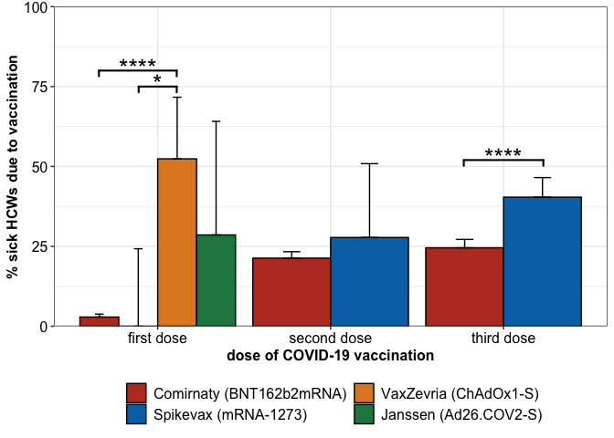<!-- -->

#### Significance

``` r
stats_sick_leave %>% mutate(p.value = format(p.value, scientific = T, digits = 2),
                            p.adj = format(p.adj, scientific = T, digits = 2)) %>%
  knitr::kable() %>%
  kableExtra::kable_paper() %>%
  kableExtra::kable_styling(position = "left")%>%
  kableExtra::column_spec(1, bold = T)
```

<table class=" lightable-paper table" style="font-family: &quot;Arial Narrow&quot;, arial, helvetica, sans-serif; margin-left: auto; margin-right: auto; ">
<thead>
<tr>
<th style="text-align:left;">
dose
</th>
<th style="text-align:left;">
group1
</th>
<th style="text-align:left;">
group2
</th>
<th style="text-align:right;">
sick.gr1
</th>
<th style="text-align:right;">
sick.gr2
</th>
<th style="text-align:right;">
not.sick.gr1
</th>
<th style="text-align:right;">
not.sick.gr2
</th>
<th style="text-align:right;">
odds_ratio
</th>
<th style="text-align:left;">
p.value
</th>
<th style="text-align:left;">
p.adj
</th>
</tr>
</thead>
<tbody>
<tr>
<td style="text-align:left;font-weight: bold;">
1
</td>
<td style="text-align:left;">
Comirnaty (BNT162b2mRNA)
</td>
<td style="text-align:left;">
Spikevax (mRNA-1273)
</td>
<td style="text-align:right;">
48
</td>
<td style="text-align:right;">
0
</td>
<td style="text-align:right;">
1616
</td>
<td style="text-align:right;">
12
</td>
<td style="text-align:right;">
Inf
</td>
<td style="text-align:left;">
1.0e+00
</td>
<td style="text-align:left;">
1.0e+00
</td>
</tr>
<tr>
<td style="text-align:left;font-weight: bold;">
1
</td>
<td style="text-align:left;">
Comirnaty (BNT162b2mRNA)
</td>
<td style="text-align:left;">
VaxZevria (ChAdOx1-S)
</td>
<td style="text-align:right;">
48
</td>
<td style="text-align:right;">
11
</td>
<td style="text-align:right;">
1616
</td>
<td style="text-align:right;">
10
</td>
<td style="text-align:right;">
0.0272636
</td>
<td style="text-align:left;">
1.0e-11
</td>
<td style="text-align:left;">
2.2e-10
</td>
</tr>
<tr>
<td style="text-align:left;font-weight: bold;">
1
</td>
<td style="text-align:left;">
Comirnaty (BNT162b2mRNA)
</td>
<td style="text-align:left;">
Janssen (Ad26.COV2-S)
</td>
<td style="text-align:right;">
48
</td>
<td style="text-align:right;">
2
</td>
<td style="text-align:right;">
1616
</td>
<td style="text-align:right;">
5
</td>
<td style="text-align:right;">
0.0746554
</td>
<td style="text-align:left;">
1.7e-02
</td>
<td style="text-align:left;">
9.1e-02
</td>
</tr>
<tr>
<td style="text-align:left;font-weight: bold;">
1
</td>
<td style="text-align:left;">
Spikevax (mRNA-1273)
</td>
<td style="text-align:left;">
VaxZevria (ChAdOx1-S)
</td>
<td style="text-align:right;">
0
</td>
<td style="text-align:right;">
11
</td>
<td style="text-align:right;">
12
</td>
<td style="text-align:right;">
10
</td>
<td style="text-align:right;">
0.0000000
</td>
<td style="text-align:left;">
2.1e-03
</td>
<td style="text-align:left;">
1.5e-02
</td>
</tr>
<tr>
<td style="text-align:left;font-weight: bold;">
1
</td>
<td style="text-align:left;">
Spikevax (mRNA-1273)
</td>
<td style="text-align:left;">
Janssen (Ad26.COV2-S)
</td>
<td style="text-align:right;">
0
</td>
<td style="text-align:right;">
2
</td>
<td style="text-align:right;">
12
</td>
<td style="text-align:right;">
5
</td>
<td style="text-align:right;">
0.0000000
</td>
<td style="text-align:left;">
1.2e-01
</td>
<td style="text-align:left;">
5.3e-01
</td>
</tr>
<tr>
<td style="text-align:left;font-weight: bold;">
1
</td>
<td style="text-align:left;">
VaxZevria (ChAdOx1-S)
</td>
<td style="text-align:left;">
Janssen (Ad26.COV2-S)
</td>
<td style="text-align:right;">
11
</td>
<td style="text-align:right;">
2
</td>
<td style="text-align:right;">
10
</td>
<td style="text-align:right;">
5
</td>
<td style="text-align:right;">
2.6538644
</td>
<td style="text-align:left;">
4.0e-01
</td>
<td style="text-align:left;">
1.0e+00
</td>
</tr>
<tr>
<td style="text-align:left;font-weight: bold;">
2
</td>
<td style="text-align:left;">
Comirnaty (BNT162b2mRNA)
</td>
<td style="text-align:left;">
Spikevax (mRNA-1273)
</td>
<td style="text-align:right;">
358
</td>
<td style="text-align:right;">
5
</td>
<td style="text-align:right;">
1322
</td>
<td style="text-align:right;">
13
</td>
<td style="text-align:right;">
0.7042448
</td>
<td style="text-align:left;">
5.6e-01
</td>
<td style="text-align:left;">
1.0e+00
</td>
</tr>
<tr>
<td style="text-align:left;font-weight: bold;">
3
</td>
<td style="text-align:left;">
Comirnaty (BNT162b2mRNA)
</td>
<td style="text-align:left;">
Spikevax (mRNA-1273)
</td>
<td style="text-align:right;">
270
</td>
<td style="text-align:right;">
103
</td>
<td style="text-align:right;">
830
</td>
<td style="text-align:right;">
152
</td>
<td style="text-align:right;">
0.4803391
</td>
<td style="text-align:left;">
8.0e-07
</td>
<td style="text-align:left;">
8.7e-06
</td>
</tr>
</tbody>
</table>

# Medication after vaccination

## Total

``` r
df_med <-  df_inab %>%
  tidyr::pivot_longer(cols = matches("dose"), names_to = "dose", values_to = "vaccine") %>%
  tidyr::pivot_longer(cols = matches("meds[1-3]"), names_to = "medication", values_to = "no_meds") %>%
  filter(!(dose == "dose1" & medication %in% c("meds2", "meds3")),
         !(dose == "dose2" & medication %in% c("meds1", "meds3")),
         !(dose == "dose3" & medication %in% c("meds1", "meds2")),
         !is.na(vaccine)) %>% select(subjectID, gender, profession, vaccine, dose, medication, no_meds) %>%
  mutate(meds = if_else(no_meds == 0, true = 1, false = 0))

df_sub <- df_med %>% group_by(dose, meds) %>% count()
vaccinations <- unique(df_sub$dose)
vaccs_done <- c()

res_list <- list()
i <- 1
for(dose1 in vaccinations){
  
  vaccs_done <- c(vaccs_done, dose1)
  for(dose2 in vaccinations[-which(vaccinations %in% vaccs_done)]){
   
     fisher_mat <- df_sub %>% filter(dose %in% c(dose1, dose2)) %>% tidyr::pivot_wider(names_from = meds, values_from = n)
     
     fisher_res <- fisher.test(fisher_mat[,c("1","0")] %>% as.matrix())
     
     res_list[[i]] <- data.frame(group1 = dose1, group2 = dose2, 
                                 no.med.gr1 = as.numeric(fisher_mat[1,2]), 
                                 med.gr1 = as.numeric(fisher_mat[1,3]), 
                                 no.med.gr2 = as.numeric(fisher_mat[2,2]), 
                                 med.gr2 = as.numeric(fisher_mat[2,3]),
                                 odds_ratio = fisher_res$estimate, p.value = as.numeric(fisher_res$p.value))
     i <<- i + 1
  }
}

fisher_res <- do.call("rbind", res_list) %>% as_tibble()

mean_meds_total <- df_med %>%
            group_by(dose) %>% 
            summarise(Mean_meds = mean(meds, na.rm = T),
                      CI_upper = Hmisc::binconf(n = n(), x = sum(meds))[3]) %>%
            mutate(dose = gsub(x = dose, pattern = "dose", replacement = "dose"))

fisher_res$xmin <- c(1, 1, 2)
fisher_res$xmax <- c(2, 3, 3)
fisher_res$y.position <- c(0.53, 1.0, 0.92) * 100

fisher_res <- fisher_res %>% rstatix::add_significance(p.col = "p.value")

avg_meds_total_plt <- mean_meds_total %>%
  ggplot2::ggplot(ggplot2::aes(x = dose, fill = dose, y = Mean_meds * 100)) + 
  ggplot2::geom_col(position = ggplot2::position_dodge(0.9), col = "black") +
  ggplot2::geom_errorbar(aes(ymin = Mean_meds * 100, ymax = CI_upper * 100), width = 0.2, position = ggplot2::position_dodge(0.9)) +
  ggplot2::theme_bw() +
  # ggsci::scale_fill_nejm() +
  ggplot2::scale_x_discrete(labels = c("first dose", "second dose", "third dose")) +
  ggplot2::scale_y_continuous(expand = c(0,0), breaks = seq(from = 0, 125, 25), labels = c(as.character(seq(from = 0, 105, 25)), "")) + 
  ggplot2::scale_fill_manual(values = c("#E5F5E0", "#A1D99B", "#31A354")) + 
  ggplot2::theme(axis.text = ggplot2::element_text(size = 12, colour = "black"),
                 axis.title = ggplot2::element_text(face = "bold", size = 12),
                 legend.title = ggplot2::element_blank(),
                 legend.text = ggplot2::element_text(size = 12),
                 legend.position = "bottom") +
  ggplot2::coord_cartesian(ylim = c(0,120)) + 
  ggplot2::ylab("% HCWs with post-vacc. medication intake") +
  ggplot2::xlab("dose of COVID-19 vaccination") + 
  ggsignif::geom_signif(xmin = fisher_res$xmin,
                        xmax = fisher_res$xmax,
                        y_position = fisher_res$y.position,
                        annotation = fisher_res$p.value.signif,
                        tip_length = 0.025, vjust = 0.5, lwd = 0.75, textsize = 7)
avg_meds_total_plt
```

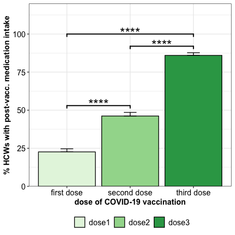<!-- -->

#### Significance

``` r
fisher_res %>% 
  select(-matches("(meds.|^x|^y|signif)")) %>%
  mutate(p.value = format(p.value, scientific = T, digits = 3)) %>% 
  relocate(group1, group2, starts_with("med"), starts_with("no.med")) %>%
  knitr::kable() %>%
  kableExtra::kable_paper() %>%
  kableExtra::kable_styling(position = "left")%>%
  kableExtra::column_spec(1, bold = T)
```

<table class=" lightable-paper table" style="font-family: &quot;Arial Narrow&quot;, arial, helvetica, sans-serif; margin-left: auto; margin-right: auto; ">
<thead>
<tr>
<th style="text-align:left;">
group1
</th>
<th style="text-align:left;">
group2
</th>
<th style="text-align:right;">
med.gr1
</th>
<th style="text-align:right;">
med.gr2
</th>
<th style="text-align:right;">
no.med.gr1
</th>
<th style="text-align:right;">
no.med.gr2
</th>
<th style="text-align:right;">
odds_ratio
</th>
<th style="text-align:left;">
p.value
</th>
</tr>
</thead>
<tbody>
<tr>
<td style="text-align:left;font-weight: bold;">
dose1
</td>
<td style="text-align:left;">
dose2
</td>
<td style="text-align:right;">
385
</td>
<td style="text-align:right;">
784
</td>
<td style="text-align:right;">
1319
</td>
<td style="text-align:right;">
914
</td>
<td style="text-align:right;">
0.3403961
</td>
<td style="text-align:left;">
3.89e-48
</td>
</tr>
<tr>
<td style="text-align:left;font-weight: bold;">
dose1
</td>
<td style="text-align:left;">
dose3
</td>
<td style="text-align:right;">
385
</td>
<td style="text-align:right;">
1165
</td>
<td style="text-align:right;">
1319
</td>
<td style="text-align:right;">
190
</td>
<td style="text-align:right;">
0.0476694
</td>
<td style="text-align:left;">
1.40e-288
</td>
</tr>
<tr>
<td style="text-align:left;font-weight: bold;">
dose2
</td>
<td style="text-align:left;">
dose3
</td>
<td style="text-align:right;">
784
</td>
<td style="text-align:right;">
1165
</td>
<td style="text-align:right;">
914
</td>
<td style="text-align:right;">
190
</td>
<td style="text-align:right;">
0.1399885
</td>
<td style="text-align:left;">
5.90e-122
</td>
</tr>
</tbody>
</table>

## Gender

``` r
mean_meds_gender <- df_med %>%
            group_by(dose, gender) %>% 
            summarise(Mean_meds = mean(meds, na.rm = T),
                      CI_upper = Hmisc::binconf(n = n(), x = sum(meds))[3]) %>%
            mutate(dose = gsub(x = dose, pattern = "dose", replacement = "dose"))

df_sub <- df_med %>% group_by(dose, meds, gender) %>% count()
vaccinations <- unique(df_sub$dose)

res_list <- list()
i <- 1
for(sel_dose in vaccinations){
  
  conf_mat <- df_sub %>% filter(dose %in% sel_dose) %>% tidyr::pivot_wider(values_from = c("n"), names_from = gender) %>% ungroup()
  
  fisher_res <-  fisher.test(conf_mat[2:1,][,-c(1:2)] %>% as.matrix())
  res_list[[i]] <- data.frame(dose = sel_dose, group1 = colnames(conf_mat)[3], group2 = colnames(conf_mat)[4], 
                              med.gr1 = as.numeric(conf_mat[2,3]),  
                              med.gr2 = as.numeric(conf_mat[2,4]), 
                              no.med.gr1 = as.numeric(conf_mat[1,3]),  
                              no.med.gr2 = as.numeric(conf_mat[1,4]), 
                              odds_ratio = fisher_res$estimate, p.value = fisher_res$p.value)
  i <<- i + 1
}

fisher_res <- do.call("rbind", res_list) %>% as_tibble()

fisher_res_plt <- fisher_res %>% filter(p.value < 0.05)

fisher_res_plt$y.position <- c(0.3, 0.6)
fisher_res_plt$xmin <- c(0.77, 1.77)
fisher_res_plt$xmax <- c(1.23, 2.23)

fisher_res_plt <- fisher_res_plt %>% rstatix::add_significance(p.col = "p.value")

avg_meds_gender_plt <- mean_meds_gender %>%
  ggplot2::ggplot(ggplot2::aes(x = dose, fill = gender, y = Mean_meds * 100)) + 
  ggplot2::geom_col(position = ggplot2::position_dodge(0.9), col = "black") +
  ggplot2::geom_errorbar(aes(ymin = Mean_meds* 100, ymax = CI_upper* 100), width = 0.2, position = ggplot2::position_dodge(0.9)) +
  ggplot2::theme_bw() +
  ggplot2::scale_fill_manual(values = c("#D95F02", "#1B9E77")) +
  ggplot2::scale_x_discrete(labels = c("first dose", "second dose", "third dose")) +
  ggplot2::scale_y_continuous(expand = c(0, 0)) +
  ggplot2::theme(axis.text = ggplot2::element_text(size = 12, colour = "black"),
                 axis.title = ggplot2::element_text(face = "bold", size = 12),
                 legend.title = ggplot2::element_blank(),
                 legend.text = ggplot2::element_text(size = 12),
                 legend.position = "bottom") +
  ggplot2::ylab("% HCWs with post-vacc. medication intake") +
  ggplot2::xlab("dose of COVID-19 vaccination") +
  ggplot2::coord_cartesian(ylim = c(0,100)) + 
  ggsignif::geom_signif(xmin = fisher_res_plt$xmin,
                        xmax = fisher_res_plt$xmax,
                        y_position = fisher_res_plt$y.position* 100,
                        annotation = fisher_res_plt$p.value.signif,
                        tip_length = 0.025, vjust = 0.5, lwd = 0.75, textsize = 7)
avg_meds_gender_plt
```

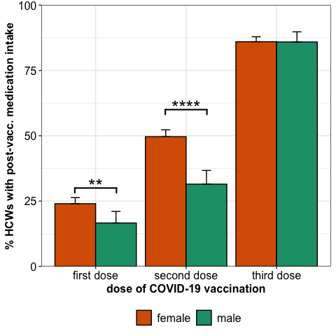<!-- -->

### Significance

``` r
fisher_res %>%
  knitr::kable() %>%
  kableExtra::kable_paper() %>%
  kableExtra::kable_styling(position = "left")%>%
  kableExtra::column_spec(1, bold = T)
```

<table class=" lightable-paper table" style="font-family: &quot;Arial Narrow&quot;, arial, helvetica, sans-serif; margin-left: auto; margin-right: auto; ">
<thead>
<tr>
<th style="text-align:left;">
dose
</th>
<th style="text-align:left;">
group1
</th>
<th style="text-align:left;">
group2
</th>
<th style="text-align:right;">
med.gr1
</th>
<th style="text-align:right;">
med.gr2
</th>
<th style="text-align:right;">
no.med.gr1
</th>
<th style="text-align:right;">
no.med.gr2
</th>
<th style="text-align:right;">
odds_ratio
</th>
<th style="text-align:right;">
p.value
</th>
</tr>
</thead>
<tbody>
<tr>
<td style="text-align:left;font-weight: bold;">
dose1
</td>
<td style="text-align:left;">
female
</td>
<td style="text-align:left;">
male
</td>
<td style="text-align:right;">
331
</td>
<td style="text-align:right;">
54
</td>
<td style="text-align:right;">
1048
</td>
<td style="text-align:right;">
271
</td>
<td style="text-align:right;">
1.584652
</td>
<td style="text-align:right;">
0.0039805
</td>
</tr>
<tr>
<td style="text-align:left;font-weight: bold;">
dose2
</td>
<td style="text-align:left;">
female
</td>
<td style="text-align:left;">
male
</td>
<td style="text-align:right;">
682
</td>
<td style="text-align:right;">
102
</td>
<td style="text-align:right;">
692
</td>
<td style="text-align:right;">
222
</td>
<td style="text-align:right;">
2.144090
</td>
<td style="text-align:right;">
0.0000000
</td>
</tr>
<tr>
<td style="text-align:left;font-weight: bold;">
dose3
</td>
<td style="text-align:left;">
female
</td>
<td style="text-align:left;">
male
</td>
<td style="text-align:right;">
964
</td>
<td style="text-align:right;">
201
</td>
<td style="text-align:right;">
157
</td>
<td style="text-align:right;">
33
</td>
<td style="text-align:right;">
1.008075
</td>
<td style="text-align:right;">
1.0000000
</td>
</tr>
</tbody>
</table>

## Profession

``` r
mean_meds_profession <- df_med %>% filter(!is.na(profession)) %>%
            group_by(dose, profession) %>% 
            summarise(Mean_meds = mean(meds, na.rm = T),
                      CI_upper = Hmisc::binconf(n = n(), x = sum(meds))[3])%>%
            mutate(dose = gsub(x = dose, pattern = "dose", replacement = "dose"))

df_sub <- df_med %>% filter(!is.na(profession)) %>% group_by(dose, meds, profession) %>% count()
vaccinations <- unique(df_sub$dose)
professions <- levels(df_sub$profession)

res_list <- list()
i <- 1
for(sel_dose in vaccinations){
  
  done_prof <- c()
  
  for(prof1 in professions){
    
    done_prof <- c(prof1, done_prof)
    
    for(prof2 in professions[-which(professions %in% done_prof)]){
      
      conf_mat <- df_sub %>% filter(dose %in% sel_dose, profession %in% c(prof1, prof2)) %>% tidyr::pivot_wider(values_from = c("n"), names_from = profession) %>% ungroup()
  
      fisher_res <-  fisher.test(conf_mat[2:1,][,-c(1:2)] %>% as.matrix())
      res_list[[i]] <- data.frame(dose = sel_dose, group1 = colnames(conf_mat)[3], group2 = colnames(conf_mat)[4], 
                              med.gr1 = as.numeric(conf_mat[2,3]),  
                              med.gr2 = as.numeric(conf_mat[2,4]), 
                              no.med.gr1 = as.numeric(conf_mat[1,3]),  
                              no.med.gr2 = as.numeric(conf_mat[1,4]), 
                              odds_ratio = fisher_res$estimate, p.value = fisher_res$p.value)
      i <<- i + 1
    }
  }
  
}

fisher_res <- do.call("rbind", res_list) 
fisher_res <- cbind(fisher_res, p.adj = p.adjust(fisher_res$p.value, "BY")) %>% as_tibble()

fisher_res_plt <- fisher_res %>% filter(p.adj < 0.05)
fisher_res_plt <- fisher_res_plt %>% rstatix::add_significance(p.col = "p.adj")

fisher_res_plt$y.position <- c(0.35, 0.6, 0.65)
fisher_res_plt$xmin <- c(0.66, 1.66, 1.66)
fisher_res_plt$xmax <- c(0.89, 1.89, 2.11)


avg_meds_profession_plt <- mean_meds_profession %>%
  ggplot2::ggplot(ggplot2::aes(x = dose, fill = profession, y = Mean_meds* 100)) + 
  ggplot2::geom_col(position = ggplot2::position_dodge(0.9), col = "black") +
  ggplot2::geom_errorbar(aes(ymin = Mean_meds* 100, ymax = CI_upper* 100), width = 0.2, position = ggplot2::position_dodge(0.9)) +
  ggplot2::theme_bw() +
  ggplot2::scale_x_discrete(labels = c("first dose", "second dose", "third dose")) +
  ggplot2::scale_y_continuous(expand = c(0, 0), limits = c(0, 100)) +
  ggplot2::scale_fill_manual(values = c("#F39B7FFF", "#4DBBD5FF", "#91D1C2FF", "#8491B4FF"))+
  ggplot2::theme(axis.text = ggplot2::element_text(size = 12, colour = "black"),
                 axis.title = ggplot2::element_text(face = "bold", size = 12),
                 legend.title = ggplot2::element_blank(),
                 legend.text = ggplot2::element_text(size = 12),
                 legend.position = "bottom") +
  ggplot2::ylab("% HCWs with post-vacc. medication intake") +
  ggplot2::xlab("dose of COVID-19 vaccination") + 
  ggsignif::geom_signif(xmin = fisher_res_plt$xmin,
                        xmax = fisher_res_plt$xmax,
                        y_position = fisher_res_plt$y.position*100,
                        annotation = fisher_res_plt$p.adj.signif,
                        tip_length = 0.02, vjust = 0.5, lwd = 0.75, textsize = 7)+
               ggplot2::guides(fill = ggplot2::guide_legend(nrow = 2))

avg_meds_profession_plt
```

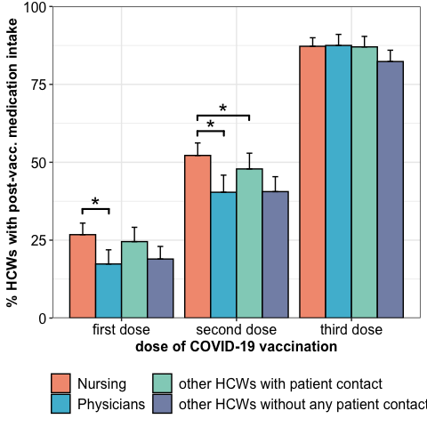<!-- -->

#### Significance

``` r
fisher_res %>% filter(p.adj < 0.05) %>%
  knitr::kable() %>%
  kableExtra::kable_paper() %>%
  kableExtra::kable_styling(position = "left")%>%
  kableExtra::column_spec(1, bold = T)
```

<table class=" lightable-paper table" style="font-family: &quot;Arial Narrow&quot;, arial, helvetica, sans-serif; margin-left: auto; margin-right: auto; ">
<thead>
<tr>
<th style="text-align:left;">
dose
</th>
<th style="text-align:left;">
group1
</th>
<th style="text-align:left;">
group2
</th>
<th style="text-align:right;">
med.gr1
</th>
<th style="text-align:right;">
med.gr2
</th>
<th style="text-align:right;">
no.med.gr1
</th>
<th style="text-align:right;">
no.med.gr2
</th>
<th style="text-align:right;">
odds_ratio
</th>
<th style="text-align:right;">
p.value
</th>
<th style="text-align:right;">
p.adj
</th>
</tr>
</thead>
<tbody>
<tr>
<td style="text-align:left;font-weight: bold;">
dose1
</td>
<td style="text-align:left;">
Nursing
</td>
<td style="text-align:left;">
Physicians
</td>
<td style="text-align:right;">
159
</td>
<td style="text-align:right;">
55
</td>
<td style="text-align:right;">
435
</td>
<td style="text-align:right;">
262
</td>
<td style="text-align:right;">
1.740171
</td>
<td style="text-align:right;">
0.0013596
</td>
<td style="text-align:right;">
0.0285118
</td>
</tr>
<tr>
<td style="text-align:left;font-weight: bold;">
dose2
</td>
<td style="text-align:left;">
Nursing
</td>
<td style="text-align:left;">
Physicians
</td>
<td style="text-align:right;">
309
</td>
<td style="text-align:right;">
128
</td>
<td style="text-align:right;">
283
</td>
<td style="text-align:right;">
189
</td>
<td style="text-align:right;">
1.611333
</td>
<td style="text-align:right;">
0.0008160
</td>
<td style="text-align:right;">
0.0256668
</td>
</tr>
<tr>
<td style="text-align:left;font-weight: bold;">
dose2
</td>
<td style="text-align:left;">
Nursing
</td>
<td style="text-align:left;">
other HCWs without any patient contact
</td>
<td style="text-align:right;">
309
</td>
<td style="text-align:right;">
168
</td>
<td style="text-align:right;">
283
</td>
<td style="text-align:right;">
246
</td>
<td style="text-align:right;">
1.598025
</td>
<td style="text-align:right;">
0.0003236
</td>
<td style="text-align:right;">
0.0203585
</td>
</tr>
</tbody>
</table>

## Rel. to vaccination

``` r
df_med_stat <- df_med %>% group_by(vaccine, dose) %>%
                          summarise(
                                 Mean_meds = mean(meds, na.rm = T),
                                 CI_upper = Hmisc::binconf(n = n(), x = sum(meds))[3]) %>% 
                          arrange(dose)

df_med_stat_sum <- df_med %>% group_by(vaccine, dose, meds) %>% count() %>% 
                          group_by(vaccine, dose) %>% 
                          mutate(n_dose = sum(n), 
                                 rel_n = n/n_dose) %>%
                   rename(medication = meds,
                          N_participants = n_dose,
                          rel_N_participants = rel_n) %>%
                    mutate(dose = gsub(x = dose, pattern = "dose", replacement = ""),
                           medication = if_else(medication == 1, true = "yes", false = "no")) %>%
                    relocate(dose) 

stats_med <- do.call("rbind", lapply(split(df_med_stat_sum %>% filter(medication %in% "yes"), f = df_med_stat_sum %>% filter(medication %in% "yes") %>% pull(dose)), function(mat){
  
  vaccs <- as.character(unique(mat$vaccine))
  df_comp <- c()
  exclude <- c()
  for(vaccs_i in vaccs){
    exclude <- c(exclude, vaccs_i)
    for(vaccs_j in vaccs[!vaccs %in% exclude]){
      
      tmp_mat <- mat %>% filter(vaccine %in% c(vaccs_i, vaccs_j)) %>% ungroup() %>% 
                         select(n, N_participants) %>% mutate(`no meds` = N_participants - n) %>% 
                         rename(meds = n) %>% select(`no meds`, meds) %>% relocate(meds, `no meds`) %>% as.matrix()

       df_comp <- rbind(df_comp, data.frame(dose = unique(mat$dose), group1 = vaccs_i, group2 = vaccs_j, 
                                            med.gr1 = tmp_mat[1,1],
                                            med.gr2 = tmp_mat[2,1],
                                            no.med.gr1 = tmp_mat[1,2],
                                            no.med.gr2 = tmp_mat[2,2],
                                            odds.ratio = fisher.test(tmp_mat)$estimate,
                                            p.value = fisher.test(tmp_mat)$p.value))
    }
  }
  df_comp
}))

stats_med <- cbind(stats_med, p.adj = p.adjust(stats_med$p.value, method = "BY")) %>% as_tibble()

stats_med_plt <- stats_med %>% filter(p.adj < 0.05)
stats_med_plt <- stats_med_plt %>% rstatix::add_significance(p.col = "p.adj")

stats_med_plt$y.position <- c(1, 0.935, 0.95)
stats_med_plt$xmin <- c(0.66, 0.89, 2.77)
stats_med_plt$xmax <- c(1.11, 1.11, 3.23)

vaccine_medication_plt <- df_med_stat %>% ggplot(ggplot2::aes(x = dose, y = Mean_meds* 100, fill = vaccine)) + 
               ggplot2::geom_col(position = ggplot2::position_dodge2(0.9), col = "black") + 
               ggplot2::geom_errorbar(aes(ymin = Mean_meds* 100, ymax = CI_upper* 100), width = 0.2, position = ggplot2::position_dodge(0.9)) +
               ggplot2::theme_bw() +
               ggplot2::scale_x_discrete(labels = c("first dose", "second dose", "third dose")) +
               ggplot2::scale_y_continuous(expand = c(0, 0)) + 
               ggsci::scale_fill_nejm() +
               ggplot2::theme(axis.text = ggplot2::element_text(size = 12, colour = "black"),
                              axis.title = ggplot2::element_text(face = "bold", size = 12),
                              legend.title = ggplot2::element_blank(),
                              legend.text = ggplot2::element_text(size = 12),
                              legend.position = "bottom") +
               ggplot2::ylab("% HCWs with post-vacc. medication intake") +
               ggplot2::xlab("dose of COVID-19 vaccination") +
               ggplot2::guides(fill = ggplot2::guide_legend(nrow = 2)) + 
               ggplot2::coord_cartesian(ylim= c(0,105)) + 
               ggsignif::geom_signif(xmin = stats_med_plt$xmin,
                                     xmax = stats_med_plt$xmax,
                                     y_position = stats_med_plt$y.position*100,
                                     annotation = stats_med_plt$p.adj.signif,
                                     tip_length = 0.02, vjust = 0.5, lwd = 0.75, textsize = 7)

vaccine_medication_plt
```

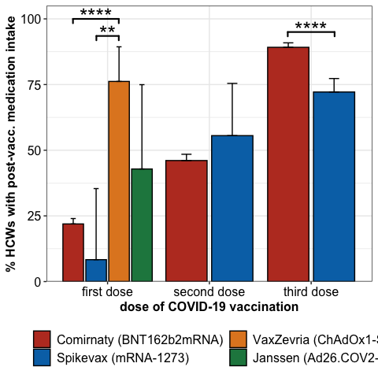<!-- -->

#### Significance

``` r
stats_med %>% mutate(p.value = format(p.value, scientific = T, digits = 2),
                     p.adj = format(p.adj, scientific = T, digits = 2)) %>%
  knitr::kable() %>%
  kableExtra::kable_paper() %>%
  kableExtra::kable_styling(position = "left")%>%
  kableExtra::column_spec(1, bold = T)
```

<table class=" lightable-paper table" style="font-family: &quot;Arial Narrow&quot;, arial, helvetica, sans-serif; margin-left: auto; margin-right: auto; ">
<thead>
<tr>
<th style="text-align:left;">
dose
</th>
<th style="text-align:left;">
group1
</th>
<th style="text-align:left;">
group2
</th>
<th style="text-align:right;">
med.gr1
</th>
<th style="text-align:right;">
med.gr2
</th>
<th style="text-align:right;">
no.med.gr1
</th>
<th style="text-align:right;">
no.med.gr2
</th>
<th style="text-align:right;">
odds.ratio
</th>
<th style="text-align:left;">
p.value
</th>
<th style="text-align:left;">
p.adj
</th>
</tr>
</thead>
<tbody>
<tr>
<td style="text-align:left;font-weight: bold;">
1
</td>
<td style="text-align:left;">
Comirnaty (BNT162b2mRNA)
</td>
<td style="text-align:left;">
Spikevax (mRNA-1273)
</td>
<td style="text-align:right;">
365
</td>
<td style="text-align:right;">
1
</td>
<td style="text-align:right;">
1299
</td>
<td style="text-align:right;">
11
</td>
<td style="text-align:right;">
3.0894298
</td>
<td style="text-align:left;">
4.8e-01
</td>
<td style="text-align:left;">
1.0e+00
</td>
</tr>
<tr>
<td style="text-align:left;font-weight: bold;">
1
</td>
<td style="text-align:left;">
Comirnaty (BNT162b2mRNA)
</td>
<td style="text-align:left;">
VaxZevria (ChAdOx1-S)
</td>
<td style="text-align:right;">
365
</td>
<td style="text-align:right;">
16
</td>
<td style="text-align:right;">
1299
</td>
<td style="text-align:right;">
5
</td>
<td style="text-align:right;">
0.0879901
</td>
<td style="text-align:left;">
2.3e-07
</td>
<td style="text-align:left;">
2.5e-06
</td>
</tr>
<tr>
<td style="text-align:left;font-weight: bold;">
1
</td>
<td style="text-align:left;">
Comirnaty (BNT162b2mRNA)
</td>
<td style="text-align:left;">
Janssen (Ad26.COV2-S)
</td>
<td style="text-align:right;">
365
</td>
<td style="text-align:right;">
3
</td>
<td style="text-align:right;">
1299
</td>
<td style="text-align:right;">
4
</td>
<td style="text-align:right;">
0.3749197
</td>
<td style="text-align:left;">
1.8e-01
</td>
<td style="text-align:left;">
6.7e-01
</td>
</tr>
<tr>
<td style="text-align:left;font-weight: bold;">
1
</td>
<td style="text-align:left;">
Spikevax (mRNA-1273)
</td>
<td style="text-align:left;">
VaxZevria (ChAdOx1-S)
</td>
<td style="text-align:right;">
1
</td>
<td style="text-align:right;">
16
</td>
<td style="text-align:right;">
11
</td>
<td style="text-align:right;">
5
</td>
<td style="text-align:right;">
0.0326672
</td>
<td style="text-align:left;">
2.3e-04
</td>
<td style="text-align:left;">
1.7e-03
</td>
</tr>
<tr>
<td style="text-align:left;font-weight: bold;">
1
</td>
<td style="text-align:left;">
Spikevax (mRNA-1273)
</td>
<td style="text-align:left;">
Janssen (Ad26.COV2-S)
</td>
<td style="text-align:right;">
1
</td>
<td style="text-align:right;">
3
</td>
<td style="text-align:right;">
11
</td>
<td style="text-align:right;">
4
</td>
<td style="text-align:right;">
0.1379510
</td>
<td style="text-align:left;">
1.2e-01
</td>
<td style="text-align:left;">
6.4e-01
</td>
</tr>
<tr>
<td style="text-align:left;font-weight: bold;">
1
</td>
<td style="text-align:left;">
VaxZevria (ChAdOx1-S)
</td>
<td style="text-align:left;">
Janssen (Ad26.COV2-S)
</td>
<td style="text-align:right;">
16
</td>
<td style="text-align:right;">
3
</td>
<td style="text-align:right;">
5
</td>
<td style="text-align:right;">
4
</td>
<td style="text-align:right;">
4.0165675
</td>
<td style="text-align:left;">
1.7e-01
</td>
<td style="text-align:left;">
6.7e-01
</td>
</tr>
<tr>
<td style="text-align:left;font-weight: bold;">
2
</td>
<td style="text-align:left;">
Comirnaty (BNT162b2mRNA)
</td>
<td style="text-align:left;">
Spikevax (mRNA-1273)
</td>
<td style="text-align:right;">
774
</td>
<td style="text-align:right;">
10
</td>
<td style="text-align:right;">
906
</td>
<td style="text-align:right;">
8
</td>
<td style="text-align:right;">
0.6836040
</td>
<td style="text-align:left;">
4.8e-01
</td>
<td style="text-align:left;">
1.0e+00
</td>
</tr>
<tr>
<td style="text-align:left;font-weight: bold;">
3
</td>
<td style="text-align:left;">
Comirnaty (BNT162b2mRNA)
</td>
<td style="text-align:left;">
Spikevax (mRNA-1273)
</td>
<td style="text-align:right;">
981
</td>
<td style="text-align:right;">
184
</td>
<td style="text-align:right;">
119
</td>
<td style="text-align:right;">
71
</td>
<td style="text-align:right;">
3.1775529
</td>
<td style="text-align:left;">
5.3e-11
</td>
<td style="text-align:left;">
1.1e-09
</td>
</tr>
</tbody>
</table>

# Sub Analysis Age above 30

## Summaries

### Vaccination schedule

``` r
df_inab <- df_inab %>% filter(age >= 30) 

df_inab %>% ungroup() %>% 
  summarise(Vaccine = vaccine_names,
            dose1 = table(dose1),
            dose2 = table(dose2),
            dose3 = table(dose3)) %>% 
  as.data.frame() %>% 
knitr::kable() %>%
kableExtra::kable_paper() %>%
kableExtra::kable_styling(position = "left")%>%
kableExtra::column_spec(1, bold = T)
```

<table class=" lightable-paper table" style="font-family: &quot;Arial Narrow&quot;, arial, helvetica, sans-serif; margin-left: auto; margin-right: auto; ">
<thead>
<tr>
<th style="text-align:left;">
Vaccine
</th>
<th style="text-align:right;">
dose1
</th>
<th style="text-align:right;">
dose2
</th>
<th style="text-align:right;">
dose3
</th>
</tr>
</thead>
<tbody>
<tr>
<td style="text-align:left;font-weight: bold;">
Comirnaty (BNT162b2mRNA)
</td>
<td style="text-align:right;">
1258
</td>
<td style="text-align:right;">
1263
</td>
<td style="text-align:right;">
806
</td>
</tr>
<tr>
<td style="text-align:left;font-weight: bold;">
Spikevax (mRNA-1273)
</td>
<td style="text-align:right;">
4
</td>
<td style="text-align:right;">
7
</td>
<td style="text-align:right;">
252
</td>
</tr>
<tr>
<td style="text-align:left;font-weight: bold;">
VaxZevria (ChAdOx1-S)
</td>
<td style="text-align:right;">
7
</td>
<td style="text-align:right;">
0
</td>
<td style="text-align:right;">
0
</td>
</tr>
<tr>
<td style="text-align:left;font-weight: bold;">
Janssen (Ad26.COV2-S)
</td>
<td style="text-align:right;">
5
</td>
<td style="text-align:right;">
0
</td>
<td style="text-align:right;">
0
</td>
</tr>
<tr>
<td style="text-align:left;font-weight: bold;">
Other
</td>
<td style="text-align:right;">
0
</td>
<td style="text-align:right;">
0
</td>
<td style="text-align:right;">
0
</td>
</tr>
<tr>
<td style="text-align:left;font-weight: bold;">
Nuvaxovid (Novavax CZ)
</td>
<td style="text-align:right;">
0
</td>
<td style="text-align:right;">
0
</td>
<td style="text-align:right;">
0
</td>
</tr>
</tbody>
</table>

### Total

``` r
df_inab %>% summarise(`Number of Subjects` = n(),
                       Age = med_iqr(age),
                       Weight = med_iqr(weight),
                       Height = med_iqr(height),
                       BMI = med_iqr(bmi),
                       "Sick leaves past 12 month" = med_iqr(sl_year),
                       "#Sick leaves past 12 month" = sum(sl_year, na.rm = T),
                       "Sick days 1" = med_iqr(audosis1),
                       "Sick days 2" = med_iqr(audosis2),
                       "Sick days 3" = med_iqr(audosis3),
                       "#Sick days 1" = sum(audosis1, na.rm = T),
                       "#Sick days 2" = sum(audosis2, na.rm = T),
                       "#Sick days 3" = sum(audosis3, na.rm = T),
                       Smoking = mut_num_perc(smoking, "smoker"),
                       "Side effects 1" = mut_num_perc(uaw1, 1),
                       "Side effects 2" = mut_num_perc(uaw2, 1),
                       "Side effects 3" = mut_num_perc(uaw3, 1),
                       "Med 1" = mut_num_perc(meds1, 1),
                       "Med 2" = mut_num_perc(meds2, 1),
                       "Med 3" = mut_num_perc(meds3, 1),
                       "Immune deficiency" = mut_num_perc(immun_def, 1),
                       Days_Vacc_12 = med_iqr(days_vaccs12),
                       Days_Vacc_23 = med_iqr(days_vaccs23),
                       IgG1 = med_iqr(IgG1),
                       IgG2 = med_iqr(IgG2),
                       IgG3 = med_iqr(IgG3)) %>% 
   mutate(across(.fns = as.character)) %>% 
  tidyr::pivot_longer(cols = c(`Number of Subjects`, Age, Weight, Height, BMI, matches("Days|mRNA|Coadmin|Smoking|IgG|Sick|Side|Immune|Med")), names_to = "Feature", values_to = "Stats") %>%
  knitr::kable()%>%
  kableExtra::kable_paper() %>%
  kableExtra::kable_styling(position = "left")%>%
  kableExtra::column_spec(1, bold = T)
```

<table class=" lightable-paper table" style="font-family: &quot;Arial Narrow&quot;, arial, helvetica, sans-serif; margin-left: auto; margin-right: auto; ">
<thead>
<tr>
<th style="text-align:left;">
Feature
</th>
<th style="text-align:left;">
Stats
</th>
</tr>
</thead>
<tbody>
<tr>
<td style="text-align:left;font-weight: bold;">
Number of Subjects
</td>
<td style="text-align:left;">
1274
</td>
</tr>
<tr>
<td style="text-align:left;font-weight: bold;">
Age
</td>
<td style="text-align:left;">
45 (36-54)
</td>
</tr>
<tr>
<td style="text-align:left;font-weight: bold;">
Weight
</td>
<td style="text-align:left;">
70 (61-82)
</td>
</tr>
<tr>
<td style="text-align:left;font-weight: bold;">
Height
</td>
<td style="text-align:left;">
168 (164-175)
</td>
</tr>
<tr>
<td style="text-align:left;font-weight: bold;">
BMI
</td>
<td style="text-align:left;">
24 (21.7-27.3)
</td>
</tr>
<tr>
<td style="text-align:left;font-weight: bold;">
Sick leaves past 12 month
</td>
<td style="text-align:left;">
1 (0-1)
</td>
</tr>
<tr>
<td style="text-align:left;font-weight: bold;">
\#Sick leaves past 12 month
</td>
<td style="text-align:left;">
1302
</td>
</tr>
<tr>
<td style="text-align:left;font-weight: bold;">
Sick days 1
</td>
<td style="text-align:left;">
0 (0-0)
</td>
</tr>
<tr>
<td style="text-align:left;font-weight: bold;">
Sick days 2
</td>
<td style="text-align:left;">
0 (0-0)
</td>
</tr>
<tr>
<td style="text-align:left;font-weight: bold;">
Sick days 3
</td>
<td style="text-align:left;">
0 (0-0)
</td>
</tr>
<tr>
<td style="text-align:left;font-weight: bold;">
\#Sick days 1
</td>
<td style="text-align:left;">
72
</td>
</tr>
<tr>
<td style="text-align:left;font-weight: bold;">
\#Sick days 2
</td>
<td style="text-align:left;">
541
</td>
</tr>
<tr>
<td style="text-align:left;font-weight: bold;">
\#Sick days 3
</td>
<td style="text-align:left;">
545
</td>
</tr>
<tr>
<td style="text-align:left;font-weight: bold;">
Smoking
</td>
<td style="text-align:left;">
155 (12.17%)
</td>
</tr>
<tr>
<td style="text-align:left;font-weight: bold;">
Side effects 1
</td>
<td style="text-align:left;">
411 (32.26%)
</td>
</tr>
<tr>
<td style="text-align:left;font-weight: bold;">
Side effects 2
</td>
<td style="text-align:left;">
252 (19.78%)
</td>
</tr>
<tr>
<td style="text-align:left;font-weight: bold;">
Side effects 3
</td>
<td style="text-align:left;">
149 (11.7%)
</td>
</tr>
<tr>
<td style="text-align:left;font-weight: bold;">
Med 1
</td>
<td style="text-align:left;">
980 (76.92%)
</td>
</tr>
<tr>
<td style="text-align:left;font-weight: bold;">
Med 2
</td>
<td style="text-align:left;">
706 (55.42%)
</td>
</tr>
<tr>
<td style="text-align:left;font-weight: bold;">
Med 3
</td>
<td style="text-align:left;">
146 (11.46%)
</td>
</tr>
<tr>
<td style="text-align:left;font-weight: bold;">
Immune deficiency
</td>
<td style="text-align:left;">
27 (2.12%)
</td>
</tr>
<tr>
<td style="text-align:left;font-weight: bold;">
Days_Vacc_12
</td>
<td style="text-align:left;">
21 (21-21)
</td>
</tr>
<tr>
<td style="text-align:left;font-weight: bold;">
Days_Vacc_23
</td>
<td style="text-align:left;">
252.5 (223.2-270.8)
</td>
</tr>
<tr>
<td style="text-align:left;font-weight: bold;">
IgG1
</td>
<td style="text-align:left;">
130.8 (74.6-244)
</td>
</tr>
<tr>
<td style="text-align:left;font-weight: bold;">
IgG2
</td>
<td style="text-align:left;">
132 (74.7-245.6)
</td>
</tr>
<tr>
<td style="text-align:left;font-weight: bold;">
IgG3
</td>
<td style="text-align:left;">
1913.6 (1173.2-2996.2)
</td>
</tr>
</tbody>
</table>

### Gender spec.

``` r
df_inab %>% group_by(gender) %>% summarise(`Number of Subjects` = n(),
                       Age = med_iqr(age),
                       Weight = med_iqr(weight),
                       Height = med_iqr(height),
                       BMI = med_iqr(bmi),
                       "Sick leaves past 12 month" = med_iqr(sl_year),
                       "#Sick leaves past 12 month" = sum(sl_year, na.rm = T),
                       "Sick days 1" = med_iqr(audosis1),
                       "Sick days 2" = med_iqr(audosis2),
                       "Sick days 3" = med_iqr(audosis3),
                       "#Sick days 1" = sum(audosis1, na.rm = T),
                       "#Sick days 2" = sum(audosis2, na.rm = T),
                       "#Sick days 3" = sum(audosis3, na.rm = T),
                       Smoking = mut_num_perc(smoking, "smoker"),
                       "Side effects 1" = mut_num_perc(uaw1, 1),
                       "Side effects 2" = mut_num_perc(uaw2, 1),
                       "Side effects 3" = mut_num_perc(uaw3, 1),
                       "Incapacity after 1 vacc" = mut_num_perc(incapacity1, 2),
                       "Incapacity after 2 vacc" = mut_num_perc(incapacity2, 2),
                       "Incapacity after 3 vacc" = mut_num_perc(incapacity3, 2),
                       "Med after vacc 1" = mut_num_perc(meds1, 1),
                       "Med after vacc 2" = mut_num_perc(meds2, 1),
                       "Med after vacc 3" = mut_num_perc(meds3, 1),
                       "Immune deficiency" = mut_num_perc(immun_def, 1),
                       Days_Vacc_12 = med_iqr(days_vaccs12),
                       Days_Vacc_23 = med_iqr(days_vaccs23),
                       IgG1 = med_iqr(IgG1),
                       IgG2 = med_iqr(IgG2),
                       IgG3 = med_iqr(IgG3)) %>% 
  mutate(`Number of Subjects` = paste0(`Number of Subjects`, " (", as.numeric(format(`Number of Subjects`/sum(`Number of Subjects`)*100, digits = 2)), "%)"),
         across(.fns = as.character)) %>% 
  tidyr::pivot_longer(cols = c(`Number of Subjects`, Age, Weight, Height, BMI, matches("Days|mRNA|Coadmin|Smoking|IgG|Sick|Side|Immune|Incap|Med")), names_to = "Feature", values_to = "vales") %>% 
  tidyr::pivot_wider(names_from = gender, values_from = c(vales)) %>%
  knitr::kable()%>%
  kableExtra::kable_paper() %>%
  kableExtra::kable_styling(position = "left")%>%
  kableExtra::column_spec(1, bold = T)
```

<table class=" lightable-paper table" style="font-family: &quot;Arial Narrow&quot;, arial, helvetica, sans-serif; margin-left: auto; margin-right: auto; ">
<thead>
<tr>
<th style="text-align:left;">
Feature
</th>
<th style="text-align:left;">
female
</th>
<th style="text-align:left;">
male
</th>
</tr>
</thead>
<tbody>
<tr>
<td style="text-align:left;font-weight: bold;">
Number of Subjects
</td>
<td style="text-align:left;">
1016 (80%)
</td>
<td style="text-align:left;">
258 (20%)
</td>
</tr>
<tr>
<td style="text-align:left;font-weight: bold;">
Age
</td>
<td style="text-align:left;">
45 (37-55)
</td>
<td style="text-align:left;">
42 (35-51)
</td>
</tr>
<tr>
<td style="text-align:left;font-weight: bold;">
Weight
</td>
<td style="text-align:left;">
66 (59-77)
</td>
<td style="text-align:left;">
82.5 (74-90.8)
</td>
</tr>
<tr>
<td style="text-align:left;font-weight: bold;">
Height
</td>
<td style="text-align:left;">
167 (163-171)
</td>
<td style="text-align:left;">
180 (176.2-185)
</td>
</tr>
<tr>
<td style="text-align:left;font-weight: bold;">
BMI
</td>
<td style="text-align:left;">
23.8 (21.5-27.3)
</td>
<td style="text-align:left;">
24.9 (23-27.5)
</td>
</tr>
<tr>
<td style="text-align:left;font-weight: bold;">
Sick leaves past 12 month
</td>
<td style="text-align:left;">
1 (1-1)
</td>
<td style="text-align:left;">
1 (0-1)
</td>
</tr>
<tr>
<td style="text-align:left;font-weight: bold;">
\#Sick leaves past 12 month
</td>
<td style="text-align:left;">
1081
</td>
<td style="text-align:left;">
221
</td>
</tr>
<tr>
<td style="text-align:left;font-weight: bold;">
Sick days 1
</td>
<td style="text-align:left;">
0 (0-0)
</td>
<td style="text-align:left;">
0 (0-0)
</td>
</tr>
<tr>
<td style="text-align:left;font-weight: bold;">
Sick days 2
</td>
<td style="text-align:left;">
0 (0-0)
</td>
<td style="text-align:left;">
0 (0-0)
</td>
</tr>
<tr>
<td style="text-align:left;font-weight: bold;">
Sick days 3
</td>
<td style="text-align:left;">
0 (0-1)
</td>
<td style="text-align:left;">
0 (0-0)
</td>
</tr>
<tr>
<td style="text-align:left;font-weight: bold;">
\#Sick days 1
</td>
<td style="text-align:left;">
67
</td>
<td style="text-align:left;">
5
</td>
</tr>
<tr>
<td style="text-align:left;font-weight: bold;">
\#Sick days 2
</td>
<td style="text-align:left;">
483
</td>
<td style="text-align:left;">
58
</td>
</tr>
<tr>
<td style="text-align:left;font-weight: bold;">
\#Sick days 3
</td>
<td style="text-align:left;">
489
</td>
<td style="text-align:left;">
56
</td>
</tr>
<tr>
<td style="text-align:left;font-weight: bold;">
Smoking
</td>
<td style="text-align:left;">
120 (11.81%)
</td>
<td style="text-align:left;">
35 (13.57%)
</td>
</tr>
<tr>
<td style="text-align:left;font-weight: bold;">
Side effects 1
</td>
<td style="text-align:left;">
287 (28.25%)
</td>
<td style="text-align:left;">
124 (48.06%)
</td>
</tr>
<tr>
<td style="text-align:left;font-weight: bold;">
Side effects 2
</td>
<td style="text-align:left;">
181 (17.81%)
</td>
<td style="text-align:left;">
71 (27.52%)
</td>
</tr>
<tr>
<td style="text-align:left;font-weight: bold;">
Side effects 3
</td>
<td style="text-align:left;">
111 (10.93%)
</td>
<td style="text-align:left;">
38 (14.73%)
</td>
</tr>
<tr>
<td style="text-align:left;font-weight: bold;">
Incapacity after 1 vacc
</td>
<td style="text-align:left;">
42 (4.13%)
</td>
<td style="text-align:left;">
4 (1.55%)
</td>
</tr>
<tr>
<td style="text-align:left;font-weight: bold;">
Incapacity after 2 vacc
</td>
<td style="text-align:left;">
239 (23.52%)
</td>
<td style="text-align:left;">
29 (11.24%)
</td>
</tr>
<tr>
<td style="text-align:left;font-weight: bold;">
Incapacity after 3 vacc
</td>
<td style="text-align:left;">
267 (26.28%)
</td>
<td style="text-align:left;">
32 (12.4%)
</td>
</tr>
<tr>
<td style="text-align:left;font-weight: bold;">
Med after vacc 1
</td>
<td style="text-align:left;">
765 (75.3%)
</td>
<td style="text-align:left;">
215 (83.33%)
</td>
</tr>
<tr>
<td style="text-align:left;font-weight: bold;">
Med after vacc 2
</td>
<td style="text-align:left;">
529 (52.07%)
</td>
<td style="text-align:left;">
177 (68.6%)
</td>
</tr>
<tr>
<td style="text-align:left;font-weight: bold;">
Med after vacc 3
</td>
<td style="text-align:left;">
118 (11.61%)
</td>
<td style="text-align:left;">
28 (10.85%)
</td>
</tr>
<tr>
<td style="text-align:left;font-weight: bold;">
Immune deficiency
</td>
<td style="text-align:left;">
25 (2.46%)
</td>
<td style="text-align:left;">
2 (0.78%)
</td>
</tr>
<tr>
<td style="text-align:left;font-weight: bold;">
Days_Vacc_12
</td>
<td style="text-align:left;">
21 (21-21)
</td>
<td style="text-align:left;">
21 (21-22)
</td>
</tr>
<tr>
<td style="text-align:left;font-weight: bold;">
Days_Vacc_23
</td>
<td style="text-align:left;">
252 (229-270)
</td>
<td style="text-align:left;">
254 (198-271)
</td>
</tr>
<tr>
<td style="text-align:left;font-weight: bold;">
IgG1
</td>
<td style="text-align:left;">
139.4 (77.3-248.9)
</td>
<td style="text-align:left;">
109.9 (66.8-225.3)
</td>
</tr>
<tr>
<td style="text-align:left;font-weight: bold;">
IgG2
</td>
<td style="text-align:left;">
139.6 (77.3-249.5)
</td>
<td style="text-align:left;">
110.4 (67-228.8)
</td>
</tr>
<tr>
<td style="text-align:left;font-weight: bold;">
IgG3
</td>
<td style="text-align:left;">
1937.8 (1205.9-3013.5)
</td>
<td style="text-align:left;">
1790 (1063.7-2924)
</td>
</tr>
</tbody>
</table>

### Dosage spec.

#### 1st Vaccination

``` r
df_inab %>% filter(!is.na(dose1)) %>% 
            group_by(dose1) %>% 
            summarise(`Number of Subjects` = n(),
                       male = paste0(sum(gender %in% "male"), " (", round(sum(gender %in% "male")/n() * 100, 2),"%)"),
                       female = paste0(sum(gender %in% "female"), " (", round(sum(gender %in% "female")/n() * 100, 2),"%)"),
                       Age = med_iqr(age),
                       Weight = med_iqr(weight),
                       Height = med_iqr(height),
                       BMI = med_iqr(bmi),
                       "Sick leaves past 12 month" = med_iqr(sl_year),
                       "#Sick leaves past 12 month" = sum(sl_year, na.rm = T),
                       "Sick days" = med_iqr(audosis1),
                       "#Sick days" = sum(audosis1, na.rm = T),
                       Smoking = mut_num_perc(smoking, "smoker"),
                       "Side effects" = mut_num_perc(uaw1, 1),
                       "Incapacity after 1st vacc" = mut_num_perc(incapacity1, 2),
                       "Med after vacc" = mut_num_perc(meds1, 1),
                       "Immune deficiency" = mut_num_perc(immun_def, 1),
                       IgG1 = med_iqr(IgG1)) %>% 
  mutate(`Number of Subjects` = paste0(`Number of Subjects`, " (", as.numeric(format(`Number of Subjects`/sum(`Number of Subjects`)*100, digits = 2)), "%)"),
         across(.fns = as.character)) %>% 
  tidyr::pivot_longer(cols = c(`Number of Subjects`, Age, Weight, Height, BMI,
                               matches("Days|male|mRNA|Coadmin|Smoking|IgG|Sick|Side|Immune|Med|Incap")), 
                      names_to = "Feature", values_to = "vales") %>%
  tidyr::pivot_wider(names_from = dose1, values_from = c(vales)) %>%
  knitr::kable()%>%
  kableExtra::kable_paper() %>%
  kableExtra::kable_styling(position = "left")%>%
  kableExtra::column_spec(1, bold = T)
```

<table class=" lightable-paper table" style="font-family: &quot;Arial Narrow&quot;, arial, helvetica, sans-serif; margin-left: auto; margin-right: auto; ">
<thead>
<tr>
<th style="text-align:left;">
Feature
</th>
<th style="text-align:left;">
Comirnaty (BNT162b2mRNA)
</th>
<th style="text-align:left;">
Spikevax (mRNA-1273)
</th>
<th style="text-align:left;">
VaxZevria (ChAdOx1-S)
</th>
<th style="text-align:left;">
Janssen (Ad26.COV2-S)
</th>
</tr>
</thead>
<tbody>
<tr>
<td style="text-align:left;font-weight: bold;">
Number of Subjects
</td>
<td style="text-align:left;">
1258 (98.74%)
</td>
<td style="text-align:left;">
4 (0.31%)
</td>
<td style="text-align:left;">
7 (0.55%)
</td>
<td style="text-align:left;">
5 (0.39%)
</td>
</tr>
<tr>
<td style="text-align:left;font-weight: bold;">
Age
</td>
<td style="text-align:left;">
45 (36-54)
</td>
<td style="text-align:left;">
33.5 (32.2-38.8)
</td>
<td style="text-align:left;">
35 (31-42)
</td>
<td style="text-align:left;">
41 (37-53)
</td>
</tr>
<tr>
<td style="text-align:left;font-weight: bold;">
Weight
</td>
<td style="text-align:left;">
70 (61-82)
</td>
<td style="text-align:left;">
71 (69.2-79.2)
</td>
<td style="text-align:left;">
72 (65.5-87.5)
</td>
<td style="text-align:left;">
59 (56-60)
</td>
</tr>
<tr>
<td style="text-align:left;font-weight: bold;">
Height
</td>
<td style="text-align:left;">
168 (164-175)
</td>
<td style="text-align:left;">
177 (168.8-185.5)
</td>
<td style="text-align:left;">
168 (165-169)
</td>
<td style="text-align:left;">
167 (162-175)
</td>
</tr>
<tr>
<td style="text-align:left;font-weight: bold;">
BMI
</td>
<td style="text-align:left;">
24 (21.7-27.3)
</td>
<td style="text-align:left;">
24.8 (23.6-25.7)
</td>
<td style="text-align:left;">
26.8 (23.5-32.3)
</td>
<td style="text-align:left;">
21.2 (19.8-22.4)
</td>
</tr>
<tr>
<td style="text-align:left;font-weight: bold;">
male
</td>
<td style="text-align:left;">
255 (20.27%)
</td>
<td style="text-align:left;">
1 (25%)
</td>
<td style="text-align:left;">
1 (14.29%)
</td>
<td style="text-align:left;">
1 (20%)
</td>
</tr>
<tr>
<td style="text-align:left;font-weight: bold;">
female
</td>
<td style="text-align:left;">
1003 (79.73%)
</td>
<td style="text-align:left;">
3 (75%)
</td>
<td style="text-align:left;">
6 (85.71%)
</td>
<td style="text-align:left;">
4 (80%)
</td>
</tr>
<tr>
<td style="text-align:left;font-weight: bold;">
Sick leaves past 12 month
</td>
<td style="text-align:left;">
1 (0-1)
</td>
<td style="text-align:left;">
0.5 (0-1.5)
</td>
<td style="text-align:left;">
2 (1.5-2.5)
</td>
<td style="text-align:left;">
1 (1-1)
</td>
</tr>
<tr>
<td style="text-align:left;font-weight: bold;">
\#Sick leaves past 12 month
</td>
<td style="text-align:left;">
1276
</td>
<td style="text-align:left;">
4
</td>
<td style="text-align:left;">
15
</td>
<td style="text-align:left;">
7
</td>
</tr>
<tr>
<td style="text-align:left;font-weight: bold;">
Sick days
</td>
<td style="text-align:left;">
0 (0-0)
</td>
<td style="text-align:left;">
0 (0-0)
</td>
<td style="text-align:left;">
1 (1-2)
</td>
<td style="text-align:left;">
0 (0-0)
</td>
</tr>
<tr>
<td style="text-align:left;font-weight: bold;">
\#Sick days
</td>
<td style="text-align:left;">
61
</td>
<td style="text-align:left;">
0
</td>
<td style="text-align:left;">
9
</td>
<td style="text-align:left;">
2
</td>
</tr>
<tr>
<td style="text-align:left;font-weight: bold;">
Smoking
</td>
<td style="text-align:left;">
155 (12.32%)
</td>
<td style="text-align:left;">
0 (0%)
</td>
<td style="text-align:left;">
0 (0%)
</td>
<td style="text-align:left;">
0 (0%)
</td>
</tr>
<tr>
<td style="text-align:left;font-weight: bold;">
Side effects
</td>
<td style="text-align:left;">
407 (32.35%)
</td>
<td style="text-align:left;">
2 (50%)
</td>
<td style="text-align:left;">
0 (0%)
</td>
<td style="text-align:left;">
2 (40%)
</td>
</tr>
<tr>
<td style="text-align:left;font-weight: bold;">
Incapacity after 1st vacc
</td>
<td style="text-align:left;">
39 (3.1%)
</td>
<td style="text-align:left;">
0 (0%)
</td>
<td style="text-align:left;">
6 (85.71%)
</td>
<td style="text-align:left;">
1 (20%)
</td>
</tr>
<tr>
<td style="text-align:left;font-weight: bold;">
Med after vacc
</td>
<td style="text-align:left;">
972 (77.27%)
</td>
<td style="text-align:left;">
3 (75%)
</td>
<td style="text-align:left;">
1 (14.29%)
</td>
<td style="text-align:left;">
4 (80%)
</td>
</tr>
<tr>
<td style="text-align:left;font-weight: bold;">
Immune deficiency
</td>
<td style="text-align:left;">
27 (2.15%)
</td>
<td style="text-align:left;">
0 (0%)
</td>
<td style="text-align:left;">
0 (0%)
</td>
<td style="text-align:left;">
0 (0%)
</td>
</tr>
<tr>
<td style="text-align:left;font-weight: bold;">
IgG1
</td>
<td style="text-align:left;">
130.6 (74.4-244)
</td>
<td style="text-align:left;">
131.2 (92.3-199.6)
</td>
<td style="text-align:left;">
224.8 (181-333.3)
</td>
<td style="text-align:left;">
91.9 (71.5-104.6)
</td>
</tr>
</tbody>
</table>

#### 2nd Vaccination

``` r
df_inab %>% filter(!is.na(dose2)) %>% 
            group_by(dose2) %>% 
            summarise(`Number of Subjects` = n(),
                       male = paste0(sum(gender %in% "male"), " (", round(sum(gender %in% "male")/n() * 100, 2),"%)"),
                       female = paste0(sum(gender %in% "female"), " (", round(sum(gender %in% "female")/n() * 100, 2),"%)"),
                       Age = med_iqr(age),
                       Weight = med_iqr(weight),
                       Height = med_iqr(height),
                       BMI = med_iqr(bmi),
                       "Sick leaves past 12 month" = med_iqr(sl_year),
                       "#Sick leaves past 12 month" = sum(sl_year, na.rm = T),
                       "Sick days" = med_iqr(audosis2),
                       "#Sick days" = sum(audosis2, na.rm = T),
                       Smoking = mut_num_perc(smoking, "smoker"),
                       "Side effects" = mut_num_perc(uaw2, 1),
                       "Incapacity after 2nd vacc" = mut_num_perc(incapacity2, 2),
                       "Med after vacc" = mut_num_perc(meds2, 1),
                       "Immune deficiency" = mut_num_perc(immun_def, 1),
                       Days_Vacc_12 = med_iqr(days_vaccs12),
                       IgG2 = med_iqr(IgG2)) %>% 
  mutate(`Number of Subjects` = paste0(`Number of Subjects`, " (", as.numeric(format(`Number of Subjects`/sum(`Number of Subjects`)*100, digits = 2)), "%)"),
         across(.fns = as.character)) %>% 
  tidyr::pivot_longer(cols = c(`Number of Subjects`, Age, Weight, Height, BMI,
                               matches("Days|male|mRNA|Coadmin|Smoking|IgG|Sick|Side|Immune|Incap|Med")), 
                      names_to = "Feature", values_to = "vales") %>%
  tidyr::pivot_wider(names_from = dose2, values_from = c(vales)) %>%
  knitr::kable()%>%
  kableExtra::kable_paper() %>%
  kableExtra::kable_styling(position = "left")%>%
  kableExtra::column_spec(1, bold = T)
```

<table class=" lightable-paper table" style="font-family: &quot;Arial Narrow&quot;, arial, helvetica, sans-serif; margin-left: auto; margin-right: auto; ">
<thead>
<tr>
<th style="text-align:left;">
Feature
</th>
<th style="text-align:left;">
Comirnaty (BNT162b2mRNA)
</th>
<th style="text-align:left;">
Spikevax (mRNA-1273)
</th>
</tr>
</thead>
<tbody>
<tr>
<td style="text-align:left;font-weight: bold;">
Number of Subjects
</td>
<td style="text-align:left;">
1263 (99.45%)
</td>
<td style="text-align:left;">
7 (0.55%)
</td>
</tr>
<tr>
<td style="text-align:left;font-weight: bold;">
Age
</td>
<td style="text-align:left;">
45 (36-54)
</td>
<td style="text-align:left;">
33 (30.5-37)
</td>
</tr>
<tr>
<td style="text-align:left;font-weight: bold;">
Weight
</td>
<td style="text-align:left;">
70 (61-82)
</td>
<td style="text-align:left;">
70 (64.5-81)
</td>
</tr>
<tr>
<td style="text-align:left;font-weight: bold;">
Height
</td>
<td style="text-align:left;">
169 (164-175.5)
</td>
<td style="text-align:left;">
168 (166-169)
</td>
</tr>
<tr>
<td style="text-align:left;font-weight: bold;">
BMI
</td>
<td style="text-align:left;">
24.1 (21.7-27.4)
</td>
<td style="text-align:left;">
24.6 (21.6-30)
</td>
</tr>
<tr>
<td style="text-align:left;font-weight: bold;">
male
</td>
<td style="text-align:left;">
258 (20.43%)
</td>
<td style="text-align:left;">
0 (0%)
</td>
</tr>
<tr>
<td style="text-align:left;font-weight: bold;">
female
</td>
<td style="text-align:left;">
1005 (79.57%)
</td>
<td style="text-align:left;">
7 (100%)
</td>
</tr>
<tr>
<td style="text-align:left;font-weight: bold;">
Sick leaves past 12 month
</td>
<td style="text-align:left;">
1 (0-1)
</td>
<td style="text-align:left;">
2 (1-2.5)
</td>
</tr>
<tr>
<td style="text-align:left;font-weight: bold;">
\#Sick leaves past 12 month
</td>
<td style="text-align:left;">
1287
</td>
<td style="text-align:left;">
12
</td>
</tr>
<tr>
<td style="text-align:left;font-weight: bold;">
Sick days
</td>
<td style="text-align:left;">
0 (0-0)
</td>
<td style="text-align:left;">
0 (0-0)
</td>
</tr>
<tr>
<td style="text-align:left;font-weight: bold;">
\#Sick days
</td>
<td style="text-align:left;">
539
</td>
<td style="text-align:left;">
2
</td>
</tr>
<tr>
<td style="text-align:left;font-weight: bold;">
Smoking
</td>
<td style="text-align:left;">
155 (12.27%)
</td>
<td style="text-align:left;">
0 (0%)
</td>
</tr>
<tr>
<td style="text-align:left;font-weight: bold;">
Side effects
</td>
<td style="text-align:left;">
251 (19.87%)
</td>
<td style="text-align:left;">
1 (14.29%)
</td>
</tr>
<tr>
<td style="text-align:left;font-weight: bold;">
Incapacity after 2nd vacc
</td>
<td style="text-align:left;">
267 (21.14%)
</td>
<td style="text-align:left;">
1 (14.29%)
</td>
</tr>
<tr>
<td style="text-align:left;font-weight: bold;">
Med after vacc
</td>
<td style="text-align:left;">
702 (55.58%)
</td>
<td style="text-align:left;">
4 (57.14%)
</td>
</tr>
<tr>
<td style="text-align:left;font-weight: bold;">
Immune deficiency
</td>
<td style="text-align:left;">
27 (2.14%)
</td>
<td style="text-align:left;">
0 (0%)
</td>
</tr>
<tr>
<td style="text-align:left;font-weight: bold;">
Days_Vacc_12
</td>
<td style="text-align:left;">
21 (21-21)
</td>
<td style="text-align:left;">
62.5 (31.5-83.8)
</td>
</tr>
<tr>
<td style="text-align:left;font-weight: bold;">
IgG2
</td>
<td style="text-align:left;">
130.8 (74.4-244)
</td>
<td style="text-align:left;">
302.1 (151.2-333.3)
</td>
</tr>
</tbody>
</table>

#### 3rd Vaccination

``` r
df_inab %>% filter(!is.na(dose3)) %>% 
            group_by(dose3) %>% 
            summarise(`Number of Subjects` = n(),
                       male = paste0(sum(gender %in% "male"), " (", round(sum(gender %in% "male")/n() * 100, 2),"%)"),
                       female = paste0(sum(gender %in% "female"), " (", round(sum(gender %in% "female")/n() * 100, 2),"%)"),
                       Age = med_iqr(age),
                       Weight = med_iqr(weight),
                       Height = med_iqr(height),
                       BMI = med_iqr(bmi),
                       "Sick leaves past 12 month" = med_iqr(sl_year),
                       "#Sick leaves past 12 month" = sum(sl_year, na.rm = T),
                       "Sick days" = med_iqr(audosis3),
                       "#Sick days" = sum(audosis3, na.rm = T),
                       Smoking = mut_num_perc(smoking, "smoker"),
                       "Side effects" = mut_num_perc(uaw3, 1),
                       "Incapacity after 3rd vacc" = mut_num_perc(incapacity3, 2),
                       "Med after vacc" = mut_num_perc(meds3, 1),
                       "Immune deficiency" = mut_num_perc(immun_def, 1),
                       "Coadmininstration" = mut_num_perc(coadmin, 1),
                       Days_Vacc_23 = med_iqr(days_vaccs23),
                       IgG3 = med_iqr(IgG3)) %>% 
  mutate(`Number of Subjects` = paste0(`Number of Subjects`, " (", as.numeric(format(`Number of Subjects`/sum(`Number of Subjects`)*100, digits = 2)), "%)"),
         across(.fns = as.character)) %>% 
  tidyr::pivot_longer(cols = c(`Number of Subjects`, Age, Weight, Height, BMI,
                               matches("Days|male|mRNA|Coadmin|Smoking|IgG|Sick|Side|Immune|Incap|Med")), 
                      names_to = "Feature", values_to = "vales") %>%
  tidyr::pivot_wider(names_from = dose3, values_from = c(vales)) %>%
  knitr::kable()%>%
  kableExtra::kable_paper() %>%
  kableExtra::kable_styling(position = "left")%>%
  kableExtra::column_spec(1, bold = T)
```

<table class=" lightable-paper table" style="font-family: &quot;Arial Narrow&quot;, arial, helvetica, sans-serif; margin-left: auto; margin-right: auto; ">
<thead>
<tr>
<th style="text-align:left;">
Feature
</th>
<th style="text-align:left;">
Comirnaty (BNT162b2mRNA)
</th>
<th style="text-align:left;">
Spikevax (mRNA-1273)
</th>
</tr>
</thead>
<tbody>
<tr>
<td style="text-align:left;font-weight: bold;">
Number of Subjects
</td>
<td style="text-align:left;">
806 (76%)
</td>
<td style="text-align:left;">
252 (24%)
</td>
</tr>
<tr>
<td style="text-align:left;font-weight: bold;">
Age
</td>
<td style="text-align:left;">
46 (37-55)
</td>
<td style="text-align:left;">
45.5 (39-55)
</td>
</tr>
<tr>
<td style="text-align:left;font-weight: bold;">
Weight
</td>
<td style="text-align:left;">
70 (62-82)
</td>
<td style="text-align:left;">
68 (60-80)
</td>
</tr>
<tr>
<td style="text-align:left;font-weight: bold;">
Height
</td>
<td style="text-align:left;">
169 (164-175)
</td>
<td style="text-align:left;">
168 (164-173)
</td>
</tr>
<tr>
<td style="text-align:left;font-weight: bold;">
BMI
</td>
<td style="text-align:left;">
24.2 (21.8-27.5)
</td>
<td style="text-align:left;">
23.8 (21.5-27.1)
</td>
</tr>
<tr>
<td style="text-align:left;font-weight: bold;">
male
</td>
<td style="text-align:left;">
159 (19.73%)
</td>
<td style="text-align:left;">
34 (13.49%)
</td>
</tr>
<tr>
<td style="text-align:left;font-weight: bold;">
female
</td>
<td style="text-align:left;">
647 (80.27%)
</td>
<td style="text-align:left;">
218 (86.51%)
</td>
</tr>
<tr>
<td style="text-align:left;font-weight: bold;">
Sick leaves past 12 month
</td>
<td style="text-align:left;">
1 (0-1)
</td>
<td style="text-align:left;">
1 (1-1)
</td>
</tr>
<tr>
<td style="text-align:left;font-weight: bold;">
\#Sick leaves past 12 month
</td>
<td style="text-align:left;">
813
</td>
<td style="text-align:left;">
278
</td>
</tr>
<tr>
<td style="text-align:left;font-weight: bold;">
Sick days
</td>
<td style="text-align:left;">
0 (0-0)
</td>
<td style="text-align:left;">
0 (0-1)
</td>
</tr>
<tr>
<td style="text-align:left;font-weight: bold;">
\#Sick days
</td>
<td style="text-align:left;">
341
</td>
<td style="text-align:left;">
204
</td>
</tr>
<tr>
<td style="text-align:left;font-weight: bold;">
Smoking
</td>
<td style="text-align:left;">
102 (12.66%)
</td>
<td style="text-align:left;">
24 (9.52%)
</td>
</tr>
<tr>
<td style="text-align:left;font-weight: bold;">
Side effects
</td>
<td style="text-align:left;">
127 (15.76%)
</td>
<td style="text-align:left;">
22 (8.73%)
</td>
</tr>
<tr>
<td style="text-align:left;font-weight: bold;">
Incapacity after 3rd vacc
</td>
<td style="text-align:left;">
193 (23.95%)
</td>
<td style="text-align:left;">
106 (42.06%)
</td>
</tr>
<tr>
<td style="text-align:left;font-weight: bold;">
Med after vacc
</td>
<td style="text-align:left;">
75 (9.31%)
</td>
<td style="text-align:left;">
71 (28.17%)
</td>
</tr>
<tr>
<td style="text-align:left;font-weight: bold;">
Immune deficiency
</td>
<td style="text-align:left;">
19 (2.36%)
</td>
<td style="text-align:left;">
4 (1.59%)
</td>
</tr>
<tr>
<td style="text-align:left;font-weight: bold;">
Coadmininstration
</td>
<td style="text-align:left;">
180 (22.33%)
</td>
<td style="text-align:left;">
24 (9.52%)
</td>
</tr>
<tr>
<td style="text-align:left;font-weight: bold;">
Days_Vacc_23
</td>
<td style="text-align:left;">
253 (223-271)
</td>
<td style="text-align:left;">
244 (224-265)
</td>
</tr>
<tr>
<td style="text-align:left;font-weight: bold;">
IgG3
</td>
<td style="text-align:left;">
1734.3 (1063.7-2761.7)
</td>
<td style="text-align:left;">
2669.3 (1719.2-3996.8)
</td>
</tr>
</tbody>
</table>

### Profession spec.

``` r
df_sick_longer <- df_inab %>%
  tidyr::pivot_longer(cols = matches("dose"), names_to = "dose", values_to = "vaccine") %>%
  tidyr::pivot_longer(cols = matches("audosis"), names_to = "sickleave", values_to = "days") %>%
  filter(!(dose == "dose1" & sickleave %in% c("audosis2", "audosis3")),
         !(dose == "dose2" & sickleave %in% c("audosis1", "audosis3")),
         !(dose == "dose3" & sickleave %in% c("audosis1", "audosis2")),
         !is.na(vaccine))

df_inab %>% filter(!is.na(profession)) %>%
            group_by(profession) %>% 
            summarise( `Number of Subjects` = n(),
                       male = paste0(sum(gender %in% "male"), " (", round(sum(gender %in% "male")/n() * 100, 2),"%)"),
                       female = paste0(sum(gender %in% "female"), " (", round(sum(gender %in% "female")/n() * 100, 2),"%)"),
                       Age = med_iqr(age),
                       BMI = med_iqr(bmi),
                       Smoking = mut_num_perc(smoking, "smoker"),
                       "#Sick leaves past 12 month" = sum(sl_year, na.rm = T),
                       "Average: Sick leaves past 12 month" = mean_std(sl_year),
                       "#Sick days 1" = sum(audosis1, na.rm = T),
                       "#Sick days 2" = sum(audosis2, na.rm = T),
                       "#Sick days 3" = sum(audosis3, na.rm = T),
                       "Average: Sick days 1" = mean_std(audosis1),
                       "Average: Sick days 2" = mean_std(audosis2),
                       "Average: Sick days 3" = mean_std(audosis3),
                       "%Medical treatment vacc 1" = mut_num_perc(meds1, 1),
                       "%Medical treatment vacc 2" = mut_num_perc(meds2, 1),
                       "%Medical treatment vacc 3" = mut_num_perc(meds3, 1))  %>% 
  mutate(across(.fns = as.character)) %>%
  tidyr::pivot_longer(cols = c(matches("Number|male|female|Age|BMI|Smoking|Sick|Medical")), 
                      names_to = "Feature", values_to = "vales") %>%
  tidyr::pivot_wider(names_from = profession, values_from = c(vales)) %>%
  knitr::kable()%>%
  kableExtra::kable_paper() %>%
  kableExtra::kable_styling(position = "left")%>%
  kableExtra::column_spec(1, bold = T)
```

<table class=" lightable-paper table" style="font-family: &quot;Arial Narrow&quot;, arial, helvetica, sans-serif; margin-left: auto; margin-right: auto; ">
<thead>
<tr>
<th style="text-align:left;">
Feature
</th>
<th style="text-align:left;">
Nursing
</th>
<th style="text-align:left;">
Physicians
</th>
<th style="text-align:left;">
other HCWs with patient contact
</th>
<th style="text-align:left;">
other HCWs without any patient contact
</th>
</tr>
</thead>
<tbody>
<tr>
<td style="text-align:left;font-weight: bold;">
Number of Subjects
</td>
<td style="text-align:left;">
408
</td>
<td style="text-align:left;">
238
</td>
<td style="text-align:left;">
286
</td>
<td style="text-align:left;">
341
</td>
</tr>
<tr>
<td style="text-align:left;font-weight: bold;">
male
</td>
<td style="text-align:left;">
58 (14.22%)
</td>
<td style="text-align:left;">
106 (44.54%)
</td>
<td style="text-align:left;">
34 (11.89%)
</td>
<td style="text-align:left;">
59 (17.3%)
</td>
</tr>
<tr>
<td style="text-align:left;font-weight: bold;">
female
</td>
<td style="text-align:left;">
350 (85.78%)
</td>
<td style="text-align:left;">
132 (55.46%)
</td>
<td style="text-align:left;">
252 (88.11%)
</td>
<td style="text-align:left;">
282 (82.7%)
</td>
</tr>
<tr>
<td style="text-align:left;font-weight: bold;">
Age
</td>
<td style="text-align:left;">
46 (38-55)
</td>
<td style="text-align:left;">
37 (32-45)
</td>
<td style="text-align:left;">
48 (39-57)
</td>
<td style="text-align:left;">
46 (38-55)
</td>
</tr>
<tr>
<td style="text-align:left;font-weight: bold;">
BMI
</td>
<td style="text-align:left;">
25.1 (22.3-29)
</td>
<td style="text-align:left;">
23 (21-25)
</td>
<td style="text-align:left;">
24.3 (21.6-27.8)
</td>
<td style="text-align:left;">
23.9 (21.8-26.8)
</td>
</tr>
<tr>
<td style="text-align:left;font-weight: bold;">
Smoking
</td>
<td style="text-align:left;">
75 (18.38%)
</td>
<td style="text-align:left;">
14 (5.88%)
</td>
<td style="text-align:left;">
37 (12.94%)
</td>
<td style="text-align:left;">
29 (8.5%)
</td>
</tr>
<tr>
<td style="text-align:left;font-weight: bold;">
\#Sick leaves past 12 month
</td>
<td style="text-align:left;">
456
</td>
<td style="text-align:left;">
176
</td>
<td style="text-align:left;">
329
</td>
<td style="text-align:left;">
340
</td>
</tr>
<tr>
<td style="text-align:left;font-weight: bold;">
Average: Sick leaves past 12 month
</td>
<td style="text-align:left;">
1.12 (±0.96)
</td>
<td style="text-align:left;">
0.74 (±0.67)
</td>
<td style="text-align:left;">
1.15 (±0.89)
</td>
<td style="text-align:left;">
1 (±0.78)
</td>
</tr>
<tr>
<td style="text-align:left;font-weight: bold;">
\#Sick days 1
</td>
<td style="text-align:left;">
25
</td>
<td style="text-align:left;">
8
</td>
<td style="text-align:left;">
26
</td>
<td style="text-align:left;">
13
</td>
</tr>
<tr>
<td style="text-align:left;font-weight: bold;">
\#Sick days 2
</td>
<td style="text-align:left;">
176
</td>
<td style="text-align:left;">
63
</td>
<td style="text-align:left;">
162
</td>
<td style="text-align:left;">
140
</td>
</tr>
<tr>
<td style="text-align:left;font-weight: bold;">
\#Sick days 3
</td>
<td style="text-align:left;">
188
</td>
<td style="text-align:left;">
51
</td>
<td style="text-align:left;">
162
</td>
<td style="text-align:left;">
144
</td>
</tr>
<tr>
<td style="text-align:left;font-weight: bold;">
Average: Sick days 1
</td>
<td style="text-align:left;">
0.06 (±0.39)
</td>
<td style="text-align:left;">
0.03 (±0.2)
</td>
<td style="text-align:left;">
0.09 (±0.54)
</td>
<td style="text-align:left;">
0.04 (±0.23)
</td>
</tr>
<tr>
<td style="text-align:left;font-weight: bold;">
Average: Sick days 2
</td>
<td style="text-align:left;">
0.43 (±1.14)
</td>
<td style="text-align:left;">
0.26 (±0.86)
</td>
<td style="text-align:left;">
0.57 (±2.12)
</td>
<td style="text-align:left;">
0.41 (±1.3)
</td>
</tr>
<tr>
<td style="text-align:left;font-weight: bold;">
Average: Sick days 3
</td>
<td style="text-align:left;">
0.46 (±1.15)
</td>
<td style="text-align:left;">
0.21 (±0.59)
</td>
<td style="text-align:left;">
0.57 (±1.4)
</td>
<td style="text-align:left;">
0.42 (±0.82)
</td>
</tr>
<tr>
<td style="text-align:left;font-weight: bold;">
%Medical treatment vacc 1
</td>
<td style="text-align:left;">
298 (73.04%)
</td>
<td style="text-align:left;">
194 (81.51%)
</td>
<td style="text-align:left;">
216 (75.52%)
</td>
<td style="text-align:left;">
271 (79.47%)
</td>
</tr>
<tr>
<td style="text-align:left;font-weight: bold;">
%Medical treatment vacc 2
</td>
<td style="text-align:left;">
202 (49.51%)
</td>
<td style="text-align:left;">
144 (60.5%)
</td>
<td style="text-align:left;">
155 (54.2%)
</td>
<td style="text-align:left;">
204 (59.82%)
</td>
</tr>
<tr>
<td style="text-align:left;font-weight: bold;">
%Medical treatment vacc 3
</td>
<td style="text-align:left;">
43 (10.54%)
</td>
<td style="text-align:left;">
27 (11.34%)
</td>
<td style="text-align:left;">
27 (9.44%)
</td>
<td style="text-align:left;">
49 (14.37%)
</td>
</tr>
</tbody>
</table>

#### 1st dose

``` r
df_inab %>% filter(!is.na(profession), !is.na(dose1)) %>% 
            group_by(dose1, profession) %>% 
            summarise(`Number of Subjects` = n()) %>% 
  ungroup() %>%
  mutate(`Number of Subjects` = paste0(`Number of Subjects`, " (", as.numeric(format(`Number of Subjects`/sum(`Number of Subjects`)*100, digits = 2)), "%)"),
         across(.fns = as.character)) %>% 
  tidyr::pivot_wider(names_from = profession, values_from =`Number of Subjects`) %>%
  knitr::kable()%>%
  kableExtra::kable_paper() %>%
  kableExtra::kable_styling(position = "left")%>%
  kableExtra::column_spec(1, bold = T)
```

<table class=" lightable-paper table" style="font-family: &quot;Arial Narrow&quot;, arial, helvetica, sans-serif; margin-left: auto; margin-right: auto; ">
<thead>
<tr>
<th style="text-align:left;">
dose1
</th>
<th style="text-align:left;">
Nursing
</th>
<th style="text-align:left;">
Physicians
</th>
<th style="text-align:left;">
other HCWs with patient contact
</th>
<th style="text-align:left;">
other HCWs without any patient contact
</th>
</tr>
</thead>
<tbody>
<tr>
<td style="text-align:left;font-weight: bold;">
Comirnaty (BNT162b2mRNA)
</td>
<td style="text-align:left;">
405 (31.815%)
</td>
<td style="text-align:left;">
237 (18.617%)
</td>
<td style="text-align:left;">
283 (22.231%)
</td>
<td style="text-align:left;">
332 (26.08%)
</td>
</tr>
<tr>
<td style="text-align:left;font-weight: bold;">
Spikevax (mRNA-1273)
</td>
<td style="text-align:left;">
NA
</td>
<td style="text-align:left;">
1 (0.079%)
</td>
<td style="text-align:left;">
1 (0.079%)
</td>
<td style="text-align:left;">
2 (0.157%)
</td>
</tr>
<tr>
<td style="text-align:left;font-weight: bold;">
VaxZevria (ChAdOx1-S)
</td>
<td style="text-align:left;">
3 (0.236%)
</td>
<td style="text-align:left;">
NA
</td>
<td style="text-align:left;">
1 (0.079%)
</td>
<td style="text-align:left;">
3 (0.236%)
</td>
</tr>
<tr>
<td style="text-align:left;font-weight: bold;">
Janssen (Ad26.COV2-S)
</td>
<td style="text-align:left;">
NA
</td>
<td style="text-align:left;">
NA
</td>
<td style="text-align:left;">
1 (0.079%)
</td>
<td style="text-align:left;">
4 (0.314%)
</td>
</tr>
</tbody>
</table>

#### 2nd dose

``` r
df_inab %>% filter(!is.na(profession), !is.na(dose2)) %>% 
            group_by(dose2, profession) %>% 
            summarise(`Number of Subjects` = n()) %>% 
  ungroup() %>%
  mutate(`Number of Subjects` = paste0(`Number of Subjects`, " (", as.numeric(format(`Number of Subjects`/sum(`Number of Subjects`)*100, digits = 2)), "%)"),
         across(.fns = as.character)) %>% 
  tidyr::pivot_wider(names_from = profession, values_from =`Number of Subjects`) %>%
  knitr::kable()%>%
  kableExtra::kable_paper() %>%
  kableExtra::kable_styling(position = "left")%>%
  kableExtra::column_spec(1, bold = T)
```

<table class=" lightable-paper table" style="font-family: &quot;Arial Narrow&quot;, arial, helvetica, sans-serif; margin-left: auto; margin-right: auto; ">
<thead>
<tr>
<th style="text-align:left;">
dose2
</th>
<th style="text-align:left;">
Nursing
</th>
<th style="text-align:left;">
Physicians
</th>
<th style="text-align:left;">
other HCWs with patient contact
</th>
<th style="text-align:left;">
other HCWs without any patient contact
</th>
</tr>
</thead>
<tbody>
<tr>
<td style="text-align:left;font-weight: bold;">
Comirnaty (BNT162b2mRNA)
</td>
<td style="text-align:left;">
405 (31.915%)
</td>
<td style="text-align:left;">
238 (18.755%)
</td>
<td style="text-align:left;">
284 (22.38%)
</td>
<td style="text-align:left;">
335 (26.399%)
</td>
</tr>
<tr>
<td style="text-align:left;font-weight: bold;">
Spikevax (mRNA-1273)
</td>
<td style="text-align:left;">
3 (0.236%)
</td>
<td style="text-align:left;">
NA
</td>
<td style="text-align:left;">
1 (0.079%)
</td>
<td style="text-align:left;">
3 (0.236%)
</td>
</tr>
</tbody>
</table>

#### 3rd dose

``` r
df_inab %>% filter(!is.na(profession), !is.na(dose3)) %>% 
            group_by(dose3, profession) %>% 
            summarise(`Number of Subjects` = n()) %>% 
  ungroup() %>%
  mutate(`Number of Subjects` = paste0(`Number of Subjects`, " (", as.numeric(format(`Number of Subjects`/sum(`Number of Subjects`)*100, digits = 2)), "%)"),
         across(.fns = as.character)) %>% 
  tidyr::pivot_wider(names_from = profession, values_from =`Number of Subjects`) %>%
  knitr::kable()%>%
  kableExtra::kable_paper() %>%
  kableExtra::kable_styling(position = "left")%>%
  kableExtra::column_spec(1, bold = T)
```

<table class=" lightable-paper table" style="font-family: &quot;Arial Narrow&quot;, arial, helvetica, sans-serif; margin-left: auto; margin-right: auto; ">
<thead>
<tr>
<th style="text-align:left;">
dose3
</th>
<th style="text-align:left;">
Nursing
</th>
<th style="text-align:left;">
Physicians
</th>
<th style="text-align:left;">
other HCWs with patient contact
</th>
<th style="text-align:left;">
other HCWs without any patient contact
</th>
</tr>
</thead>
<tbody>
<tr>
<td style="text-align:left;font-weight: bold;">
Comirnaty (BNT162b2mRNA)
</td>
<td style="text-align:left;">
258 (24.4%)
</td>
<td style="text-align:left;">
175 (16.6%)
</td>
<td style="text-align:left;">
175 (16.6%)
</td>
<td style="text-align:left;">
197 (18.6%)
</td>
</tr>
<tr>
<td style="text-align:left;font-weight: bold;">
Spikevax (mRNA-1273)
</td>
<td style="text-align:left;">
80 (7.6%)
</td>
<td style="text-align:left;">
15 (1.4%)
</td>
<td style="text-align:left;">
58 (5.5%)
</td>
<td style="text-align:left;">
99 (9.4%)
</td>
</tr>
</tbody>
</table>

## Sick leave after vaccination

# Total

``` r
sick_days_overall <- df_inab %>%
  summarise(audosis1_abs = sum(audosis1, na.rm = T),
            audosis2_abs = sum(audosis2, na.rm = T),
            audosis3_abs = sum(audosis3, na.rm = T),
            audosis1_rel = audosis1_abs/sum(!is.na(dose1)),
            audosis2_rel = audosis2_abs/sum(!is.na(dose2)),
            audosis3_rel = audosis3_abs/sum(!is.na(dose3)))

sick_days <- df_inab %>% mutate(N1 = sum(!is.na(dose1)),
                                N2 = sum(!is.na(dose2)),
                                N3 = sum(!is.na(dose3))) %>%
  group_by(AgeCategory, gender, profession) %>%
  mutate(audosis1 = replace(audosis1, NA, 0),
         audosis2 = replace(audosis2, NA, 0),
         audosis3 = replace(audosis3, NA, 0)) %>%
  summarise(audosis1_abs = sum(audosis1, na.rm = T),
            audosis2_abs = sum(audosis2, na.rm = T),
            audosis3_abs = sum(audosis3, na.rm = T),
            audosis1_rel = audosis1_abs/N1,
            audosis2_rel = audosis2_abs/N2,
            audosis3_rel = audosis3_abs/N3) %>% unique() %>% na.omit()


df_sick_longer <- df_inab %>%
  tidyr::pivot_longer(cols = matches("dose"), names_to = "dose", values_to = "vaccine") %>%
  tidyr::pivot_longer(cols = matches("audosis"), names_to = "sickleave", values_to = "days") %>%
  mutate(sickleave = factor(sickleave, levels = paste0("audosis", 1:3))) %>%
  filter(!(dose == "dose1" & sickleave %in% c("audosis2", "audosis3")),
         !(dose == "dose2" & sickleave %in% c("audosis1", "audosis3")),
         !(dose == "dose3" & sickleave %in% c("audosis1", "audosis2")),
         !is.na(vaccine))

mean_sick_total <- df_sick_longer %>%
            group_by(sickleave) %>% 
            summarise(Mean_days = mean(days, na.rm = T),
                      SD_days = sd(days, na.rm = T)) %>%
            mutate(sickleave = gsub(x = sickleave, pattern = "audosis", replacement = "dose "))


stat_mwu <- df_sick_longer %>% select(days, sickleave) %>% rstatix::wilcox_test(days ~ sickleave, p.adjust.method = "BY") %>% 
                               rstatix::add_xy_position() %>%
                               mutate(group1 = gsub(x = group1, pattern = "audosis", replacement = "dose "),
                                      group2 = gsub(x = group2, pattern = "audosis", replacement = "dose ")) %>% 
                               filter(p.adj.signif < 0.05) 

stat_mwu$y.position <- c(2, 2.35, 2.15)

plt_list_figure_2_age30 <- list()

avg_sick_leave_plt_30 <- mean_sick_total %>%
  ggplot2::ggplot(ggplot2::aes(x = sickleave, fill = sickleave, y = Mean_days)) + 
  ggpattern::geom_col_pattern(position = ggplot2::position_dodge(0.9), col = "black", lwd = 1, pattern_fill = "black", show.legend = T) +
  ggplot2::geom_errorbar(aes(ymin = Mean_days, ymax = Mean_days + SD_days), width = 0.2, position = ggplot2::position_dodge(0.9), lwd = 1) +
  ggplot2::theme_bw() +
  ggplot2::scale_fill_manual(values = c("#E5F5E0", "#A1D99B", "#31A354")) + 
  ggplot2::scale_y_continuous(expand = c(0, 0)) + 
  ggplot2::theme(axis.text = ggplot2::element_text(size = 12, colour = "black"),
                 axis.title = ggplot2::element_text(face = "bold", size = 12),
                 legend.title = ggplot2::element_blank(),
                 legend.text = ggplot2::element_text(size = 12),
                 legend.position = "bottom") +
  ggplot2::ylab("average days on sick leave") +
  ggplot2::xlab("dose of COVID-19 vaccination") + 
  ggplot2::coord_cartesian(ylim = c(0,3)) +
  ggsignif::geom_signif(xmin = stat_mwu$xmin,
                        xmax = stat_mwu$xmax,
                        y_position = stat_mwu$y.position,
                        annotation = stat_mwu$p.adj.signif,
                        tip_length = 0.025, vjust = 0.5, lwd = 0.75, textsize = 7)
avg_sick_leave_plt_30
```

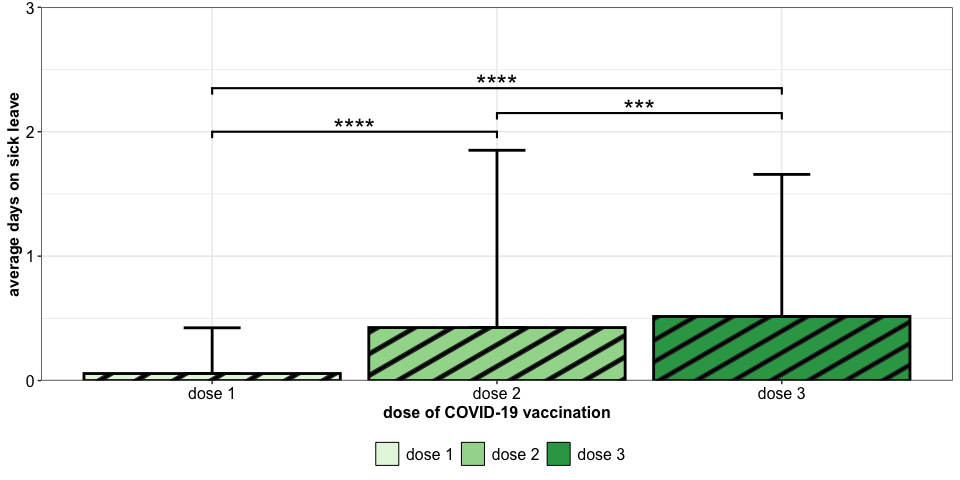<!-- -->

#### Significance

``` r
stat_mwu %>% inner_join(mean_sick_total , by = c("group1" = "sickleave")) %>% 
  inner_join(mean_sick_total, by = c("group2" = "sickleave"), suffix = c(".gr1", ".gr2")) %>% 
  select(-matches("(.|)y.|^x|signif|groups")) %>%
  knitr::kable() %>%
  kableExtra::kable_paper() %>%
  kableExtra::kable_styling(position = "left")%>%
  kableExtra::column_spec(1:2, bold = T)
```

<table class=" lightable-paper table" style="font-family: &quot;Arial Narrow&quot;, arial, helvetica, sans-serif; margin-left: auto; margin-right: auto; ">
<thead>
<tr>
<th style="text-align:left;">
group1
</th>
<th style="text-align:left;">
group2
</th>
<th style="text-align:right;">
n1
</th>
<th style="text-align:right;">
n2
</th>
<th style="text-align:right;">
statistic
</th>
<th style="text-align:right;">
p
</th>
<th style="text-align:right;">
p.adj
</th>
</tr>
</thead>
<tbody>
<tr>
<td style="text-align:left;font-weight: bold;">
dose 1
</td>
<td style="text-align:left;font-weight: bold;">
dose 2
</td>
<td style="text-align:right;">
1274
</td>
<td style="text-align:right;">
1270
</td>
<td style="text-align:right;">
668921.5
</td>
<td style="text-align:right;">
0.00e+00
</td>
<td style="text-align:right;">
0.000000
</td>
</tr>
<tr>
<td style="text-align:left;font-weight: bold;">
dose 1
</td>
<td style="text-align:left;font-weight: bold;">
dose 3
</td>
<td style="text-align:right;">
1274
</td>
<td style="text-align:right;">
1058
</td>
<td style="text-align:right;">
508956.0
</td>
<td style="text-align:right;">
0.00e+00
</td>
<td style="text-align:right;">
0.000000
</td>
</tr>
<tr>
<td style="text-align:left;font-weight: bold;">
dose 2
</td>
<td style="text-align:left;font-weight: bold;">
dose 3
</td>
<td style="text-align:right;">
1270
</td>
<td style="text-align:right;">
1058
</td>
<td style="text-align:right;">
624349.5
</td>
<td style="text-align:right;">
8.13e-05
</td>
<td style="text-align:right;">
0.000149
</td>
</tr>
</tbody>
</table>

### Gender spec.

``` r
mean_sick_gender <- df_sick_longer %>%
            group_by(gender, sickleave) %>% 
            summarise(Mean_days = mean(days, na.rm = T),
                      SD_days = sd(days, na.rm = T)) %>%
            mutate(sickleave = gsub(x = sickleave, pattern = "audosis", replacement = "dose "))

stat_mwu <- df_sick_longer %>% select(gender, days, sickleave) %>% group_by(sickleave) %>% 
            rstatix::pairwise_wilcox_test(days ~ gender, p.adjust.method = "BY")  %>%
            rstatix::add_xy_position() %>%
            mutate(sickleave = gsub(x = sickleave, pattern = "audosis", replacement = "dose ")) %>% 
            filter(p.adj.signif < 0.05) 

stat_mwu_plt <- stat_mwu %>% filter(p.adj < 0.05)

stat_mwu_plt$y.position <- c(2.05 , 1.9)
stat_mwu_plt$xmin <- c(1.77, 2.77)
stat_mwu_plt$xmax <- c(2.23, 3.23)

plt_avg_sick_gender_30 <- mean_sick_gender %>%
  ggplot2::ggplot(ggplot2::aes(x = sickleave, fill = gender, y = Mean_days)) + 
  ggpattern::geom_col_pattern(position = ggplot2::position_dodge(0.9), col = "black", lwd = 1, pattern_fill = "black", show.legend = T) +
  ggplot2::geom_errorbar(aes(ymin = Mean_days, ymax = Mean_days + SD_days), width = 0.2, position = ggplot2::position_dodge(0.9), lwd = 1) +
  ggplot2::theme_bw() +
  ggplot2::scale_fill_manual(values = c("#D95F02", "#1B9E77")) +
  ggplot2::scale_y_continuous(expand = c(0, 0)) + 
  ggplot2::theme(axis.text = ggplot2::element_text(size = 12, colour = "black"),
                 axis.title = ggplot2::element_text(face = "bold", size = 12),
                 legend.title = ggplot2::element_blank(),
                 legend.text = ggplot2::element_text(size = 12),
                 legend.position = "bottom") +
  ggplot2::ylab("average days on sick leave") +
  ggplot2::xlab("dose of COVID-19 vaccination")  + 
  ggplot2::coord_cartesian(ylim = c(0, 3)) +
  ggsignif::geom_signif(xmin = stat_mwu_plt$xmin,
                        xmax = stat_mwu_plt$xmax,
                        y_position = stat_mwu_plt$y.position,
                        annotation = stat_mwu_plt$p.adj.signif,
                        tip_length = 0.025, vjust = 0.5, lwd = 0.75, textsize = 7)

plt_avg_sick_gender_30
```

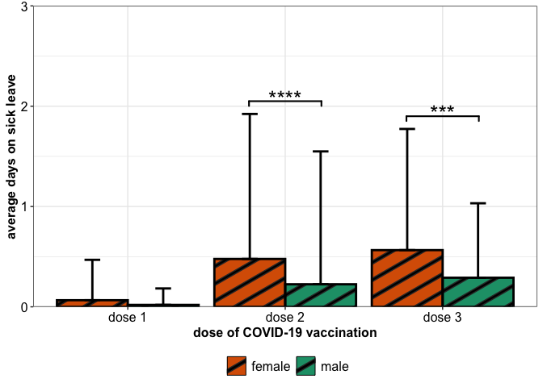<!-- -->

#### Significance

``` r
stat_mwu %>% inner_join(mean_sick_gender , by = c("group1" = "gender", "sickleave" = "sickleave")) %>% 
  inner_join(mean_sick_gender, by = c("group2" = "gender", "sickleave" = "sickleave"), suffix = c(".gr1", ".gr2")) %>% 
  select(-matches("^(.|)y|^x|groups|signif")) %>% rename(Dosis = sickleave) %>%
  knitr::kable() %>%
  kableExtra::kable_paper() %>%
  kableExtra::kable_styling(position = "left")%>%
  kableExtra::column_spec(1, bold = T)
```

<table class=" lightable-paper table" style="font-family: &quot;Arial Narrow&quot;, arial, helvetica, sans-serif; margin-left: auto; margin-right: auto; ">
<thead>
<tr>
<th style="text-align:left;">
Dosis
</th>
<th style="text-align:left;">
group1
</th>
<th style="text-align:left;">
group2
</th>
<th style="text-align:right;">
n1
</th>
<th style="text-align:right;">
n2
</th>
<th style="text-align:right;">
statistic
</th>
<th style="text-align:right;">
p
</th>
<th style="text-align:right;">
p.adj
</th>
<th style="text-align:right;">
Mean_days.gr1
</th>
<th style="text-align:right;">
SD_days.gr1
</th>
<th style="text-align:right;">
Mean_days.gr2
</th>
<th style="text-align:right;">
SD_days.gr2
</th>
</tr>
</thead>
<tbody>
<tr>
<td style="text-align:left;font-weight: bold;">
dose 2
</td>
<td style="text-align:left;">
female
</td>
<td style="text-align:left;">
male
</td>
<td style="text-align:right;">
1012
</td>
<td style="text-align:right;">
258
</td>
<td style="text-align:right;">
147115.5
</td>
<td style="text-align:right;">
8.10e-06
</td>
<td style="text-align:right;">
8.10e-06
</td>
<td style="text-align:right;">
0.4772727
</td>
<td style="text-align:right;">
1.445508
</td>
<td style="text-align:right;">
0.2248062
</td>
<td style="text-align:right;">
1.3246558
</td>
</tr>
<tr>
<td style="text-align:left;font-weight: bold;">
dose 3
</td>
<td style="text-align:left;">
female
</td>
<td style="text-align:left;">
male
</td>
<td style="text-align:right;">
865
</td>
<td style="text-align:right;">
193
</td>
<td style="text-align:right;">
94738.0
</td>
<td style="text-align:right;">
1.93e-04
</td>
<td style="text-align:right;">
1.93e-04
</td>
<td style="text-align:right;">
0.5653179
</td>
<td style="text-align:right;">
1.207883
</td>
<td style="text-align:right;">
0.2901554
</td>
<td style="text-align:right;">
0.7421509
</td>
</tr>
</tbody>
</table>

### Profession spec.

``` r
mean_sick_profession <- df_sick_longer %>% filter(!is.na(profession)) %>%
            group_by(profession, sickleave) %>% 
            summarise(Mean_days = mean(days, na.rm = T),
                      SD_days = sd(days, na.rm = T)) %>%
            mutate(sickleave = gsub(x = sickleave, pattern = "audosis", replacement = "dose "))

stat_mwu <- df_sick_longer %>% select(profession, days, sickleave) %>% group_by(sickleave) %>% 
            rstatix::pairwise_wilcox_test(days ~ profession, p.adjust.method = "BY")  %>%
            mutate(sickleave = gsub(x = sickleave, pattern = "audosis", replacement = "dose ")) %>% 
            filter(p.adj.signif < 0.05) %>%
            rstatix::add_xy_position()

stat_mwu_plt <- stat_mwu %>% filter(p.adj < 0.05) 
stat_mwu_plt$y.position <- c(2.4, 2.6)
stat_mwu_plt$xmin <- c(2.89, 2.89)
stat_mwu_plt$xmax <- c(3.11, 3.33)

avg_sick_profession_plt_30 <- mean_sick_profession %>%
  ggplot2::ggplot(ggplot2::aes(x = sickleave, fill = profession, y = Mean_days)) + 
  ggpattern::geom_col_pattern(position = ggplot2::position_dodge(0.9), col = "black", lwd = 1, pattern_fill = "black", show.legend = T) +
  ggplot2::geom_errorbar(aes(ymin = Mean_days, ymax = Mean_days + SD_days), width = 0.2, position = ggplot2::position_dodge(0.9), lwd = 1) +
  ggplot2::theme_bw() +
  ggplot2::scale_fill_manual(values = c("#F39B7FFF", "#4DBBD5FF", "#91D1C2FF", "#8491B4FF")) +
  ggplot2::scale_y_continuous(expand = c(0, 0)) + 
  ggplot2::theme(axis.text = ggplot2::element_text(size = 12, colour = "black"),
                 axis.title = ggplot2::element_text(face = "bold", size = 12),
                 legend.title = ggplot2::element_blank(),
                 legend.text = ggplot2::element_text(size = 12),
                 legend.position = "bottom") +
  ggplot2::ylab("average days on sick leave") +
  ggplot2::xlab("dose of COVID-19 vaccination") + 
  ggplot2::coord_cartesian(ylim = c(0,3)) +
  ggsignif::geom_signif(xmin = stat_mwu_plt$xmin,
                        xmax = stat_mwu_plt$xmax,
                        y_position = stat_mwu_plt$y.position,
                        annotation = stat_mwu_plt$p.adj.signif,
                        tip_length = 0.025, vjust = 0.5, lwd = 0.75, textsize = 7)

avg_sick_profession_plt_30
```

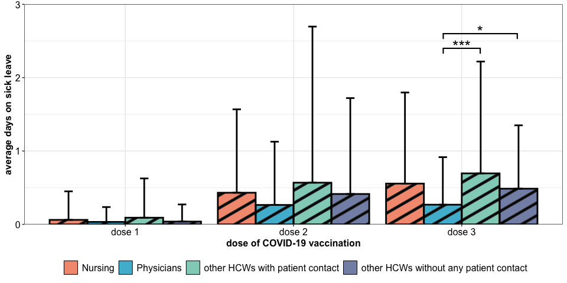<!-- -->

#### Significance

``` r
stat_mwu %>% inner_join(mean_sick_profession , by = c("group1" = "profession", "sickleave" = "sickleave")) %>% 
  inner_join(mean_sick_profession, by = c("group2" = "profession", "sickleave" = "sickleave"), suffix = c(".gr1", ".gr2")) %>% 
  select(-matches("^(.|)y|^x|groups|signif")) %>% rename(Dosis = sickleave) %>%
  knitr::kable() %>%
  kableExtra::kable_paper() %>%
  kableExtra::kable_styling(position = "left") %>%
  kableExtra::column_spec(1, bold = T)
```

<table class=" lightable-paper table" style="font-family: &quot;Arial Narrow&quot;, arial, helvetica, sans-serif; margin-left: auto; margin-right: auto; ">
<thead>
<tr>
<th style="text-align:left;">
Dosis
</th>
<th style="text-align:left;">
group1
</th>
<th style="text-align:left;">
group2
</th>
<th style="text-align:right;">
n1
</th>
<th style="text-align:right;">
n2
</th>
<th style="text-align:right;">
statistic
</th>
<th style="text-align:right;">
p
</th>
<th style="text-align:right;">
p.adj
</th>
<th style="text-align:right;">
Mean_days.gr1
</th>
<th style="text-align:right;">
SD_days.gr1
</th>
<th style="text-align:right;">
Mean_days.gr2
</th>
<th style="text-align:right;">
SD_days.gr2
</th>
</tr>
</thead>
<tbody>
<tr>
<td style="text-align:left;font-weight: bold;">
dose 3
</td>
<td style="text-align:left;">
Physicians
</td>
<td style="text-align:left;">
other HCWs with patient contact
</td>
<td style="text-align:right;">
190
</td>
<td style="text-align:right;">
233
</td>
<td style="text-align:right;">
18064.5
</td>
<td style="text-align:right;">
3.44e-05
</td>
<td style="text-align:right;">
0.000506
</td>
<td style="text-align:right;">
0.2684211
</td>
<td style="text-align:right;">
0.6477904
</td>
<td style="text-align:right;">
0.6952790
</td>
<td style="text-align:right;">
1.5247453
</td>
</tr>
<tr>
<td style="text-align:left;font-weight: bold;">
dose 3
</td>
<td style="text-align:left;">
Physicians
</td>
<td style="text-align:left;">
other HCWs without any patient contact
</td>
<td style="text-align:right;">
190
</td>
<td style="text-align:right;">
296
</td>
<td style="text-align:right;">
24451.0
</td>
<td style="text-align:right;">
2.00e-03
</td>
<td style="text-align:right;">
0.011000
</td>
<td style="text-align:right;">
0.2684211
</td>
<td style="text-align:right;">
0.6477904
</td>
<td style="text-align:right;">
0.4864865
</td>
<td style="text-align:right;">
0.8634694
</td>
</tr>
</tbody>
</table>

### Rel. to vaccination

``` r
vaccine_order <- data.frame(vaccine = levels(df_sick_longer$vaccine), nr = seq_along(levels(df_sick_longer$vaccine)))

df_sick_longer_sub <- df_sick_longer %>% dplyr::select(subjectID, gender, AgeCategory, profession, dose, vaccine, days)

df_sick_mean_vacc <- df_sick_longer_sub %>% 
                     group_by(vaccine, dose) %>% 
                     summarise(Sum_days = sum(days, na.rm = T),
                              Mean_days = mean(days, na.rm = T),
                              SD_days = sd(days, na.rm = T)) %>% arrange(vaccine, dose)

stat.test <- df_sick_longer_sub %>% group_by(dose) %>% rstatix::wilcox_test(days ~ vaccine) %>% rstatix::add_significance()

gr_matrix <- as.data.frame(t(combn(levels(df_sick_longer_sub$vaccine), 2)))
colnames(gr_matrix) <- c("group1", "group2")
gr_matrix <- cbind(dose = rep(unique(df_sick_longer_sub$dose), each = 15), gr_matrix)      
                    
gr_count <- df_sick_longer_sub %>% group_by(vaccine, dose) %>% count() 

stat.comp <- gr_matrix %>% full_join(gr_count %>% as.data.frame() %>% mutate(vaccine = as.character(vaccine)), 
                                     by = c("group1" = "vaccine"), suffix = c("1", "2")) %>% 
                 inner_join(gr_count %>% as.data.frame(), by = c("group2" = "vaccine"), suffix = c("1", "2")) %>% 
                 filter(dose1 == dose2) %>% select(-dose, -dose2) %>% rename(dose = dose1) %>%
                 inner_join(stat.test) %>% arrange(dose) 

stat.comp <- stat.comp %>% inner_join(vaccine_order, by = c("group1" = "vaccine")) %>% rename(xmin = nr) %>%
             inner_join(vaccine_order, by = c("group2" = "vaccine")) %>% rename(xmax = nr)

stat.comp <- stat.comp %>% filter(p.adj < 0.05) 

box_upper <- df_sick_mean_vacc %>% mutate(days_max = Mean_days + SD_days)

stat.comp <- stat.comp %>% inner_join(box_upper, by = c("group1" = "vaccine", "dose" = "dose")) %>% rename(ygr1 = days_max) %>% 
                           inner_join(box_upper, by = c("group2" = "vaccine", "dose" = "dose"))  %>% rename(ygr2 = days_max)

stat.comp <- stat.comp %>% group_by(group1, group2) %>%
                           mutate(ymax = max(ygr1, ygr2))

stat.comp <- stat.comp %>% mutate(plt_xmin = dplyr::case_when(dose == "dose1" ~ 0.7 + (xmin-1) * 0.2,
                                                              dose == "dose2" ~ 1.8 + (xmin-1) * 0.4,
                                                              dose == "dose3" ~ 2.8 + (xmin-1) * 0.4),
                                  plt_xmax = dplyr::case_when(dose == "dose1" ~ 0.7 + (xmax-1) * 0.2,
                                                              dose == "dose2" ~ 1.8 + (xmax-1) * 0.4,
                                                              dose == "dose3" ~ 2.8 + (xmax-1) * 0.4))
stat.comp <- stat.comp %>% group_by(dose) %>% mutate(ymax = max(ymax))


plt_sick_leave_days_mean_30 <- df_sick_mean_vacc %>% 
  ggplot2::ggplot(ggplot2::aes(x = dose, y = Mean_days, fill = factor(vaccine))) +
  ggpattern::geom_col_pattern(position = ggplot2::position_dodge(width = 0.9), color = "black", lwd = 1, pattern_fill = "black", show.legend = T) +
  ggplot2::geom_errorbar(aes(ymin = Mean_days, ymax = Mean_days + SD_days), width = 0.2, position = ggplot2::position_dodge(0.9)) +
  ggplot2::theme_bw() +
  ggplot2::scale_x_discrete(labels = c("first dose", "second dose", "third dose")) +
  ggsci::scale_fill_nejm() +
  ggplot2::theme(axis.text = ggplot2::element_text(size = 12, colour = "black"),
                 axis.title = ggplot2::element_text(face = "bold", size = 12),
                 legend.title = ggplot2::element_blank(),
                 legend.text = ggplot2::element_text(size = 12),
                 legend.position = "bottom") +
  ggplot2::ylab("average days on sick leave") +
  ggplot2::xlab("dose of COVID-19 vaccination") +
  ggplot2::coord_cartesian(ylim = c(0, 3)) +
  ggsignif::geom_signif(xmin = stat.comp$plt_xmin,
                        xmax = stat.comp$plt_xmax,
                        y_position = 0.3 * unlist(sapply(stat.comp %>% group_by(dose) %>% count() %>% pull(n), function(i) seq_len(i))) + (stat.comp$ymax),
                        annotation = stat.comp$p.adj.signif,
                        tip_length = 0.025, vjust = 0.5, lwd = 0.75, textsize = 7) +
  ggplot2::guides(fill = ggplot2::guide_legend(nrow = 2))

plt_sick_leave_days_mean_30
```

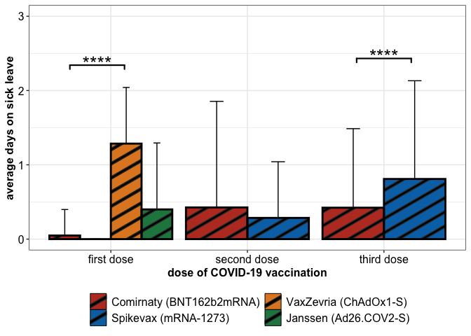<!-- -->

#### Significance

``` r
stat.test %>% dplyr::select(-p.adj, -matches("x|y")) %>% dplyr::rename(p.value = p, p.value.signif = p.adj.signif) %>%
              dplyr::mutate(group1 = gsub(x = group1, pattern = "dose", replace = "dose "),
                            group2 = gsub(x = group2, pattern = "dose", replace = "dose ")) %>%
  knitr::kable() %>%
  kableExtra::kable_paper() %>%
  kableExtra::kable_styling(position = "left")%>%
  kableExtra::column_spec(1:2, bold = T)
```

<table class=" lightable-paper table" style="font-family: &quot;Arial Narrow&quot;, arial, helvetica, sans-serif; margin-left: auto; margin-right: auto; ">
<thead>
<tr>
<th style="text-align:left;">
dose
</th>
<th style="text-align:left;">
group1
</th>
<th style="text-align:left;">
group2
</th>
<th style="text-align:right;">
n1
</th>
<th style="text-align:right;">
n2
</th>
<th style="text-align:right;">
statistic
</th>
<th style="text-align:right;">
p.value
</th>
<th style="text-align:left;">
p.value.signif
</th>
</tr>
</thead>
<tbody>
<tr>
<td style="text-align:left;font-weight: bold;">
dose1
</td>
<td style="text-align:left;font-weight: bold;">
Comirnaty (BNT162b2mRNA)
</td>
<td style="text-align:left;">
Spikevax (mRNA-1273)
</td>
<td style="text-align:right;">
1258
</td>
<td style="text-align:right;">
4
</td>
<td style="text-align:right;">
2588.0
</td>
<td style="text-align:right;">
0.733
</td>
<td style="text-align:left;">
ns
</td>
</tr>
<tr>
<td style="text-align:left;font-weight: bold;">
dose1
</td>
<td style="text-align:left;font-weight: bold;">
Comirnaty (BNT162b2mRNA)
</td>
<td style="text-align:left;">
VaxZevria (ChAdOx1-S)
</td>
<td style="text-align:right;">
1258
</td>
<td style="text-align:right;">
7
</td>
<td style="text-align:right;">
752.0
</td>
<td style="text-align:right;">
0.000
</td>
<td style="text-align:left;">
\*\*\*\*
</td>
</tr>
<tr>
<td style="text-align:left;font-weight: bold;">
dose1
</td>
<td style="text-align:left;font-weight: bold;">
Comirnaty (BNT162b2mRNA)
</td>
<td style="text-align:left;">
Janssen (Ad26.COV2-S)
</td>
<td style="text-align:right;">
1258
</td>
<td style="text-align:right;">
5
</td>
<td style="text-align:right;">
2597.5
</td>
<td style="text-align:right;">
0.021
</td>
<td style="text-align:left;">
ns
</td>
</tr>
<tr>
<td style="text-align:left;font-weight: bold;">
dose1
</td>
<td style="text-align:left;font-weight: bold;">
Spikevax (mRNA-1273)
</td>
<td style="text-align:left;">
VaxZevria (ChAdOx1-S)
</td>
<td style="text-align:right;">
4
</td>
<td style="text-align:right;">
7
</td>
<td style="text-align:right;">
2.0
</td>
<td style="text-align:right;">
0.020
</td>
<td style="text-align:left;">
ns
</td>
</tr>
<tr>
<td style="text-align:left;font-weight: bold;">
dose1
</td>
<td style="text-align:left;font-weight: bold;">
Spikevax (mRNA-1273)
</td>
<td style="text-align:left;">
Janssen (Ad26.COV2-S)
</td>
<td style="text-align:right;">
4
</td>
<td style="text-align:right;">
5
</td>
<td style="text-align:right;">
8.0
</td>
<td style="text-align:right;">
0.502
</td>
<td style="text-align:left;">
ns
</td>
</tr>
<tr>
<td style="text-align:left;font-weight: bold;">
dose1
</td>
<td style="text-align:left;font-weight: bold;">
VaxZevria (ChAdOx1-S)
</td>
<td style="text-align:left;">
Janssen (Ad26.COV2-S)
</td>
<td style="text-align:right;">
7
</td>
<td style="text-align:right;">
5
</td>
<td style="text-align:right;">
27.5
</td>
<td style="text-align:right;">
0.100
</td>
<td style="text-align:left;">
ns
</td>
</tr>
<tr>
<td style="text-align:left;font-weight: bold;">
dose2
</td>
<td style="text-align:left;font-weight: bold;">
Comirnaty (BNT162b2mRNA)
</td>
<td style="text-align:left;">
Spikevax (mRNA-1273)
</td>
<td style="text-align:right;">
1263
</td>
<td style="text-align:right;">
7
</td>
<td style="text-align:right;">
4659.5
</td>
<td style="text-align:right;">
0.727
</td>
<td style="text-align:left;">
ns
</td>
</tr>
<tr>
<td style="text-align:left;font-weight: bold;">
dose3
</td>
<td style="text-align:left;font-weight: bold;">
Comirnaty (BNT162b2mRNA)
</td>
<td style="text-align:left;">
Spikevax (mRNA-1273)
</td>
<td style="text-align:right;">
806
</td>
<td style="text-align:right;">
252
</td>
<td style="text-align:right;">
82966.0
</td>
<td style="text-align:right;">
0.000
</td>
<td style="text-align:left;">
\*\*\*\*
</td>
</tr>
</tbody>
</table>

## HCWs on sick leave

### Total

``` r
sick_days_vacc <- df_sick_longer %>% 
                  group_by(dose, sickleave, vaccine) %>%
                  count(.drop = FALSE) %>%
                  full_join(df_sick_longer %>% filter(days > 0) %>%
                              group_by(dose, sickleave, vaccine) %>%
                              dplyr::count(name = "n_sick", .drop = FALSE)) %>%
                   mutate(n_sick = replace(n_sick, is.na(n_sick), 0)) 

sick_hcw_overall_rel <- df_sick_longer %>% 
                  group_by(dose, sickleave) %>%
                  count(.drop = FALSE) %>%
                  full_join(df_sick_longer %>% filter(days > 0) %>%
                              group_by(dose, sickleave) %>%
                              dplyr::count(name = "n_sick", .drop = FALSE)) %>%
                   mutate(n_sick = replace(n_sick, is.na(n_sick), 0)) 

gr_labs <- c("Dose 1", "Dose 2", "Dose 3")
names(gr_labs) <- paste0("dose", 1:3)

sick_hcw_df <- sick_hcw_overall_rel %>% tidyr::pivot_longer(cols = c(n, n_sick), names_to = "n_subset", values_to = "number")  %>% ungroup() %>% select(!sickleave) %>%
                   dplyr::rename(dose = dose) %>%
                   mutate(dose = gsub(x = dose, pattern = "dose", replacement = ""),
                          n_subset = if_else(n_subset == "n", true = "#hcw", false = "#hcw on sick leave")) %>%
                  tidyr::pivot_wider(names_from = n_subset, values_from = number) 


dose <- as.character(unique(sick_hcw_df$dose))
stats_hcw_overall <- c()
exclude <- c()
for(dose_i in dose){
  exclude <- c(exclude, dose_i)
  for(dose_j in dose[!dose %in% exclude]){
      
    tmp_mat <- sick_hcw_df %>% filter(dose %in% c(dose_i, dose_j)) %>% ungroup() %>% select(matches("hcw")) %>% as.matrix()
    tmp_mat[,1] <- tmp_mat[,1] - tmp_mat[,2]
    tmp_mat <- tmp_mat[,2:1]
    stats_hcw_overall <- rbind(stats_hcw_overall, data.frame(dose.gr1 = dose_i, dose.gr2 = dose_j, 
                                                             sick.gr1 = tmp_mat[1,1],
                                                             sick.gr2 = tmp_mat[2,1],
                                                             not.sick.gr1 = tmp_mat[1,2],
                                                             not.sick.gr2 = tmp_mat[2,2],
                                                             odds_ratio = fisher.test(tmp_mat)$estimate,
                                                             p.value = fisher.test(tmp_mat)$p.value))
  }
}
stats_hcw_overall <- stats_hcw_overall %>% as_tibble()

stats_hcw_overall_plt <- stats_hcw_overall
stats_hcw_overall_plt$xmin <- as.numeric(stats_hcw_overall_plt$dose.gr1)
stats_hcw_overall_plt$xmax <- as.numeric(stats_hcw_overall_plt$dose.gr2)
stats_hcw_overall_plt$y.position <- c(0.28, 0.45, 0.35)

stats_hcw_overall_plt <- stats_hcw_overall_plt %>% rstatix::add_significance(p.col = "p.value")

plt_rels <- sick_hcw_overall_rel %>% group_by(dose) %>% 
                   summarise(n_sick_freq = Hmisc::binconf(x = n_sick, n = n)[1],
                             CI_upper = Hmisc::binconf(x = n_sick, n = n)[3])


plt_hcw_leave <-  plt_rels %>%
  ggplot2::ggplot(ggplot2::aes(x = dose, y = n_sick_freq * 100, fill = dose)) +
  ggpattern::geom_col_pattern(col = "black", lwd = 1, pattern_fill = "black", show.legend = T) +
  ggplot2::geom_errorbar(aes(ymin = n_sick_freq*100, ymax = CI_upper*100), width = 0.2) +
  ggplot2::theme_bw() +
  ggplot2::scale_x_discrete(labels = c("first dose", "second dose", "third dose")) +
  ggplot2::scale_y_continuous(expand =  c(0, 0)) + 
  ggplot2::scale_fill_manual(values = c("#9ECAE1", "#4292C6", "#08519C")) + 
  ggplot2::theme(axis.text = ggplot2::element_text(size = 12, colour = "black"),
                 axis.title = ggplot2::element_text(face = "bold", size = 12),
                 legend.title = ggplot2::element_blank(),
                 legend.text = ggplot2::element_text(size = 12),
                 legend.position = "none") +
  ggplot2::ylab("% sick HCWs") +
  ggplot2::xlab("dose of COVID-19 vaccination") +
  ggplot2::coord_cartesian(ylim = c(0,100)) + 
  ggsignif::geom_signif(xmin = stats_hcw_overall_plt$xmin,
                        xmax = stats_hcw_overall_plt$xmax,
                        y_position = stats_hcw_overall_plt$y.position * 100,
                        annotation = stats_hcw_overall_plt$p.value.signif,
                        tip_length = 0.05, vjust = 0.5, lwd = 0.75, textsize = 7) 

plt_hcw_leave
```

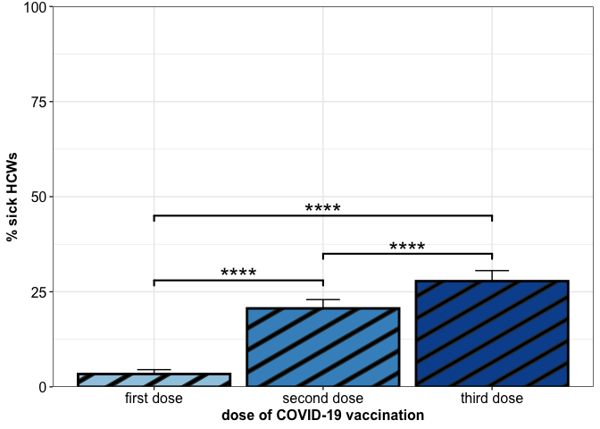<!-- -->

#### Significance

``` r
stats_hcw_overall %>%
  kable() %>%
  kableExtra::kable_paper() %>%
  kableExtra::kable_styling(position = "left")%>%
  kableExtra::column_spec(1, bold = T)
```

<table class=" lightable-paper table" style="font-family: &quot;Arial Narrow&quot;, arial, helvetica, sans-serif; margin-left: auto; margin-right: auto; ">
<thead>
<tr>
<th style="text-align:left;">
dose.gr1
</th>
<th style="text-align:left;">
dose.gr2
</th>
<th style="text-align:right;">
sick.gr1
</th>
<th style="text-align:right;">
sick.gr2
</th>
<th style="text-align:right;">
not.sick.gr1
</th>
<th style="text-align:right;">
not.sick.gr2
</th>
<th style="text-align:right;">
odds_ratio
</th>
<th style="text-align:right;">
p.value
</th>
</tr>
</thead>
<tbody>
<tr>
<td style="text-align:left;font-weight: bold;">
1
</td>
<td style="text-align:left;">
2
</td>
<td style="text-align:right;">
43
</td>
<td style="text-align:right;">
262
</td>
<td style="text-align:right;">
1231
</td>
<td style="text-align:right;">
1008
</td>
<td style="text-align:right;">
0.1345129
</td>
<td style="text-align:right;">
0.00e+00
</td>
</tr>
<tr>
<td style="text-align:left;font-weight: bold;">
1
</td>
<td style="text-align:left;">
3
</td>
<td style="text-align:right;">
43
</td>
<td style="text-align:right;">
294
</td>
<td style="text-align:right;">
1231
</td>
<td style="text-align:right;">
764
</td>
<td style="text-align:right;">
0.0908879
</td>
<td style="text-align:right;">
0.00e+00
</td>
</tr>
<tr>
<td style="text-align:left;font-weight: bold;">
2
</td>
<td style="text-align:left;">
3
</td>
<td style="text-align:right;">
262
</td>
<td style="text-align:right;">
294
</td>
<td style="text-align:right;">
1008
</td>
<td style="text-align:right;">
764
</td>
<td style="text-align:right;">
0.6755697
</td>
<td style="text-align:right;">
6.16e-05
</td>
</tr>
</tbody>
</table>

### Rel. to vaccination

``` r
sick_leave_df <- sick_days_vacc %>% tidyr::pivot_longer(cols = c(n, n_sick), names_to = "n_subset", values_to = "number") %>% filter(vaccine != "Other") %>% ungroup() %>% select(!sickleave) %>%
                   mutate(dose = gsub(x = dose, pattern = "dose", replacement = ""),
                          n_subset = if_else(n_subset == "n", true = "#hcw", false = "#hcw on sick leave")) %>%
                  tidyr::pivot_wider(names_from = n_subset, values_from = number) %>% group_by(dose, vaccine)


stats_sick_leave <- do.call("rbind", lapply(split(sick_leave_df, f = sick_leave_df$dose), function(mat){
  
  vaccs <- as.character(unique(mat$vaccine))
  df_comp <- c()
  exclude <- c()
  for(vaccs_i in vaccs){
    exclude <- c(exclude, vaccs_i)
    for(vaccs_j in vaccs[!vaccs %in% exclude]){
      
      tmp_mat <- mat %>% filter(vaccine %in% c(vaccs_i, vaccs_j)) %>% ungroup() %>% select(matches("hcw")) %>% as.matrix()
      tmp_mat[,1] <- tmp_mat[,1] - tmp_mat[,2]
      tmp_mat <- tmp_mat[,2:1]
      df_comp <- rbind(df_comp, data.frame(dose = unique(mat$dose), group1 = vaccs_i, group2 = vaccs_j, 
                                            sick.gr1 = tmp_mat[1,1],
                                            sick.gr2 = tmp_mat[2,1],
                                            not.sick.gr1 = tmp_mat[1,2],
                                            not.sick.gr2 = tmp_mat[2,2],
                                            odds_ratio = fisher.test(tmp_mat)$estimate,
                                            p.value = fisher.test(tmp_mat)$p.value))
    }
  }
  df_comp
}))

stats_sick_leave <- cbind(stats_sick_leave, p.adj = p.adjust(stats_sick_leave$p.value, method = "BY")) %>% as_tibble()

stats_sick_leave_plt <- stats_sick_leave %>% filter(p.adj < 0.05)
stats_sick_leave_plt$xmin <- c(0.66, 2.77)
stats_sick_leave_plt$xmax <- c(1.11, 3.23)
stats_sick_leave_plt$y.position <- c(1.05, 0.55)

stats_sick_leave_plt <- stats_sick_leave_plt %>% rstatix::add_significance(p.col = "p.adj")

plt_rels <- sick_days_vacc %>% group_by(dose, vaccine) %>% 
                   summarise(n_sick_freq = Hmisc::binconf(x = n_sick, n = n)[1],
                          CI_upper = Hmisc::binconf(x = n_sick, n = n)[3]) %>% filter(vaccine != "Others")


plt_vacc_on_leave_30 <-  plt_rels %>%
  ggplot2::ggplot(ggplot2::aes(x = dose, y = n_sick_freq * 100, fill = vaccine)) +
  ggpattern::geom_col_pattern(position = ggplot2::position_dodge(0.9), col = "black", lwd = 1, pattern_fill = "black", show.legend = T) +
  ggplot2::geom_errorbar(aes(ymin = n_sick_freq*100, ymax = CI_upper*100), width = 0.2, position = ggplot2::position_dodge(0.9)) +
  ggplot2::theme_bw() +
  ggplot2::scale_x_discrete(labels = c("first dose", "second dose", "third dose")) +
  ggplot2::scale_y_continuous(expand = c(0,0), breaks = seq(0,100, 25)) + 
  ggsci::scale_fill_nejm() + 
  ggplot2::theme(axis.text = ggplot2::element_text(size = 16, colour = "black"),
                 axis.title = ggplot2::element_text(face = "bold", size = 16),
                 legend.title = ggplot2::element_blank(),
                 legend.text = ggplot2::element_text(size = 16),
                 legend.position = "bottom") +
  ggplot2::ylab("% sick HCW due to vaccination") +
  ggplot2::xlab("dose of COVID-19 vaccination") +
  ggplot2::coord_cartesian(ylim = c(0,115)) +
  ggplot2::guides(fill = ggplot2::guide_legend(nrow = 2)) +
  ggsignif::geom_signif(xmin = stats_sick_leave_plt$xmin,
                        xmax = stats_sick_leave_plt$xmax,
                        y_position = stats_sick_leave_plt$y.position * 100,
                        annotation = stats_sick_leave_plt$p.adj.signif,
                        tip_length = 0.025, vjust = 0.5, lwd = 0.75, textsize = 7) 

plt_vacc_on_leave_30
```

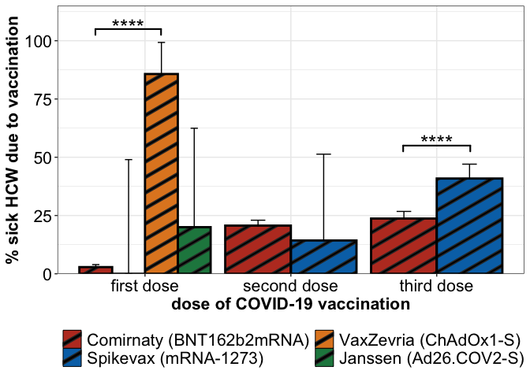<!-- -->

#### Significance

``` r
stats_sick_leave %>% mutate(p.value = format(p.value, scientific = T, digits = 2),
                            p.adj = format(p.adj, scientific = T, digits = 2)) %>%
  knitr::kable() %>%
  kableExtra::kable_paper() %>%
  kableExtra::kable_styling(position = "left")%>%
  kableExtra::column_spec(1, bold = T)
```

<table class=" lightable-paper table" style="font-family: &quot;Arial Narrow&quot;, arial, helvetica, sans-serif; margin-left: auto; margin-right: auto; ">
<thead>
<tr>
<th style="text-align:left;">
dose
</th>
<th style="text-align:left;">
group1
</th>
<th style="text-align:left;">
group2
</th>
<th style="text-align:right;">
sick.gr1
</th>
<th style="text-align:right;">
sick.gr2
</th>
<th style="text-align:right;">
not.sick.gr1
</th>
<th style="text-align:right;">
not.sick.gr2
</th>
<th style="text-align:right;">
odds_ratio
</th>
<th style="text-align:left;">
p.value
</th>
<th style="text-align:left;">
p.adj
</th>
</tr>
</thead>
<tbody>
<tr>
<td style="text-align:left;font-weight: bold;">
1
</td>
<td style="text-align:left;">
Comirnaty (BNT162b2mRNA)
</td>
<td style="text-align:left;">
Spikevax (mRNA-1273)
</td>
<td style="text-align:right;">
36
</td>
<td style="text-align:right;">
0
</td>
<td style="text-align:right;">
1222
</td>
<td style="text-align:right;">
4
</td>
<td style="text-align:right;">
Inf
</td>
<td style="text-align:left;">
1.0e+00
</td>
<td style="text-align:left;">
1.0e+00
</td>
</tr>
<tr>
<td style="text-align:left;font-weight: bold;">
1
</td>
<td style="text-align:left;">
Comirnaty (BNT162b2mRNA)
</td>
<td style="text-align:left;">
VaxZevria (ChAdOx1-S)
</td>
<td style="text-align:right;">
36
</td>
<td style="text-align:right;">
6
</td>
<td style="text-align:right;">
1222
</td>
<td style="text-align:right;">
1
</td>
<td style="text-align:right;">
0.0050168
</td>
<td style="text-align:left;">
6.4e-09
</td>
<td style="text-align:left;">
1.4e-07
</td>
</tr>
<tr>
<td style="text-align:left;font-weight: bold;">
1
</td>
<td style="text-align:left;">
Comirnaty (BNT162b2mRNA)
</td>
<td style="text-align:left;">
Janssen (Ad26.COV2-S)
</td>
<td style="text-align:right;">
36
</td>
<td style="text-align:right;">
1
</td>
<td style="text-align:right;">
1222
</td>
<td style="text-align:right;">
4
</td>
<td style="text-align:right;">
0.1184007
</td>
<td style="text-align:left;">
1.4e-01
</td>
<td style="text-align:left;">
6.0e-01
</td>
</tr>
<tr>
<td style="text-align:left;font-weight: bold;">
1
</td>
<td style="text-align:left;">
Spikevax (mRNA-1273)
</td>
<td style="text-align:left;">
VaxZevria (ChAdOx1-S)
</td>
<td style="text-align:right;">
0
</td>
<td style="text-align:right;">
6
</td>
<td style="text-align:right;">
4
</td>
<td style="text-align:right;">
1
</td>
<td style="text-align:right;">
0.0000000
</td>
<td style="text-align:left;">
1.5e-02
</td>
<td style="text-align:left;">
1.1e-01
</td>
</tr>
<tr>
<td style="text-align:left;font-weight: bold;">
1
</td>
<td style="text-align:left;">
Spikevax (mRNA-1273)
</td>
<td style="text-align:left;">
Janssen (Ad26.COV2-S)
</td>
<td style="text-align:right;">
0
</td>
<td style="text-align:right;">
1
</td>
<td style="text-align:right;">
4
</td>
<td style="text-align:right;">
4
</td>
<td style="text-align:right;">
0.0000000
</td>
<td style="text-align:left;">
1.0e+00
</td>
<td style="text-align:left;">
1.0e+00
</td>
</tr>
<tr>
<td style="text-align:left;font-weight: bold;">
1
</td>
<td style="text-align:left;">
VaxZevria (ChAdOx1-S)
</td>
<td style="text-align:left;">
Janssen (Ad26.COV2-S)
</td>
<td style="text-align:right;">
6
</td>
<td style="text-align:right;">
1
</td>
<td style="text-align:right;">
1
</td>
<td style="text-align:right;">
4
</td>
<td style="text-align:right;">
15.9949136
</td>
<td style="text-align:left;">
7.2e-02
</td>
<td style="text-align:left;">
3.9e-01
</td>
</tr>
<tr>
<td style="text-align:left;font-weight: bold;">
2
</td>
<td style="text-align:left;">
Comirnaty (BNT162b2mRNA)
</td>
<td style="text-align:left;">
Spikevax (mRNA-1273)
</td>
<td style="text-align:right;">
261
</td>
<td style="text-align:right;">
1
</td>
<td style="text-align:right;">
1002
</td>
<td style="text-align:right;">
6
</td>
<td style="text-align:right;">
1.5623771
</td>
<td style="text-align:left;">
1.0e+00
</td>
<td style="text-align:left;">
1.0e+00
</td>
</tr>
<tr>
<td style="text-align:left;font-weight: bold;">
3
</td>
<td style="text-align:left;">
Comirnaty (BNT162b2mRNA)
</td>
<td style="text-align:left;">
Spikevax (mRNA-1273)
</td>
<td style="text-align:right;">
191
</td>
<td style="text-align:right;">
103
</td>
<td style="text-align:right;">
615
</td>
<td style="text-align:right;">
149
</td>
<td style="text-align:right;">
0.4496429
</td>
<td style="text-align:left;">
2.2e-07
</td>
<td style="text-align:left;">
2.4e-06
</td>
</tr>
</tbody>
</table>

## Medication after vaccination

### Total

``` r
df_med <-  df_inab %>%
  tidyr::pivot_longer(cols = matches("dose"), names_to = "dose", values_to = "vaccine") %>%
  tidyr::pivot_longer(cols = matches("meds[1-3]"), names_to = "medication", values_to = "no_meds") %>%
  filter(!(dose == "dose1" & medication %in% c("meds2", "meds3")),
         !(dose == "dose2" & medication %in% c("meds1", "meds3")),
         !(dose == "dose3" & medication %in% c("meds1", "meds2")),
         !is.na(vaccine)) %>% select(subjectID, gender, profession, vaccine, dose, medication, no_meds) %>%
  mutate(meds = if_else(no_meds == 0, true = 1, false = 0))
```

``` r
df_sub <- df_med %>% group_by(dose, meds) %>% count()
vaccinations <- unique(df_sub$dose)
vaccs_done <- c()

res_list <- list()
i <- 1
for(dose1 in vaccinations){
  
  vaccs_done <- c(vaccs_done, dose1)
  for(dose2 in vaccinations[-which(vaccinations %in% vaccs_done)]){
   
     fisher_mat <- df_sub %>% filter(dose %in% c(dose1, dose2)) %>% tidyr::pivot_wider(names_from = meds, values_from = n)
     
     fisher_res <- fisher.test(fisher_mat[,c("1","0")] %>% as.matrix())
     
     res_list[[i]] <- data.frame(group1 = dose1, group2 = dose2, 
                                 no.med.gr1 = as.numeric(fisher_mat[1,2]), 
                                 med.gr1 = as.numeric(fisher_mat[1,3]), 
                                 no.med.gr2 = as.numeric(fisher_mat[2,2]), 
                                 med.gr2 = as.numeric(fisher_mat[2,3]),
                                 odds_ratio = fisher_res$estimate, p.value = as.numeric(fisher_res$p.value))
     i <<- i + 1
  }
}

fisher_res <- do.call("rbind", res_list) %>% as_tibble()

mean_meds_total <- df_med %>%
            group_by(dose) %>% 
            summarise(Mean_meds = mean(meds, na.rm = T),
                      CI_upper = Hmisc::binconf(n = n(), x = sum(meds))[3]) %>%
            mutate(dose = gsub(x = dose, pattern = "dose", replacement = "dose"))

fisher_res$xmin <- c(1, 1, 2)
fisher_res$xmax <- c(2, 3, 3)
fisher_res$y.position <- c(0.52, 1.05, 0.95) * 100

fisher_res <- fisher_res %>% rstatix::add_significance(p.col = "p.value")

avg_meds_total_plt_30 <- mean_meds_total %>%
  ggplot2::ggplot(ggplot2::aes(x = dose, fill = dose, y = Mean_meds * 100)) + 
  ggpattern::geom_col_pattern(position = ggplot2::position_dodge2(width = 0.9), color = "black", lwd = 1, pattern_fill = "black", show.legend = T) +
  ggplot2::geom_errorbar(aes(ymin = Mean_meds * 100, ymax = CI_upper * 100), width = 0.2, position = ggplot2::position_dodge(0.9)) +
  ggplot2::theme_bw() +
  ggplot2::scale_y_continuous(expand = c(0, 0)) + 
  ggplot2::scale_fill_manual(values = c("#E5F5E0", "#A1D99B", "#31A354")) + 
  ggplot2::theme(axis.text = ggplot2::element_text(size = 12, colour = "black"),
                 axis.title = ggplot2::element_text(face = "bold", size = 12),
                 legend.title = ggplot2::element_blank(),
                 legend.text = ggplot2::element_text(size = 12),
                 legend.position = "bottom") +
  ggplot2::coord_cartesian(ylim = c(0,110)) + 
  ggplot2::ylab("% HCWs with post-vacc. medication intake") +
  ggplot2::xlab("dose of COVID-19 vaccination") + 
  ggsignif::geom_signif(xmin = fisher_res$xmin,
                        xmax = fisher_res$xmax,
                        y_position = fisher_res$y.position,
                        annotation = fisher_res$p.value.signif,
                        tip_length = 0.025, vjust = 0.5, lwd = 0.75, textsize = 7)

avg_meds_total_plt_30
```

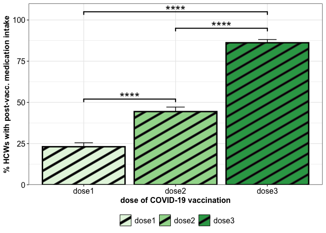<!-- -->

#### Significance

``` r
fisher_res %>% 
  select(-matches("(meds.|^x|^y|signif)")) %>%
  mutate(p.value = format(p.value, scientific = T, digits = 3)) %>% 
  relocate(group1, group2, starts_with("med"), starts_with("no.med")) %>%
  knitr::kable() %>%
  kableExtra::kable_paper() %>%
  kableExtra::kable_styling(position = "left")%>%
  kableExtra::column_spec(1, bold = T)
```

<table class=" lightable-paper table" style="font-family: &quot;Arial Narrow&quot;, arial, helvetica, sans-serif; margin-left: auto; margin-right: auto; ">
<thead>
<tr>
<th style="text-align:left;">
group1
</th>
<th style="text-align:left;">
group2
</th>
<th style="text-align:right;">
med.gr1
</th>
<th style="text-align:right;">
med.gr2
</th>
<th style="text-align:right;">
no.med.gr1
</th>
<th style="text-align:right;">
no.med.gr2
</th>
<th style="text-align:right;">
odds_ratio
</th>
<th style="text-align:left;">
p.value
</th>
</tr>
</thead>
<tbody>
<tr>
<td style="text-align:left;font-weight: bold;">
dose1
</td>
<td style="text-align:left;">
dose2
</td>
<td style="text-align:right;">
294
</td>
<td style="text-align:right;">
564
</td>
<td style="text-align:right;">
980
</td>
<td style="text-align:right;">
706
</td>
<td style="text-align:right;">
0.3756803
</td>
<td style="text-align:left;">
2.87e-30
</td>
</tr>
<tr>
<td style="text-align:left;font-weight: bold;">
dose1
</td>
<td style="text-align:left;">
dose3
</td>
<td style="text-align:right;">
294
</td>
<td style="text-align:right;">
912
</td>
<td style="text-align:right;">
980
</td>
<td style="text-align:right;">
146
</td>
<td style="text-align:right;">
0.0481125
</td>
<td style="text-align:left;">
4.99e-220
</td>
</tr>
<tr>
<td style="text-align:left;font-weight: bold;">
dose2
</td>
<td style="text-align:left;">
dose3
</td>
<td style="text-align:right;">
564
</td>
<td style="text-align:right;">
912
</td>
<td style="text-align:right;">
706
</td>
<td style="text-align:right;">
146
</td>
<td style="text-align:right;">
0.1280104
</td>
<td style="text-align:left;">
1.50e-102
</td>
</tr>
</tbody>
</table>

### Gender spec.

``` r
mean_meds_gender <- df_med %>%
            group_by(dose, gender) %>% 
            summarise(Mean_meds = mean(meds, na.rm = T),
                      CI_upper = Hmisc::binconf(n = n(), x = sum(meds))[3]) %>%
            mutate(dose = gsub(x = dose, pattern = "dose", replacement = "dose"))

df_sub <- df_med %>% group_by(dose, meds, gender) %>% count()
vaccinations <- unique(df_sub$dose)

res_list <- list()
i <- 1
for(sel_dose in vaccinations){
  
  conf_mat <- df_sub %>% filter(dose %in% sel_dose) %>% tidyr::pivot_wider(values_from = c("n"), names_from = gender) %>% ungroup()
  
  fisher_res <-  fisher.test(conf_mat[2:1,][,-c(1:2)] %>% as.matrix())
  res_list[[i]] <- data.frame(dose = sel_dose, group1 = colnames(conf_mat)[3], group2 = colnames(conf_mat)[4], 
                              med.gr1 = as.numeric(conf_mat[2,3]),  
                              med.gr2 = as.numeric(conf_mat[2,4]), 
                              no.med.gr1 = as.numeric(conf_mat[1,3]),  
                              no.med.gr2 = as.numeric(conf_mat[1,4]), 
                              odds_ratio = fisher_res$estimate, p.value = fisher_res$p.value)
  i <<- i + 1
}

fisher_res <- do.call("rbind", res_list) %>% as_tibble()

fisher_res_plt <- fisher_res %>% filter(p.value < 0.05)

fisher_res_plt$y.position <- c(0.32, 0.55)
fisher_res_plt$xmin <- c(0.77, 1.77)
fisher_res_plt$xmax <- c(1.23, 2.23)

fisher_res_plt <- fisher_res_plt %>% rstatix::add_significance(p.col = "p.value")

avg_meds_gender_plt_30 <- mean_meds_gender %>%
  ggplot2::ggplot(ggplot2::aes(x = dose, fill = gender, y = Mean_meds * 100)) + 
  ggpattern::geom_col_pattern(position = ggplot2::position_dodge2(width = 0.9), color = "black", lwd = 1, pattern_fill = "black", show.legend = T) +
  ggplot2::geom_errorbar(aes(ymin = Mean_meds* 100, ymax = CI_upper* 100), width = 0.2, position = ggplot2::position_dodge(0.9)) +
  ggplot2::theme_bw() +
  ggplot2::scale_fill_manual(values = c("#D95F02", "#1B9E77")) +
  ggplot2::scale_y_continuous(expand = c(0, 0)) + 
  ggplot2::theme(axis.text = ggplot2::element_text(size = 12, colour = "black"),
                 axis.title = ggplot2::element_text(face = "bold", size = 12),
                 legend.title = ggplot2::element_blank(),
                 legend.text = ggplot2::element_text(size = 12),
                 legend.position = "bottom") +
  ggplot2::ylab("% HCWs with post-vacc. medication intake") +
  ggplot2::xlab("dose of COVID-19 vaccination") +
  ggplot2::coord_cartesian(ylim = c(0,100)) + 
  ggsignif::geom_signif(xmin = fisher_res_plt$xmin,
                        xmax = fisher_res_plt$xmax,
                        y_position = fisher_res_plt$y.position* 100,
                        annotation = fisher_res_plt$p.value.signif,
                        tip_length = 0.025, vjust = 0.5, lwd = 0.75, textsize = 7)

avg_meds_gender_plt_30
```

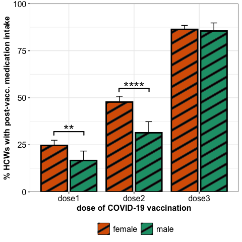<!-- -->

#### Significance

``` r
fisher_res %>%
  knitr::kable() %>%
  kableExtra::kable_paper() %>%
  kableExtra::kable_styling(position = "left")%>%
  kableExtra::column_spec(1, bold = T)
```

<table class=" lightable-paper table" style="font-family: &quot;Arial Narrow&quot;, arial, helvetica, sans-serif; margin-left: auto; margin-right: auto; ">
<thead>
<tr>
<th style="text-align:left;">
dose
</th>
<th style="text-align:left;">
group1
</th>
<th style="text-align:left;">
group2
</th>
<th style="text-align:right;">
med.gr1
</th>
<th style="text-align:right;">
med.gr2
</th>
<th style="text-align:right;">
no.med.gr1
</th>
<th style="text-align:right;">
no.med.gr2
</th>
<th style="text-align:right;">
odds_ratio
</th>
<th style="text-align:right;">
p.value
</th>
</tr>
</thead>
<tbody>
<tr>
<td style="text-align:left;font-weight: bold;">
dose1
</td>
<td style="text-align:left;">
female
</td>
<td style="text-align:left;">
male
</td>
<td style="text-align:right;">
251
</td>
<td style="text-align:right;">
43
</td>
<td style="text-align:right;">
765
</td>
<td style="text-align:right;">
215
</td>
<td style="text-align:right;">
1.639935
</td>
<td style="text-align:right;">
0.0062293
</td>
</tr>
<tr>
<td style="text-align:left;font-weight: bold;">
dose2
</td>
<td style="text-align:left;">
female
</td>
<td style="text-align:left;">
male
</td>
<td style="text-align:right;">
483
</td>
<td style="text-align:right;">
81
</td>
<td style="text-align:right;">
529
</td>
<td style="text-align:right;">
177
</td>
<td style="text-align:right;">
1.994127
</td>
<td style="text-align:right;">
0.0000023
</td>
</tr>
<tr>
<td style="text-align:left;font-weight: bold;">
dose3
</td>
<td style="text-align:left;">
female
</td>
<td style="text-align:left;">
male
</td>
<td style="text-align:right;">
747
</td>
<td style="text-align:right;">
165
</td>
<td style="text-align:right;">
118
</td>
<td style="text-align:right;">
28
</td>
<td style="text-align:right;">
1.074203
</td>
<td style="text-align:right;">
0.7302425
</td>
</tr>
</tbody>
</table>

### Profession spec.

``` r
mean_meds_profession <- df_med %>% filter(!is.na(profession)) %>%
            group_by(dose, profession) %>% 
            summarise(Mean_meds = mean(meds, na.rm = T),
                      CI_upper = Hmisc::binconf(n = n(), x = sum(meds))[3])%>%
            mutate(dose = gsub(x = dose, pattern = "dose", replacement = "dose"))

df_sub <- df_med %>% filter(!is.na(profession)) %>% group_by(dose, meds, profession) %>% count()
vaccinations <- unique(df_sub$dose)
professions <- levels(df_sub$profession)

res_list <- list()
i <- 1
for(sel_dose in vaccinations){
  
  done_prof <- c()
  
  for(prof1 in professions){
    
    done_prof <- c(prof1, done_prof)
    
    for(prof2 in professions[-which(professions %in% done_prof)]){
      
      conf_mat <- df_sub %>% filter(dose %in% sel_dose, profession %in% c(prof1, prof2)) %>% tidyr::pivot_wider(values_from = c("n"), names_from = profession) %>% ungroup()
  
      fisher_res <-  fisher.test(conf_mat[2:1,][,-c(1:2)] %>% as.matrix())
      res_list[[i]] <- data.frame(dose = sel_dose, group1 = colnames(conf_mat)[3], group2 = colnames(conf_mat)[4], 
                              med.gr1 = as.numeric(conf_mat[2,3]),  
                              med.gr2 = as.numeric(conf_mat[2,4]), 
                              no.med.gr1 = as.numeric(conf_mat[1,3]),  
                              no.med.gr2 = as.numeric(conf_mat[1,4]), 
                              odds_ratio = fisher_res$estimate, p.value = fisher_res$p.value)
      i <<- i + 1
    }
  }
  
}

fisher_res <- do.call("rbind", res_list) 
fisher_res <- cbind(fisher_res, p.adj = p.adjust(fisher_res$p.value, "BY")) %>% as_tibble()

fisher_res_plt <- fisher_res %>% filter(p.adj < 0.05)
fisher_res_plt <- fisher_res_plt %>% rstatix::add_significance(p.col = "p.adj")

avg_meds_profession_plt_30 <- mean_meds_profession %>%
  ggplot2::ggplot(ggplot2::aes(x = dose, fill = profession, y = Mean_meds* 100)) + 
  ggpattern::geom_col_pattern(position = ggplot2::position_dodge2(width = 0.9), color = "black", lwd = 1, pattern_fill = "black", show.legend = T) +
  ggplot2::geom_errorbar(aes(ymin = Mean_meds* 100, ymax = CI_upper* 100), width = 0.2, position = ggplot2::position_dodge(0.9)) +
  ggplot2::theme_bw() +
  ggplot2::scale_fill_manual(values = c("#F39B7FFF", "#4DBBD5FF", "#91D1C2FF", "#8491B4FF")) +
  ggplot2::scale_y_continuous(expand = c(0, 0), limits = c(0, 100)) +
  ggplot2::theme(axis.text = ggplot2::element_text(size = 12, colour = "black"),
                 axis.title = ggplot2::element_text(face = "bold", size = 12),
                 legend.title = ggplot2::element_blank(),
                 legend.text = ggplot2::element_text(size = 12),
                 legend.position = "bottom") +
  ggplot2::ylab("% HCWs with post-vacc. medication intake") +
  ggplot2::xlab("dose of COVID-19 vaccination")  

avg_meds_profession_plt_30
```

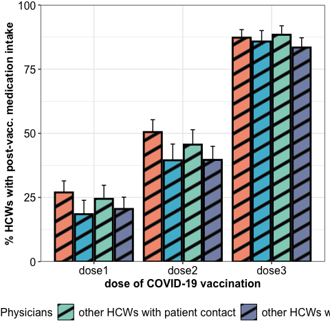<!-- -->

#### Significance

``` r
fisher_res %>%
  knitr::kable() %>%
  kableExtra::kable_paper() %>%
  kableExtra::kable_styling(position = "left")%>%
  kableExtra::column_spec(1, bold = T)
```

<table class=" lightable-paper table" style="font-family: &quot;Arial Narrow&quot;, arial, helvetica, sans-serif; margin-left: auto; margin-right: auto; ">
<thead>
<tr>
<th style="text-align:left;">
dose
</th>
<th style="text-align:left;">
group1
</th>
<th style="text-align:left;">
group2
</th>
<th style="text-align:right;">
med.gr1
</th>
<th style="text-align:right;">
med.gr2
</th>
<th style="text-align:right;">
no.med.gr1
</th>
<th style="text-align:right;">
no.med.gr2
</th>
<th style="text-align:right;">
odds_ratio
</th>
<th style="text-align:right;">
p.value
</th>
<th style="text-align:right;">
p.adj
</th>
</tr>
</thead>
<tbody>
<tr>
<td style="text-align:left;font-weight: bold;">
dose1
</td>
<td style="text-align:left;">
Nursing
</td>
<td style="text-align:left;">
Physicians
</td>
<td style="text-align:right;">
110
</td>
<td style="text-align:right;">
44
</td>
<td style="text-align:right;">
298
</td>
<td style="text-align:right;">
194
</td>
<td style="text-align:right;">
1.6263226
</td>
<td style="text-align:right;">
0.0166029
</td>
<td style="text-align:right;">
0.3481741
</td>
</tr>
<tr>
<td style="text-align:left;font-weight: bold;">
dose1
</td>
<td style="text-align:left;">
Nursing
</td>
<td style="text-align:left;">
other HCWs with patient contact
</td>
<td style="text-align:right;">
110
</td>
<td style="text-align:right;">
70
</td>
<td style="text-align:right;">
298
</td>
<td style="text-align:right;">
216
</td>
<td style="text-align:right;">
1.1388088
</td>
<td style="text-align:right;">
0.4824546
</td>
<td style="text-align:right;">
1.0000000
</td>
</tr>
<tr>
<td style="text-align:left;font-weight: bold;">
dose1
</td>
<td style="text-align:left;">
Nursing
</td>
<td style="text-align:left;">
other HCWs without any patient contact
</td>
<td style="text-align:right;">
110
</td>
<td style="text-align:right;">
70
</td>
<td style="text-align:right;">
298
</td>
<td style="text-align:right;">
271
</td>
<td style="text-align:right;">
1.4283631
</td>
<td style="text-align:right;">
0.0481147
</td>
<td style="text-align:right;">
0.7567467
</td>
</tr>
<tr>
<td style="text-align:left;font-weight: bold;">
dose1
</td>
<td style="text-align:left;">
Physicians
</td>
<td style="text-align:left;">
other HCWs with patient contact
</td>
<td style="text-align:right;">
44
</td>
<td style="text-align:right;">
70
</td>
<td style="text-align:right;">
194
</td>
<td style="text-align:right;">
216
</td>
<td style="text-align:right;">
0.7003303
</td>
<td style="text-align:right;">
0.1108795
</td>
<td style="text-align:right;">
1.0000000
</td>
</tr>
<tr>
<td style="text-align:left;font-weight: bold;">
dose1
</td>
<td style="text-align:left;">
Physicians
</td>
<td style="text-align:left;">
other HCWs without any patient contact
</td>
<td style="text-align:right;">
44
</td>
<td style="text-align:right;">
70
</td>
<td style="text-align:right;">
194
</td>
<td style="text-align:right;">
271
</td>
<td style="text-align:right;">
0.8782522
</td>
<td style="text-align:right;">
0.5958162
</td>
<td style="text-align:right;">
1.0000000
</td>
</tr>
<tr>
<td style="text-align:left;font-weight: bold;">
dose1
</td>
<td style="text-align:left;">
other HCWs with patient contact
</td>
<td style="text-align:left;">
other HCWs without any patient contact
</td>
<td style="text-align:right;">
70
</td>
<td style="text-align:right;">
70
</td>
<td style="text-align:right;">
216
</td>
<td style="text-align:right;">
271
</td>
<td style="text-align:right;">
1.2541637
</td>
<td style="text-align:right;">
0.2489897
</td>
<td style="text-align:right;">
1.0000000
</td>
</tr>
<tr>
<td style="text-align:left;font-weight: bold;">
dose2
</td>
<td style="text-align:left;">
Nursing
</td>
<td style="text-align:left;">
Physicians
</td>
<td style="text-align:right;">
206
</td>
<td style="text-align:right;">
94
</td>
<td style="text-align:right;">
202
</td>
<td style="text-align:right;">
144
</td>
<td style="text-align:right;">
1.5611381
</td>
<td style="text-align:right;">
0.0070659
</td>
<td style="text-align:right;">
0.2222655
</td>
</tr>
<tr>
<td style="text-align:left;font-weight: bold;">
dose2
</td>
<td style="text-align:left;">
Nursing
</td>
<td style="text-align:left;">
other HCWs with patient contact
</td>
<td style="text-align:right;">
206
</td>
<td style="text-align:right;">
130
</td>
<td style="text-align:right;">
202
</td>
<td style="text-align:right;">
155
</td>
<td style="text-align:right;">
1.2155679
</td>
<td style="text-align:right;">
0.2170755
</td>
<td style="text-align:right;">
1.0000000
</td>
</tr>
<tr>
<td style="text-align:left;font-weight: bold;">
dose2
</td>
<td style="text-align:left;">
Nursing
</td>
<td style="text-align:left;">
other HCWs without any patient contact
</td>
<td style="text-align:right;">
206
</td>
<td style="text-align:right;">
134
</td>
<td style="text-align:right;">
202
</td>
<td style="text-align:right;">
204
</td>
<td style="text-align:right;">
1.5515767
</td>
<td style="text-align:right;">
0.0031781
</td>
<td style="text-align:right;">
0.1999408
</td>
</tr>
<tr>
<td style="text-align:left;font-weight: bold;">
dose2
</td>
<td style="text-align:left;">
Physicians
</td>
<td style="text-align:left;">
other HCWs with patient contact
</td>
<td style="text-align:right;">
94
</td>
<td style="text-align:right;">
130
</td>
<td style="text-align:right;">
144
</td>
<td style="text-align:right;">
155
</td>
<td style="text-align:right;">
0.7786921
</td>
<td style="text-align:right;">
0.1831963
</td>
<td style="text-align:right;">
1.0000000
</td>
</tr>
<tr>
<td style="text-align:left;font-weight: bold;">
dose2
</td>
<td style="text-align:left;">
Physicians
</td>
<td style="text-align:left;">
other HCWs without any patient contact
</td>
<td style="text-align:right;">
94
</td>
<td style="text-align:right;">
134
</td>
<td style="text-align:right;">
144
</td>
<td style="text-align:right;">
204
</td>
<td style="text-align:right;">
0.9937915
</td>
<td style="text-align:right;">
1.0000000
</td>
<td style="text-align:right;">
1.0000000
</td>
</tr>
<tr>
<td style="text-align:left;font-weight: bold;">
dose2
</td>
<td style="text-align:left;">
other HCWs with patient contact
</td>
<td style="text-align:left;">
other HCWs without any patient contact
</td>
<td style="text-align:right;">
130
</td>
<td style="text-align:right;">
134
</td>
<td style="text-align:right;">
155
</td>
<td style="text-align:right;">
204
</td>
<td style="text-align:right;">
1.2763243
</td>
<td style="text-align:right;">
0.1433202
</td>
<td style="text-align:right;">
1.0000000
</td>
</tr>
<tr>
<td style="text-align:left;font-weight: bold;">
dose3
</td>
<td style="text-align:left;">
Nursing
</td>
<td style="text-align:left;">
Physicians
</td>
<td style="text-align:right;">
295
</td>
<td style="text-align:right;">
163
</td>
<td style="text-align:right;">
43
</td>
<td style="text-align:right;">
27
</td>
<td style="text-align:right;">
1.1361121
</td>
<td style="text-align:right;">
0.6886200
</td>
<td style="text-align:right;">
1.0000000
</td>
</tr>
<tr>
<td style="text-align:left;font-weight: bold;">
dose3
</td>
<td style="text-align:left;">
Nursing
</td>
<td style="text-align:left;">
other HCWs with patient contact
</td>
<td style="text-align:right;">
295
</td>
<td style="text-align:right;">
206
</td>
<td style="text-align:right;">
43
</td>
<td style="text-align:right;">
27
</td>
<td style="text-align:right;">
0.8993804
</td>
<td style="text-align:right;">
0.7953102
</td>
<td style="text-align:right;">
1.0000000
</td>
</tr>
<tr>
<td style="text-align:left;font-weight: bold;">
dose3
</td>
<td style="text-align:left;">
Nursing
</td>
<td style="text-align:left;">
other HCWs without any patient contact
</td>
<td style="text-align:right;">
295
</td>
<td style="text-align:right;">
247
</td>
<td style="text-align:right;">
43
</td>
<td style="text-align:right;">
49
</td>
<td style="text-align:right;">
1.3603038
</td>
<td style="text-align:right;">
0.1769962
</td>
<td style="text-align:right;">
1.0000000
</td>
</tr>
<tr>
<td style="text-align:left;font-weight: bold;">
dose3
</td>
<td style="text-align:left;">
Physicians
</td>
<td style="text-align:left;">
other HCWs with patient contact
</td>
<td style="text-align:right;">
163
</td>
<td style="text-align:right;">
206
</td>
<td style="text-align:right;">
27
</td>
<td style="text-align:right;">
27
</td>
<td style="text-align:right;">
0.7917091
</td>
<td style="text-align:right;">
0.4651864
</td>
<td style="text-align:right;">
1.0000000
</td>
</tr>
<tr>
<td style="text-align:left;font-weight: bold;">
dose3
</td>
<td style="text-align:left;">
Physicians
</td>
<td style="text-align:left;">
other HCWs without any patient contact
</td>
<td style="text-align:right;">
163
</td>
<td style="text-align:right;">
247
</td>
<td style="text-align:right;">
27
</td>
<td style="text-align:right;">
49
</td>
<td style="text-align:right;">
1.1971920
</td>
<td style="text-align:right;">
0.5241201
</td>
<td style="text-align:right;">
1.0000000
</td>
</tr>
<tr>
<td style="text-align:left;font-weight: bold;">
dose3
</td>
<td style="text-align:left;">
other HCWs with patient contact
</td>
<td style="text-align:left;">
other HCWs without any patient contact
</td>
<td style="text-align:right;">
206
</td>
<td style="text-align:right;">
247
</td>
<td style="text-align:right;">
27
</td>
<td style="text-align:right;">
49
</td>
<td style="text-align:right;">
1.5124024
</td>
<td style="text-align:right;">
0.1336983
</td>
<td style="text-align:right;">
1.0000000
</td>
</tr>
</tbody>
</table>

### Rel. to vaccination

``` r
df_med_stat <- df_med %>% group_by(vaccine, dose) %>%
                          summarise(
                                 Mean_meds = mean(meds, na.rm = T),
                                 CI_upper = Hmisc::binconf(n = n(), x = sum(meds))[3]) %>% 
                          arrange(dose)

df_med_stat_sum <- df_med %>% group_by(vaccine, dose, meds) %>% count() %>% 
                          group_by(vaccine, dose) %>% 
                          mutate(n_dose = sum(n), 
                                 rel_n = n/n_dose) %>%
                   rename(dose = dose,
                          medication = meds,
                          N_participants = n_dose,
                          rel_N_participants = rel_n) %>%
                    mutate(dose = gsub(x = dose, pattern = "dose", replacement = ""),
                           medication = if_else(medication == 1, true = "yes", false = "no")) %>%
                    relocate(dose) 

stats_med <- do.call("rbind", lapply(split(df_med_stat_sum %>% filter(medication %in% "yes"), f = df_med_stat_sum %>% filter(medication %in% "yes") %>% pull(dose)), function(mat){
  
  vaccs <- as.character(unique(mat$vaccine))
  df_comp <- c()
  exclude <- c()
  for(vaccs_i in vaccs){
    exclude <- c(exclude, vaccs_i)
    for(vaccs_j in vaccs[!vaccs %in% exclude]){
      
      tmp_mat <- mat %>% filter(vaccine %in% c(vaccs_i, vaccs_j)) %>% ungroup() %>% 
                         select(n, N_participants) %>% mutate(`no meds` = N_participants - n) %>% 
                         rename(meds = n) %>% select(`no meds`, meds) %>% relocate(meds, `no meds`) %>% as.matrix()

       df_comp <- rbind(df_comp, data.frame(dose = unique(mat$dose), group1 = vaccs_i, group2 = vaccs_j, 
                                            med.gr1 = tmp_mat[1,1],
                                            med.gr2 = tmp_mat[2,1],
                                            no.med.gr1 = tmp_mat[1,2],
                                            no.med.gr2 = tmp_mat[2,2],
                                            odds.ratio = fisher.test(tmp_mat)$estimate,
                                            p.value = fisher.test(tmp_mat)$p.value))
    }
  }
  df_comp
}))

stats_med <- cbind(stats_med, p.adj = p.adjust(stats_med$p.value, method = "BY")) %>% as_tibble()

stats_med_plt <- stats_med %>% filter(p.adj < 0.05)
stats_med_plt <- stats_med_plt %>% rstatix::add_significance(p.col = "p.adj")

stats_med_plt$y.position <- c(1.03, 0.97)
stats_med_plt$xmin <- c(0.66, 2.77)
stats_med_plt$xmax <- c(1.11, 3.23)

vaccine_medication_plt_30 <- df_med_stat %>% ggplot(ggplot2::aes(x = dose, y = Mean_meds* 100, fill = vaccine)) + 
               ggpattern::geom_col_pattern(position = ggplot2::position_dodge2(width = 0.9), color = "black", lwd = 1, pattern_fill = "black", show.legend = T) +
               ggplot2::geom_errorbar(aes(ymin = Mean_meds* 100, ymax = CI_upper* 100), width = 0.2, position = ggplot2::position_dodge(0.9)) +
               ggplot2::theme_bw() +
               ggplot2::scale_x_discrete(labels = c("first dose", "second dose", "third dose")) +
               ggplot2::scale_y_continuous(expand = c(0,0), limits = c(0, 110)) + 
               ggsci::scale_fill_nejm() +
               ggplot2::theme(axis.text = ggplot2::element_text(size = 12, colour = "black"),
                              axis.title = ggplot2::element_text(face = "bold", size = 12),
                              legend.title = ggplot2::element_blank(),
                              legend.text = ggplot2::element_text(size = 12),
                              legend.position = "bottom") +
               ggplot2::ylab("% HCWs with post-vacc. medication intake") +
               ggplot2::xlab("dose of COVID-19 vaccination") +
               ggplot2::guides(fill = ggplot2::guide_legend(nrow = 2)) + 
               ggsignif::geom_signif(xmin = stats_med_plt$xmin,
                                     xmax = stats_med_plt$xmax,
                                     y_position = stats_med_plt$y.position*100,
                                     annotation = stats_med_plt$p.adj.signif,
                                     tip_length = 0.02, vjust = 0.5, lwd = 0.75, textsize = 7)

vaccine_medication_plt_30
```

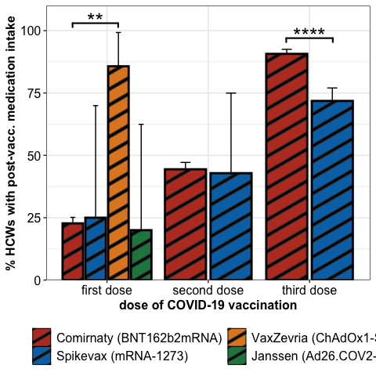<!-- -->

#### Significance

``` r
stats_med %>% mutate(p.value = format(p.value, scientific = T, digits = 2),
                     p.adj = format(p.adj, scientific = T, digits = 2)) %>%
  knitr::kable() %>%
  kableExtra::kable_paper() %>%
  kableExtra::kable_styling(position = "left")%>%
  kableExtra::column_spec(1, bold = T)
```

<table class=" lightable-paper table" style="font-family: &quot;Arial Narrow&quot;, arial, helvetica, sans-serif; margin-left: auto; margin-right: auto; ">
<thead>
<tr>
<th style="text-align:left;">
dose
</th>
<th style="text-align:left;">
group1
</th>
<th style="text-align:left;">
group2
</th>
<th style="text-align:right;">
med.gr1
</th>
<th style="text-align:right;">
med.gr2
</th>
<th style="text-align:right;">
no.med.gr1
</th>
<th style="text-align:right;">
no.med.gr2
</th>
<th style="text-align:right;">
odds.ratio
</th>
<th style="text-align:left;">
p.value
</th>
<th style="text-align:left;">
p.adj
</th>
</tr>
</thead>
<tbody>
<tr>
<td style="text-align:left;font-weight: bold;">
1
</td>
<td style="text-align:left;">
Comirnaty (BNT162b2mRNA)
</td>
<td style="text-align:left;">
Spikevax (mRNA-1273)
</td>
<td style="text-align:right;">
286
</td>
<td style="text-align:right;">
1
</td>
<td style="text-align:right;">
972
</td>
<td style="text-align:right;">
3
</td>
<td style="text-align:right;">
0.8827881
</td>
<td style="text-align:left;">
1.0e+00
</td>
<td style="text-align:left;">
1.0e+00
</td>
</tr>
<tr>
<td style="text-align:left;font-weight: bold;">
1
</td>
<td style="text-align:left;">
Comirnaty (BNT162b2mRNA)
</td>
<td style="text-align:left;">
VaxZevria (ChAdOx1-S)
</td>
<td style="text-align:right;">
286
</td>
<td style="text-align:right;">
6
</td>
<td style="text-align:right;">
972
</td>
<td style="text-align:right;">
1
</td>
<td style="text-align:right;">
0.0491551
</td>
<td style="text-align:left;">
8.2e-04
</td>
<td style="text-align:left;">
8.9e-03
</td>
</tr>
<tr>
<td style="text-align:left;font-weight: bold;">
1
</td>
<td style="text-align:left;">
Comirnaty (BNT162b2mRNA)
</td>
<td style="text-align:left;">
Janssen (Ad26.COV2-S)
</td>
<td style="text-align:right;">
286
</td>
<td style="text-align:right;">
1
</td>
<td style="text-align:right;">
972
</td>
<td style="text-align:right;">
4
</td>
<td style="text-align:right;">
1.1768075
</td>
<td style="text-align:left;">
1.0e+00
</td>
<td style="text-align:left;">
1.0e+00
</td>
</tr>
<tr>
<td style="text-align:left;font-weight: bold;">
1
</td>
<td style="text-align:left;">
Spikevax (mRNA-1273)
</td>
<td style="text-align:left;">
VaxZevria (ChAdOx1-S)
</td>
<td style="text-align:right;">
1
</td>
<td style="text-align:right;">
6
</td>
<td style="text-align:right;">
3
</td>
<td style="text-align:right;">
1
</td>
<td style="text-align:right;">
0.0817641
</td>
<td style="text-align:left;">
8.8e-02
</td>
<td style="text-align:left;">
4.8e-01
</td>
</tr>
<tr>
<td style="text-align:left;font-weight: bold;">
1
</td>
<td style="text-align:left;">
Spikevax (mRNA-1273)
</td>
<td style="text-align:left;">
Janssen (Ad26.COV2-S)
</td>
<td style="text-align:right;">
1
</td>
<td style="text-align:right;">
1
</td>
<td style="text-align:right;">
3
</td>
<td style="text-align:right;">
4
</td>
<td style="text-align:right;">
1.2909826
</td>
<td style="text-align:left;">
1.0e+00
</td>
<td style="text-align:left;">
1.0e+00
</td>
</tr>
<tr>
<td style="text-align:left;font-weight: bold;">
1
</td>
<td style="text-align:left;">
VaxZevria (ChAdOx1-S)
</td>
<td style="text-align:left;">
Janssen (Ad26.COV2-S)
</td>
<td style="text-align:right;">
6
</td>
<td style="text-align:right;">
1
</td>
<td style="text-align:right;">
1
</td>
<td style="text-align:right;">
4
</td>
<td style="text-align:right;">
15.9949136
</td>
<td style="text-align:left;">
7.2e-02
</td>
<td style="text-align:left;">
4.8e-01
</td>
</tr>
<tr>
<td style="text-align:left;font-weight: bold;">
2
</td>
<td style="text-align:left;">
Comirnaty (BNT162b2mRNA)
</td>
<td style="text-align:left;">
Spikevax (mRNA-1273)
</td>
<td style="text-align:right;">
561
</td>
<td style="text-align:right;">
3
</td>
<td style="text-align:right;">
702
</td>
<td style="text-align:right;">
4
</td>
<td style="text-align:right;">
1.0654898
</td>
<td style="text-align:left;">
1.0e+00
</td>
<td style="text-align:left;">
1.0e+00
</td>
</tr>
<tr>
<td style="text-align:left;font-weight: bold;">
3
</td>
<td style="text-align:left;">
Comirnaty (BNT162b2mRNA)
</td>
<td style="text-align:left;">
Spikevax (mRNA-1273)
</td>
<td style="text-align:right;">
731
</td>
<td style="text-align:right;">
181
</td>
<td style="text-align:right;">
75
</td>
<td style="text-align:right;">
71
</td>
<td style="text-align:right;">
3.8172219
</td>
<td style="text-align:left;">
1.8e-12
</td>
<td style="text-align:left;">
4.0e-11
</td>
</tr>
</tbody>
</table>
